# Deep learning in drug discovery: Computational chemistry application

Summer 2024 Workshop

Drug Discovery

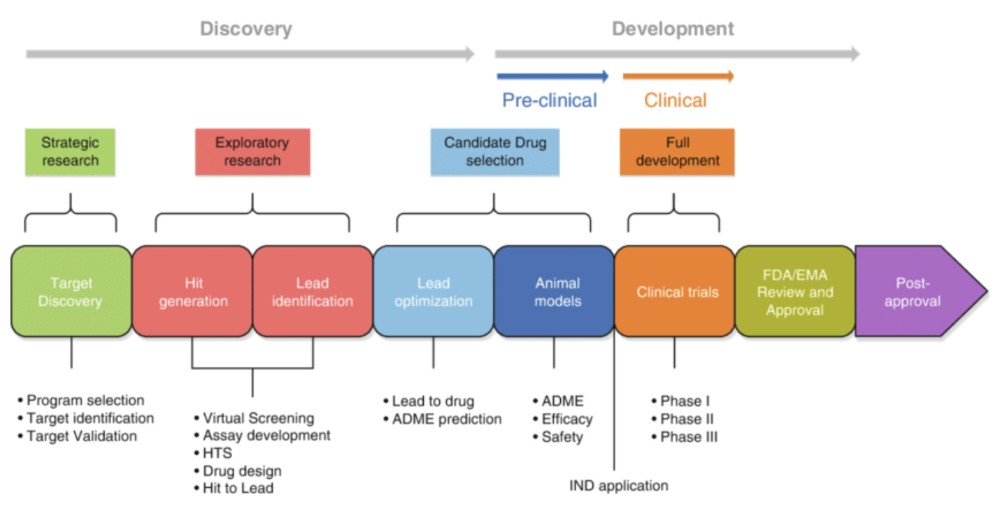

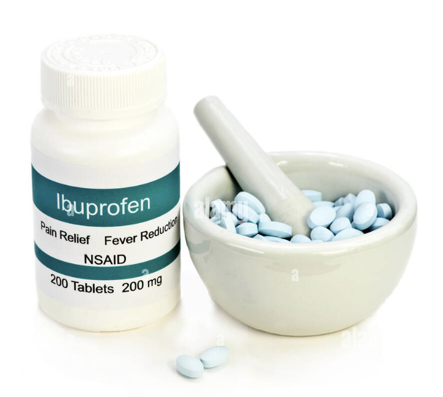

Outline of the workshop

Introduction to drug discovery (computer-aided drug design, CADD)

General idea about the tools for CADD

Deep-learning based drug discovery (example: chemprop)

Jupyter-notebook – highlighting chemprop’s abilities

Slurm scripts for chemprop

Application of chemprop demonstrating its abilities

# Drug discovery

Small – molecule therapeutics

Peptide – based therapeutics

Antibody – conjugate based drug design

# Peptide-based therapeutics

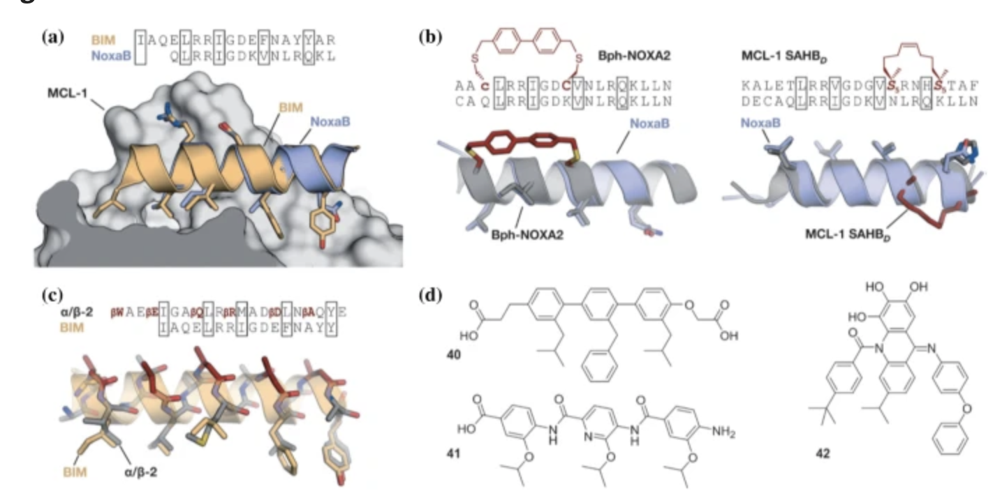

Peptidomimetics: A synthetic tool for inhibiting protein-protein interactions in cancer,  _Int J_  _Pept_  _Res_ _and_  _Ther_ , _2020_

Small – molecule therapeutics

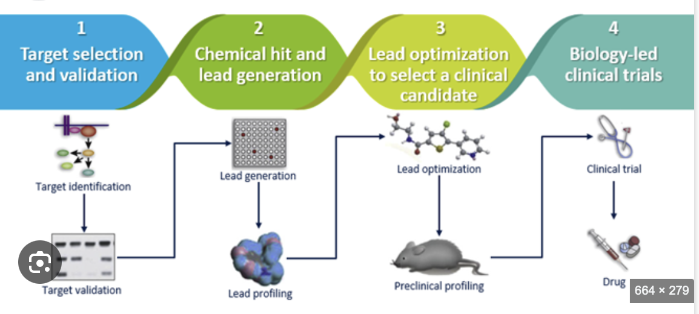

Google search image!

# Computational simulations – drug discovery

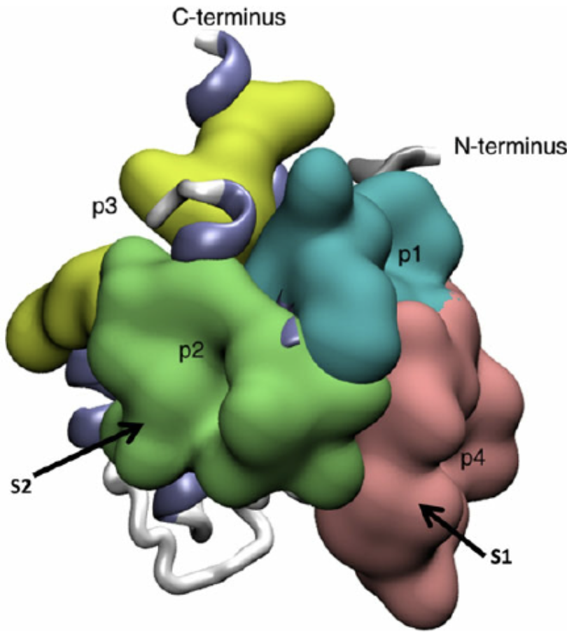

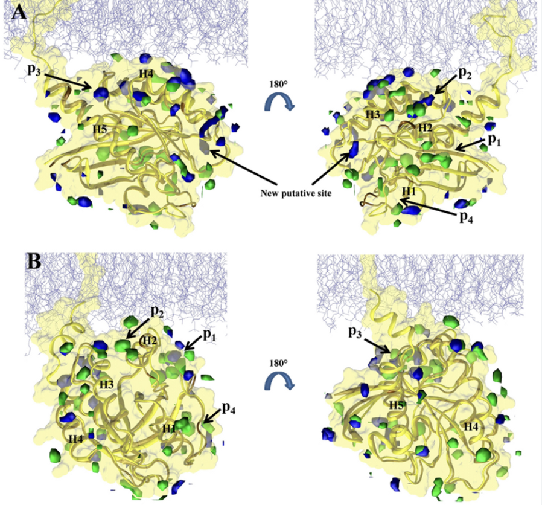

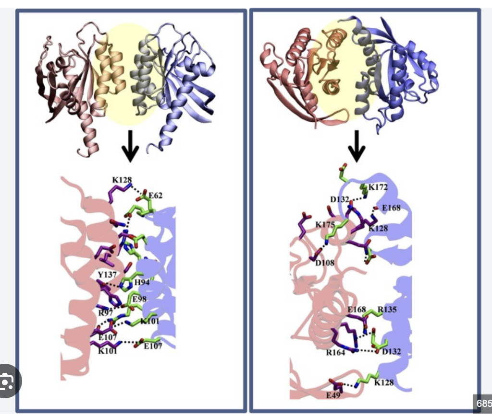

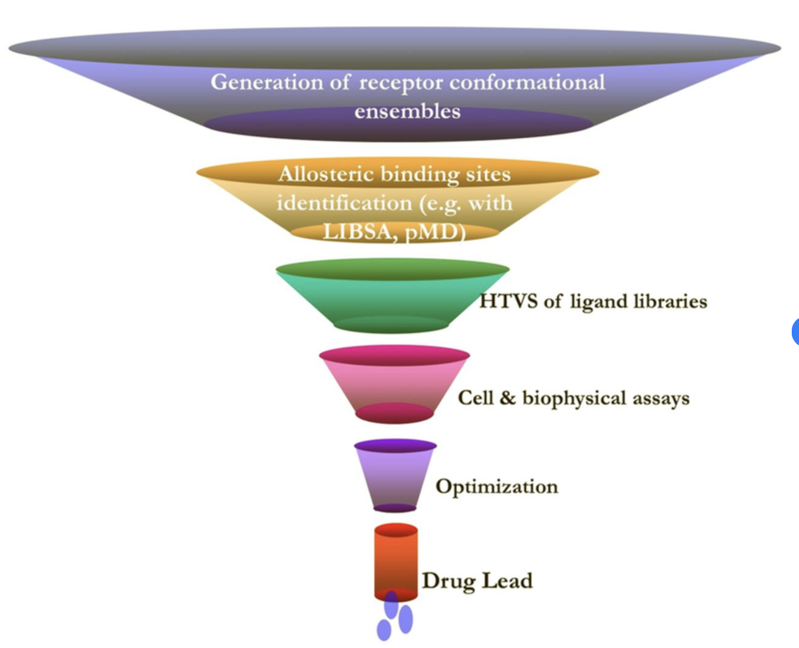

  * https://www.linkedin.com/in/priyaps

# Cheminformatics – drug discovery

Organic reaction

Compound library and database

Model generation

Property

Mining database

Analogues

Fingerprints/Graphs

Chemical descriptors

3D/2D encoding

Inspired by the following article:

Cheminformatics: An introductory review, Chonde and Kumara – conference contribution Penn State

# Deep learning in drug discovery: Chemprop

d-Message passing neural network (MPNN)

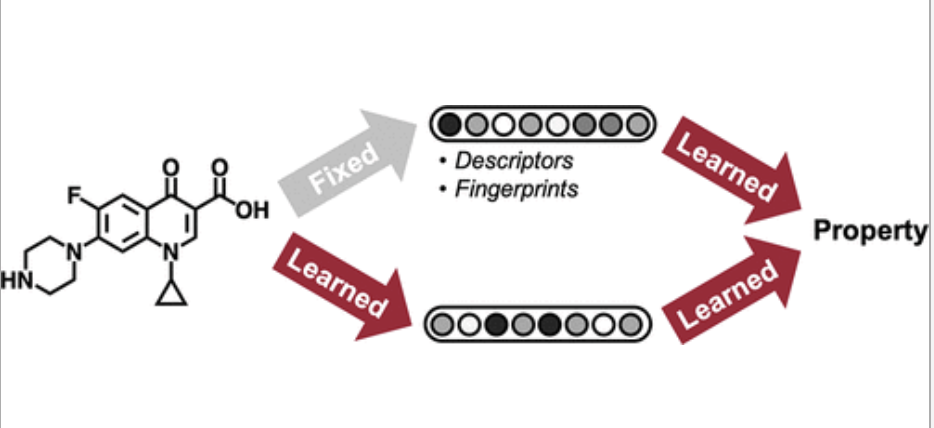

Original Article:  _Analyzing learned Molecular Representations for Property Prediction, _  _Yang et al, _  _JCIM 2019_

Chemprop – a directed MPNN

MPNN operates in two phases:

(1) a message passing phase – in the context of chemical structures it is transmitting information across the molecule to build a neural representation of the molecule

(2) a readout phase – This uses the final representation of the molecule for predictions

D-MPNN uses information associated with edges – accumulative type

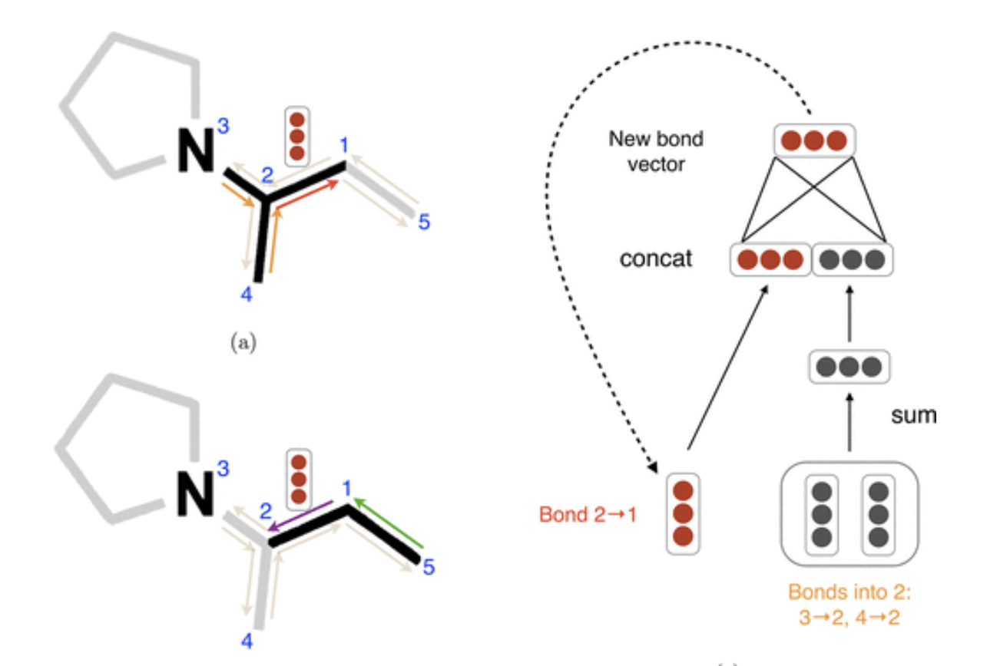

# Classification/Regression in ML

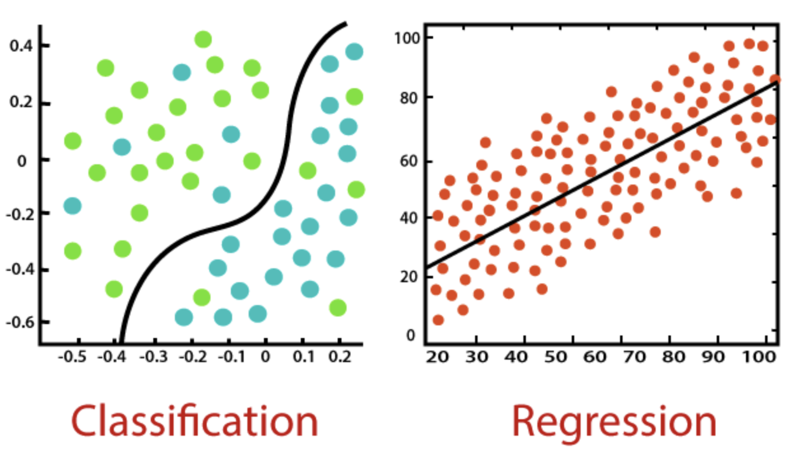

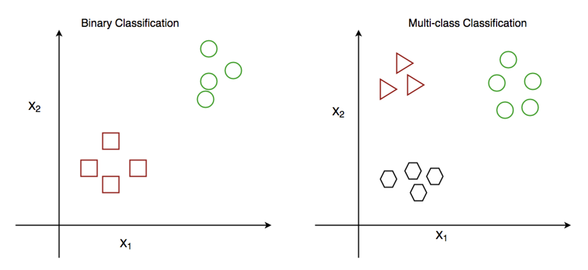

Regression example in drug discovery

Input is in CSV file format

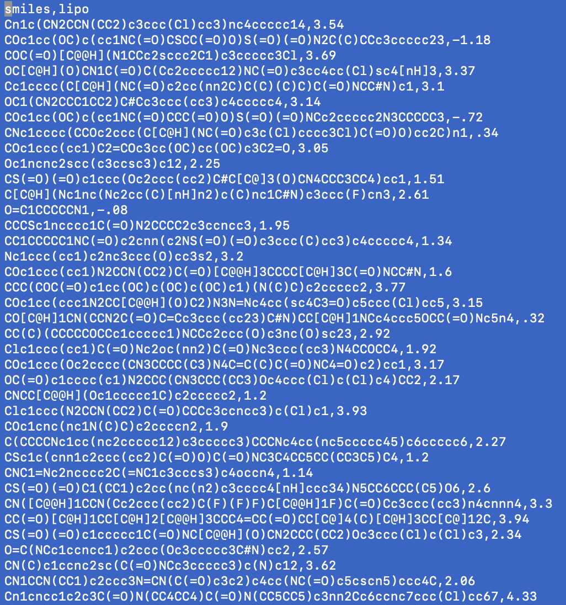

Regression example in drug discovery

Discuss the training example – Jupyter example

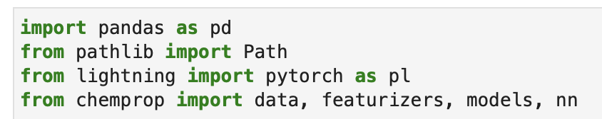

# Smile format

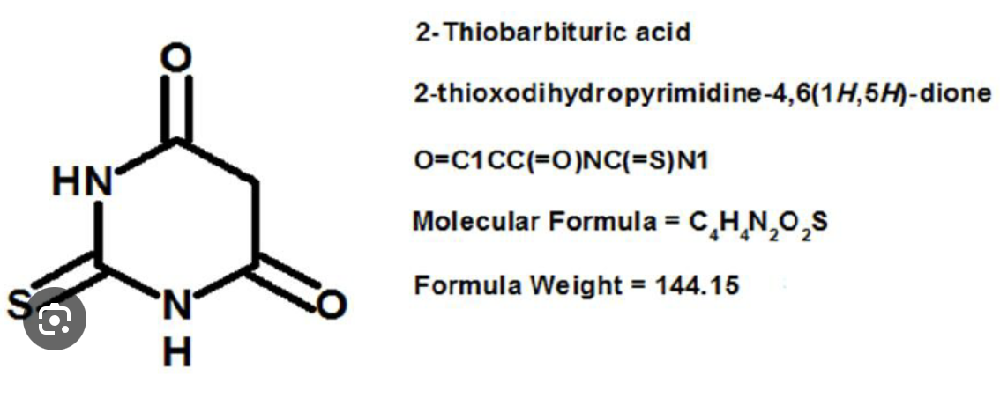

# Featurization

Atom level information: atomic number, number of bonds for each atom, charge

Molecule level feature: type of bond, conjugation, ring membership

Other properties

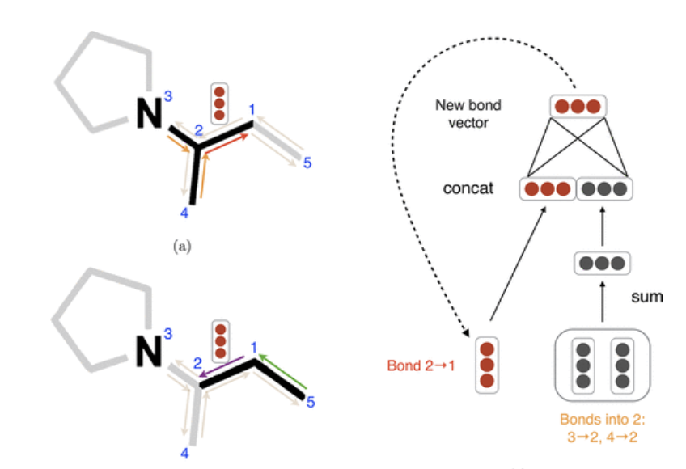

Featurization

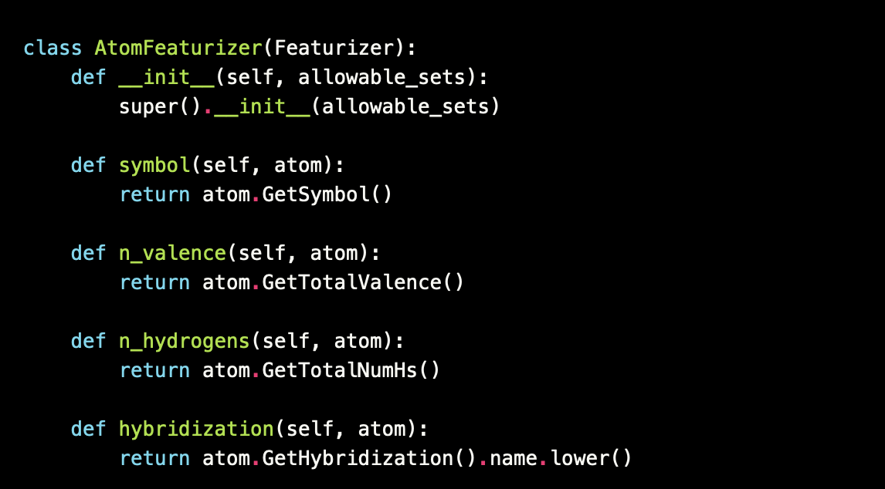

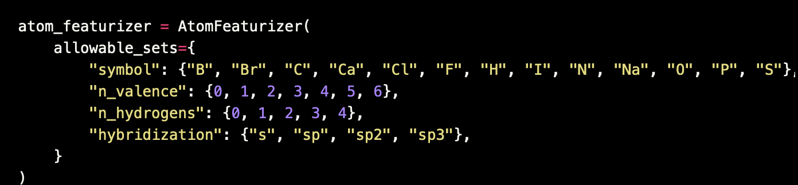

# Chemprop using slurm script - train

__Set Up Resources__

-A: allocation

-p: partition

--gres=gpu:1 :use 1 gpu

-c: number of cores

-t: time limit

-J: job name

-o: standard output file (%A is the job #)

-e: standard error file (%A is the job #)

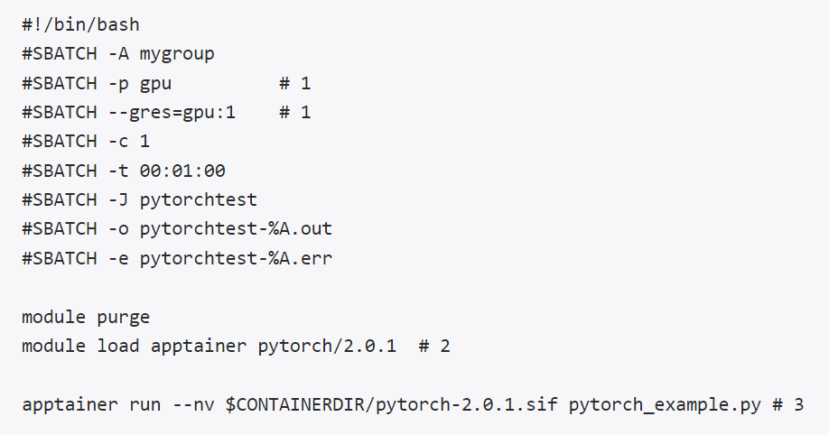

module purge

module load anaconda/2023.07-py3.11

conda activate chemprop

chemprop_train --data_path <input.csv> --dataset_type regression/classification --save_dir checkpoint --features_generator rdkit_2d_normalized --no_features_scaling

Chemprop using slurm script - predict

__Set Up Resources__

-A: allocation

-p: partition

--gres=gpu:1 :use 1 gpu

-c: number of cores

-t: time limit

-J: job name

-o: standard output file (%A is the job #)

-e: standard error file (%A is the job #)

module purge

module load anaconda/2023.07-py3.11

conda activate chemprop

chemprop_predict --test_path <test_set.csv> --checkpoint_dir checkpoint –prediction.csv

Chemprop using slurm script - interpret

__Set Up Resources__

-A: allocation

-p: partition

--gres=gpu:1 :use 1 gpu

-c: number of cores

-t: time limit

-J: job name

-o: standard output file (%A is the job #)

-e: standard error file (%A is the job #)

module purge

module load anaconda/2023.07-py3.11

conda activate chemprop

chemprop_interpret --data_path <input.csv> --checkpoint_dir checkpoint/location --property_id 1

"auc": [

0.7532467532467532 ]

Chemprop using slurm script – hyperparameter Opt

__Set Up Resources__

-A: allocation

-p: partition

--gres=gpu:1 :use 1 gpu

-c: number of cores

-t: time limit

-J: job name

-o: standard output file (%A is the job #)

-e: standard error file (%A is the job #)

module purge

module load anaconda/2023.07-py3.11

conda activate chemprop

chemprop_hyperopt --data_path <input.csv> --dataset_type regression/classification --num_iters 20 --config_save_path <path> --depth 5 --hidden_size 1600 --ffn_num_layers 1 --dropout 0.35 --epochs 30 --hyperopt_checkpoint_dir HYPEROPT_CHECKPOINT_DIR --num_folds 20

# Application of Chemprop resulted in a novel antibiotic

__A deep learning approach to antibiotic discovery, Stokes et al, Cell, 2020__

US-FDA approved drug library containing 1760 molecules of diverse structure and function

800 natural products from plants, animals, and microbial sources

A total of 2,560 molecules tested for relative growth

Red = inhibitory action; Blue = non-inhibitory action

Deduplication resulted in 2,335 molecules

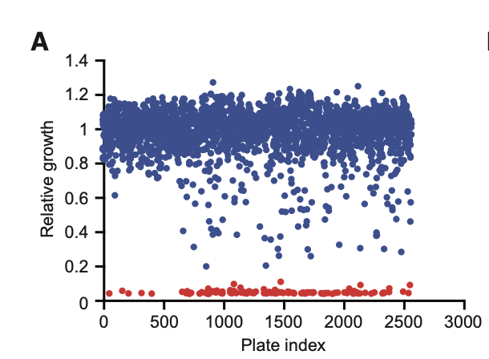

Small dataset hence learning is augmented by several features such as by including hundreds of molecular features, hyperparameter optimizations, ensembling

# Model prediction in excellent agreement with experiments

The trained model is applied on the Drug Repurposing Hub

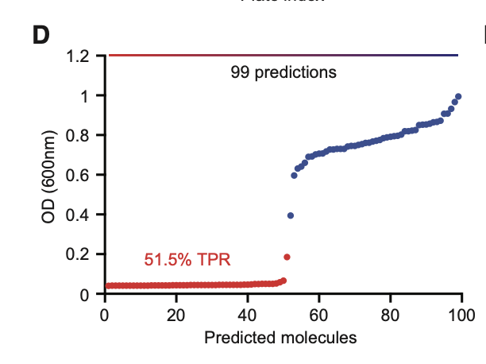

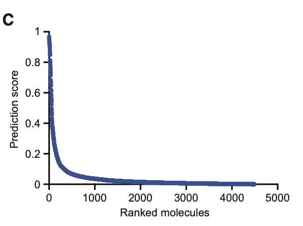

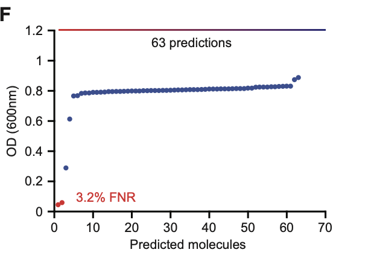

Positive correlation between growth inhibitory activity (red) and predicted D-MPNN derived ranking

# Halicin

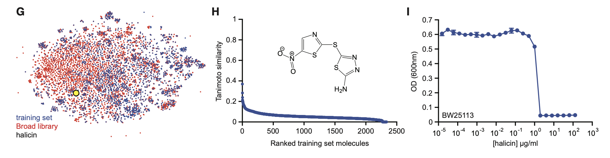

Halicin is fished out by combining the tanimoto similarity with training set and clinical toxicity values with primary focus on lower toxicity and phase 1/2/3 study (Halicin shown as yellow circle)

Lowest similarity with training set is our primary target

Experiment shows Halicin’s low MIC value of 2 microgram/mL

Chemprop helped in the identification a potential new compound with antibiotic-like properties

# Screening billion compound library -- ZINC

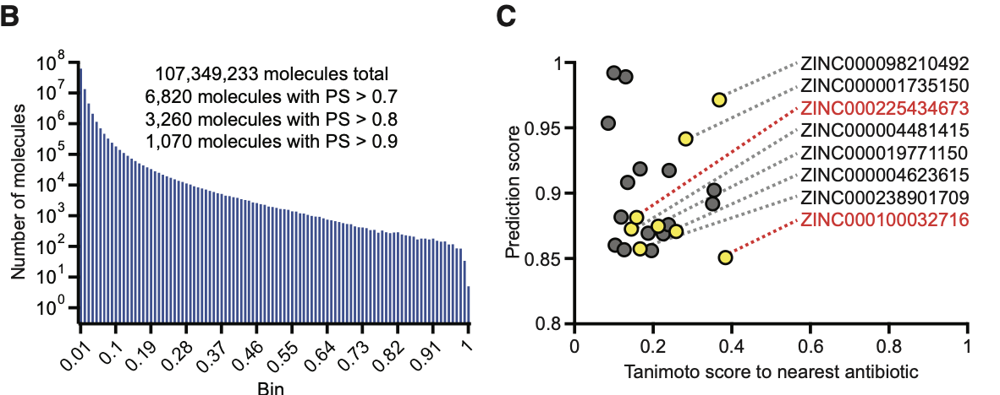

# Two ZINC-derived compounds are promising

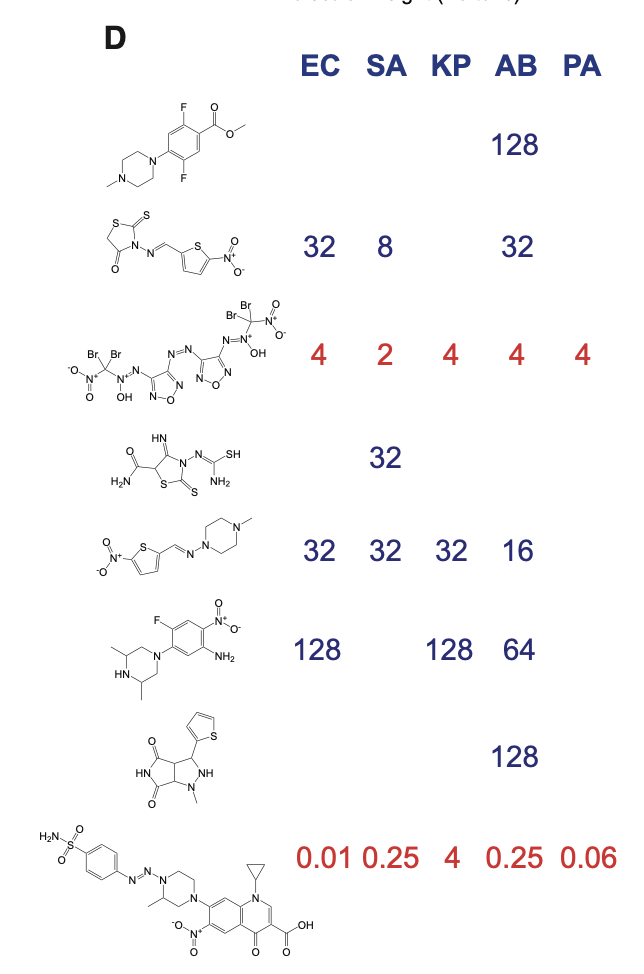

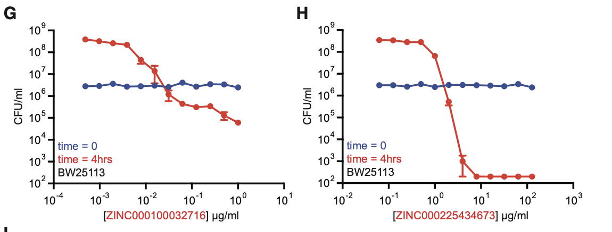

Chemprop helped in the identification a potential new compounds with antibiotic-like properties

# Summary

Deep learning approach as applied in the field of small-molecule therapeutics

Application of the deep learning approach in the field of antibiotic drug discovery

HPC is required to harness the full power of deep-learning based programs

# Data Analytics Center – Collaborations!

[https://www.rc.virginia.edu/service/dac/](https://www.rc.virginia.edu/service/dac/)

# Need more help?

_Office Hours via Zoom_

Tuesdays:       	3 pm - 5 pm

Thursdays:     	10 am - noon

Zoom Links are available at [https://www.rc.virginia.edu/support/#office-hours](https://www.rc.virginia.edu/support/#office-hours)

  * Website:
  * [https://rc.virginia.edu](https://rc.virginia.edu/)

[https://virginia.az1.qualtrics.com/jfe/form/SV_7OtK8IEI2SEBQa2](https://virginia.az1.qualtrics.com/jfe/form/SV_7OtK8IEI2SEBQa2)

  * Website:
  * [https://rc.virginia.edu](https://rc.virginia.edu/)
