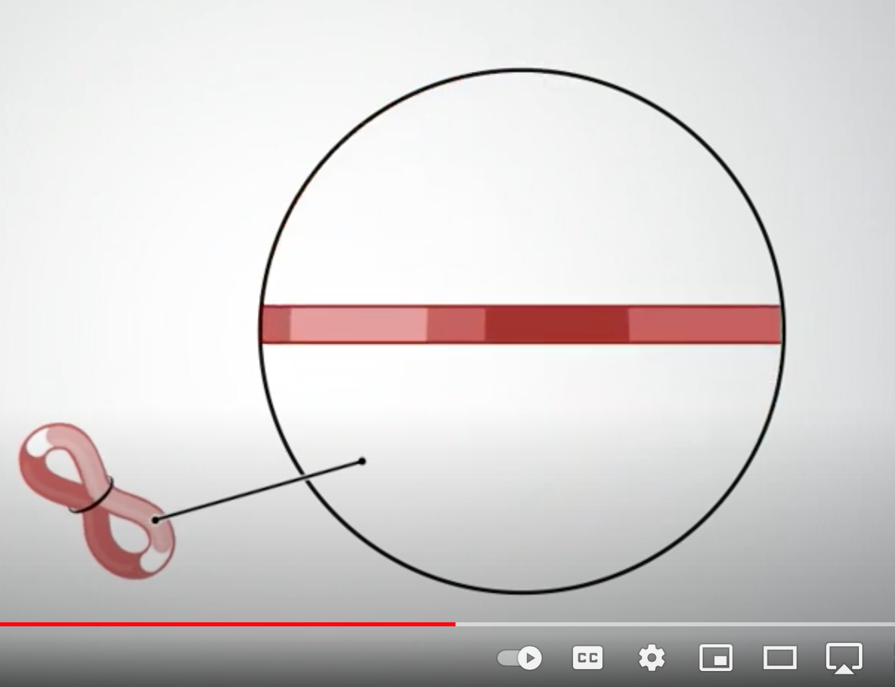
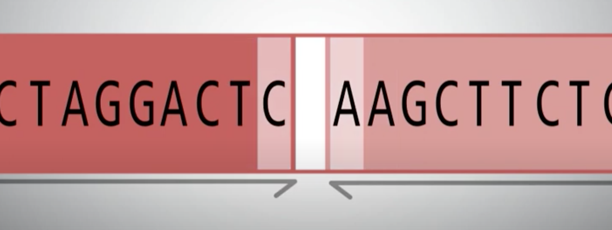
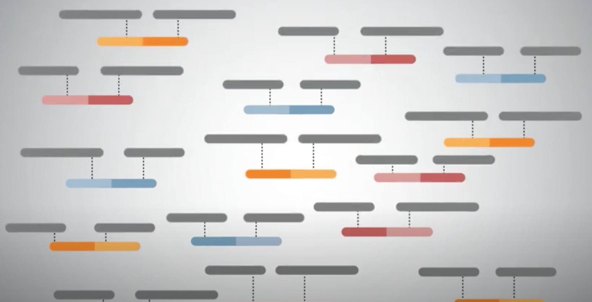

Sequencing Technologies

* Illumina - short read sequences (< 1kb)
* - whole genome sequencing, exomes, micro RNA, single-cell apps
* PacBio - long read sequences (~ 25 kb)
  * - Revio sequencer at UVA
* Nanopore -  “ultra-long” sequences (up to 1Mb)
* HiC -  crosslinking technique to capture interactions within genome

PacBio Hi Fi reads

Long reads - 25kb

99.9% read quality (Q30)  - better than some short-read contigs

Distinguish repeats rather than spanning full repeats

Limited length

Lower throughput than Nanopore

Wenger et al. 2019  _Nature Biotechnology_

---

Not know for when first appeared on the market. ~2010

Phased Genome Assemblies

“Pseudo-haplotypes” - mixture of both types

How do we get phased genomes?

Chin et al.  _Nat Meth _ 2016

Phased Genome Assemblies

https://www.pacb.com/blog/ploidy-haplotypes-and-phasing/

Nanopore sequencing

“Ultra-long” reads

Up to 4 Mb read length

95% read quality

Engineered

Long lengths

Able to span repeat regions

Limited quality

Took a while for technology to catch up

Sample-to-sequence

Kate Rubins, ISS

Shafin et al.  _Nature Biotechnology_ , 2020

---

Oxford - Long and noisy data
 To scale it – 8cm string through Human fist – 3.2kb rope in minutes, reading nucletides as you pass it 

Nanopore sequencing - detecting repeats

Using long reads and coverage to detect repeats

More frequently sequenced ligated, closer are in genome

Junctions between adjacent sequences

Ligations are paired-end sequenced and reads mapped against draft genome

https://www.youtube.com/watch?v=-MxEw3IXUWU

---

Proximity lkigation

Hi-C - genomic technique to capture chromatin conformation

Contact map with frequency of contact: black - more contact, dotted red - less
