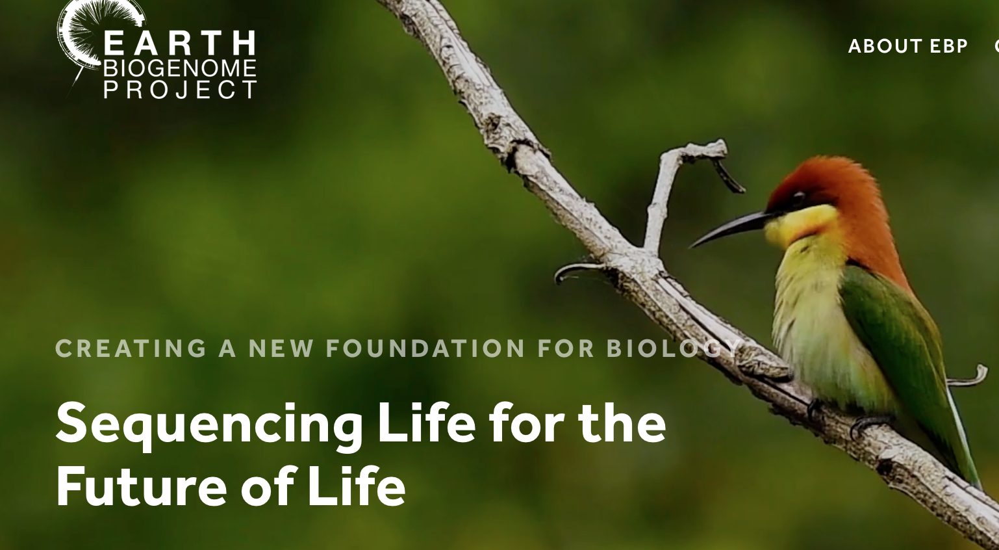
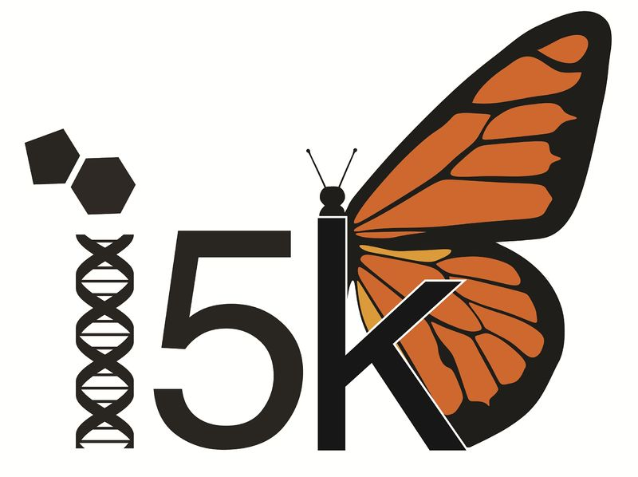
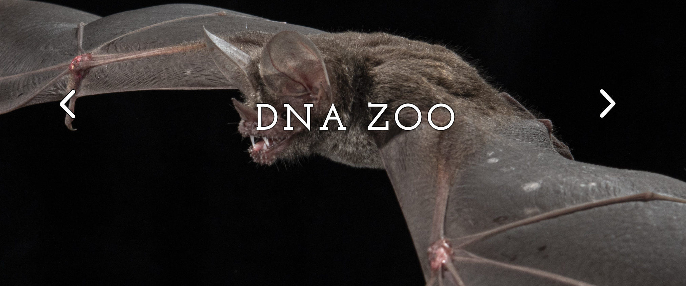
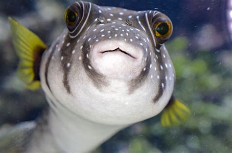
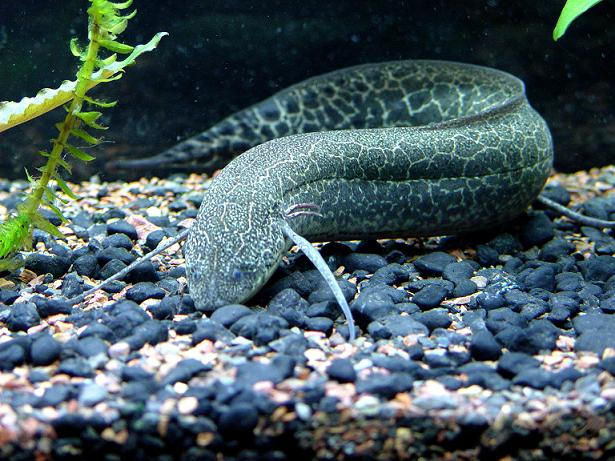
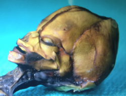
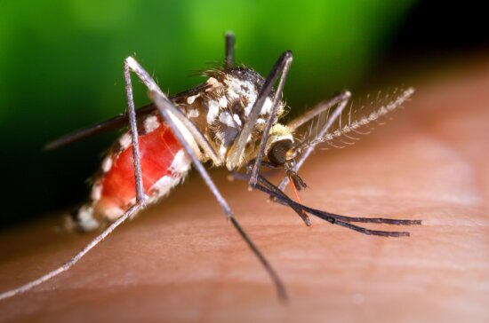
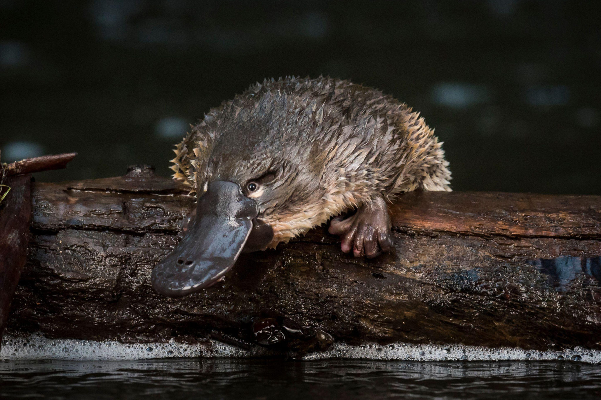

Reference Genome

---

Pangenomes
Genome assembly now genomes assembly
Technology outpacing policy
Pan-genomes are constructed from various many available resources such as the reference sequence and its variants, raw reads and haplotype reference panels.

26 denovo assemblies

3 previously reported assemblies

Searching for variants that were undetectable in single reference genome

---

Human genome >1000diverse human haplotypes

Humans

3.2 billion

Fugu - 400 million

Wheat - hexaploid, 15.3 billion bases

Bhattacharya et al. 2018    _Genome Research _

_Anopheles_  mosquitos

3 chromosomes

African lungfish - 400 billion

_Axolotl_  salamander -  32 billion

Platypus -10 sex chromosomes