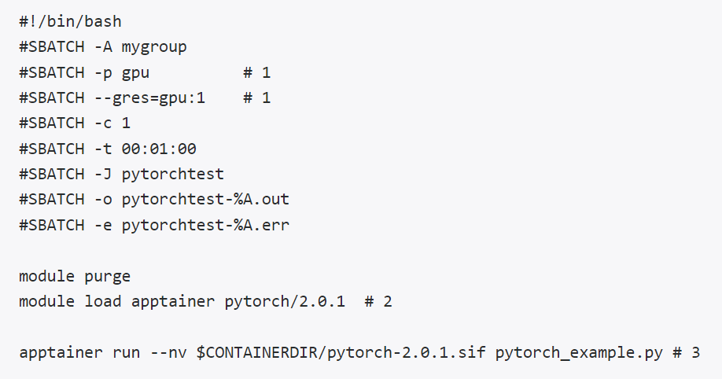

# Large language models (LLMs) on HPC

# Topics

* Introduction
* Set up/Installation
* HPC resources for LLMs
* Model selection
* Inference
* Fine-tuning
* Slurm scripts
* Wrap-up

# What is an LLM?

* A Large Language Model (LLM) is a deep learning model that generally solves a natural language processing problem
  * Ex) ChatGPT
* There are many different types of LLMs that are suited to particular tasks
* Hubs such as [Hugging Face](https://huggingface.co/) provide many LLMs for download

Graphic Source: [https://attri.ai/blog/introduction-to-large-language-models](https://attri.ai/blog/introduction-to-large-language-models)

---

You may hear people talk about LLMs for image classification, computer vision, etc.  These are also called VLMs (vision language models) and we are not covering those today.

# What types of NLP problems can LLMs solve?

__Examples:__

__Classify__ : sentiment analysis of Tweets

__Rewrite__ : text translation

__Extract__ : find company names in news articles

__Generate__ : create a story

__Search__ : question answering from a text passage

__Applications: __ chatbots, virtual assistants, recommendation systems

Source: [https://attri.ai/blog/introduction-to-large-language-models](https://attri.ai/blog/introduction-to-large-language-models)

# Terminology

* LLMs can have billions of  __parameters__  (unknown quantities in the model)
* An LLM is  __trained __ (model parameters are determined) using a very large amount of text data
* A  __pre-trained__  LLM has already been trained.  This process allows the model to “learn” the language.
* A  __fine-tuned__  LLM is a pre-trained LLM that then is further trained on additional data for a specific task.  Model parameters are updated in the fine-tuning process.
* __Inference__  is the process in which a trained (or fine-tuned) LLM makes a prediction for a given input

# Terminology cont.

* The input to an LLM is a  __sequence__  of  __tokens __ (words, characters, subwords, etc.)
* The  __batch size __ for an LLM is the number of sequences passed to the model at once
* Generally, raw text is passed through a  __tokenizer__  which processes it into tokens and sequences and then numerical data which can be sent to the LLM.

# Theory Behind LLMs

* LLMs are based on the transformer architecture
* We are not covering this in today’s workshop
* For more information:
  * _[Attention Is All You Need](https://arxiv.org/abs/1706.03762)_  _ _ by Vaswani et al. (2017)
  * [https://jalammar.github.io/illustrated-transformer/](https://jalammar.github.io/illustrated-transformer/)

Figure: [https://arxiv.org/pdf/1706.03762](https://arxiv.org/pdf/1706.03762) ( _Attention Is All You Need_ )

# Set up/installation

## Software for LLMs

* We will use Python deep learning libraries to run and fine tune LLMs
  * PyTorch
  * TensorFlow/Keras
* The [transformers](https://huggingface.co/docs/transformers/en/index) package:
  * Works with PyTorch and TensorFlow
  * “Transformers provides APIs and tools to easily download and train state-of-the-art pretrained models”
    * Natural Language Processing (our focus for today)
    * Computer Vision
    * Audio
    * Multimodal

---

- There are packages in R/Rstudio that can do deep learning and/or use LLMs.  We are not using those in this workshop

# Software Modules and Containers

* “Software on Rivanna is accessed via environment  __modules__  or  __containers__ .”
* __Software Module: __
  * Ex: R, Rstudio, JupyterLab, TensorFlow, PyTorch
  * List of software available on Rivanna: [https://www.rc.virginia.edu/userinfo/rivanna/software/complete-list/](https://www.rc.virginia.edu/userinfo/rivanna/software/complete-list/)
* __Container: __
  * “Containers bundle an application, the libraries and other executables it may need, and even the data used with the application into portable, self-contained files called images.”
  * “Containers simplify installation and management of software with complex dependencies and can also be used to package workflows.”

## Open OnDemand – JupyterLab

Click on the kernel to open a Jupyter Notebook.

Packages from the selected kernel will be available for use in the notebook.

# Exercise 1 – Log On, Copy Materials

* Log in to Rivanna using the Interactive partition.
  * 2 hours, 4 cores
  * Allocation: hpc_training
  * GPU: yes, 1
  * Show Additional Options: Yes, Optional: Slurm Option: --reservation=llm_workshop
* Copy the workshop folder /project/hpc_training/llms_on_hpc to your home or scratch account.
* cp –r /project/hpc_training/llms_on_hpc ~/<…>
* OR
* cp –r /project/hpc_training/llms_on_hpc /scratch/<ID>/<…>
* Open a Jupyter Notebook for PyTorch 2.4.0.
* In the first cell of the notebook run the command pip list to see a list of software (i.e., packages) available in the PyTorch  2.4.0 kernel.
* Do you see a package called “transformers” or “datasets”?

# Install transformers and datasets packages

Using the PyTorch container:

`module load apptainer pytorch/2.4.0`

`apptainer exec $CONTAINERDIR/pytorch-2.4.0.sif pip install transformers datasets`

* These packages are provided by Hugging Face (more details on Hugging Face in a bit)
* For the fine-tuning example we will do later today, we will also need to install the accelerate and evaluate packages.

`apptainer exec $CONTAINERDIR/pytorch-2.4.0.sif pip install accelerate evaluate`

# Downloading LLMs on UVA HPC

* When you use a transformers LLM for inference, it is downloaded to your home account
  * ~/.cache/huggingface/hub
* Datasets (from the datasets package) are also downloaded to your home account
  * ~/.cache/huggingface/datasets
* Make sure you have enough storage in your home account!
* As of now, each user has 50GB of home storage.  But after the October 15th maintenance, each user will have 200GB of home storage.

# Exercise 2 – Installing LLM Software

1. Install the transformers and datasets packages in the PyTorch 2.4.0 container.

2. Open the ex2.ipynb file from the workshop folder.

3. Run each cell of this notebook.

# HPC Resources Needed for LLMs

* HPC Resources:
  * CPU memory
  * CPU cores
  * GPU
* The resources you choose will depend on your LLM use
  * Inference
  * Fine-tuning
  * Training an LLM from scratch (we are not covering this today)

# GPUs for LLMs (or Deep Learning)

* Because LLMs involve a huge number of computations, we need a form of parallelization to speed up the process.
  * Ex: ChatGPT free version (based on GPT-3.5): 175 billion parameters,
  * ChatGPT paid version (based on GPT-4): over 1 trillion parameters
* GPUs (graphics processing units) provide the needed parallelization and speed up.
* All the major deep learning Python libraries (Tensorflow, PyTorch, Keras,…) support the use of GPUs and allow users to distribute their code over multiple GPUs.
* New GPUs have been developed and optimized specifically for deep learning.

# Computations on the CPU or GPU?

| Task | CPU or GPU |
| :-: | :-: |
| Tokenization | CPU |
| LLM Training/Fine-tuning | GPU |
| LLM Inference | Either, but GPU recommended |

**When you request memory for HPC, that is CPU memory.**

If you request a GPU, you will receive all of that GPU’s memory.

# General GPU workflow

* Create data on the CPU

* Send data from the CPU to the GPU (for DL this is done in batches)

* Compute result on the GPU

* Send the result back to the CPU

* Depending on the DL framework/LLM pipeline you are using, some of these steps may be automatically done for you.

# GPUs on UVA HPC

| GPU | Full Name | Year Launched | Memory | # of Tensor Cores |
| :-: | :-: | :-: | :-: | :-: |
| A100 | NVIDIA A100 | 2020 | 40GB or 80GB | 432 (3rd gen) |
| A6000 | NVIDIA RTX A6000 | 2020 | 48GB | 336 (3rd gen) |
| A40 | NVIDIA A40 | 2020 | 48GB | 336 (3rd gen) |
| RTX3090 | NVIDIA GeForce RTX 3090 | 2020 | 24GB | 328 (3rd gen) |
| RTX2080Ti | NVIDIA GeForce RTX 2080 Ti | 2018 | 11GB | 544 (2nd gen) |
| V100 | NVIDIA V100 | 2018 | 32GB | 640 (1st gen) |

# UVA HPC - NVIDIA DGX BasePOD

* 10 DGX A100 nodes
  * 8 NVIDIA A100 GPUs.
  * 80 GB GPU memory options.
  * Dual AMD EPYC™ 7742 CPUs, 128 total cores, 2.25 GHz (base), 3.4 GHz (max boost).
  * 2 TB of system memory.
  * Two 1.92 TB M.2 NVMe drives for DGX OS, eight 3.84 TB U.2 NVMe drives forstorage/cache.
* Advanced Features:
  * NVLink for fast multi-GPU communication
  * GPUDirect RDMA Peer Memory for fast multi-node multi-GPU communication
  * GPUDirect Storage with 200 TB IBM ESS3200 (NVMe) SpectrumScale storage array
* Ideal Scenarios:
  * Job needs multiple GPUs on a single node or multi node
  * Job (single or multi-GPU) is I/O intensive
  * Job (single or multi-GPU) requires more than 40GB of GPU memory

---

The POD is good if you need multiple GPUs and very fast computation.

# Wait Time in the Queue

* You may not need to request an A100 GPU!
* Requesting an A100 may mean you wait in the queue for a much longer time than using another GPU,
* This could give you a slower overall time (wait time + execution time) than if you had used another GPU.

**When you request memory for HPC, that is CPU memory.**

If you request a GPU, you will receive all of the GPU memory.

# GPU access on Rivanna

__General__

Choose “GPU” or “Interactive” as the Rivanna Partition in OOD

Optional: choose GPU type and number of GPUs

__POD nodes__

POD nodes are contained in the gpu partition with a specific Slurm constraint.

* Slurm script:
  * #SBATCH -p gpu
  * #SBATCH --gres=gpu:a100:X	# X number of GPUs
  * #SBATCH -C gpupod
* Open OnDemand:
  * --constraint=gpupod

---

Only one person can be using a GPU at a time.

# GPU Dashboard to Check CPU and GPU Efficiency

* GPU Dashboard is included in OOD (Open On Demand)
* This will be demoed during the exercises in today’s workshop
* Includes GPU and CPU memory and utilization tracking in real time
* Helpful for GPU selection in future OOD sessions

# GPU Memory Usage

__PyTorch__

* Correct GPU memory usage will be reported by GPU Dashboard

**TensorFlow/Keras** 

* By default, TF automatically allocates ALL of the GPU memory so GPU Dashboard may show that all (or almost all) of the GPU memory is being used
* To track the amount of GPU memory actually used, you can add these lines to your python script:

`import os`

`os.environ['TF_FORCE_GPU_ALLOW_GROWTH'] = 'true'`

More Info: [https://www.tensorflow.org/guide/gpu#limiting_gpu_memory_growth](https://www.tensorflow.org/guide/gpu#limiting_gpu_memory_growth)

---

Homework for Keras users: try out GPU dashboard and see if it reports all of the GPU memory as used

# Resource Allocation for LLMs

Resource needs will vary based on LLM use (inference, fine-tuning, etc.)

We will cover good starting choices in the Inference and Fine-Tuning sections of today’s workshop

# Model Selection

## Hugging Face

* [Hugging Face](https://huggingface.co/) is a machine learning platform that includes
  * Models,
  * Datasets, and
  * Spaces (AI apps)
* Information and/or code is provided to show how to use the models and datasets
  * Information on how the models were trained, benchmarked, etc. may also be provided
* Models and datasets are filterable by task (e.g., text classification, question answering)
* Some models may require you to sign an agreement before using them
  
---

Models and datasets include metrics such as number of downloads and date of last update.

# Planning to Choose a Hugging Face Model

* What type of task will you do?  (text classification, question answering, etc.)
* What type of data will you work with?  Is the text data from a specific domain (financial, scientific, Tweets, etc.)?  What language is it in?
  * More specific text data will most likely need a fine-tuned model, otherwise a more general LLM may work better
* If you need to fine-tune a model, do you have the computational resources to do so?
  * Larger models (i.e., models with more parameters) will need more resources

Source and more information: [https://medium.com/@harshapulletikurti/choosing-the-correct-llm-model-from-hugging-face-hub-183fc6198295](https://medium.com/@harshapulletikurti/choosing-the-correct-llm-model-from-hugging-face-hub-183fc6198295)

# Choosing a Hugging Face Model

* Appropriately use model filters (task, language, license, etc.)
* Select either a general LLM or a fine-tuned model
* Check number of downloads
  * While a more popular model isn’t always better, it is good to know what models other people find useful
* Check model size (how to examples on next slides)
* Read model card (documentation), including
  * The datasets that the model was trained on and fine-tuned on (if applicable)
  * The model license (does this meet your needs?)
  * Any benchmarking results

Source and more information: [https://medium.com/@harshapulletikurti/choosing-the-correct-llm-model-from-hugging-face-hub-183fc6198295](https://medium.com/@harshapulletikurti/choosing-the-correct-llm-model-from-hugging-face-hub-183fc6198295)

# Finding Model Size on Hugging Face 

* Use the information on the model card

* Model size (B) = (# of parameters) * (bytes/parameter)

---

* Use information on the Files and versions tab

* Look for the pytorch model in the list of files.  (It will have a .bin extension.)

* The size of the model will be given

# Benchmarking LLMs

* Once you have narrowed down your choice of LLMs to a few, benchmarking can help you make a final decision on a model
* Benchmarking results may be given in the model documentation on standard (or other) datasets.
* It is always good to test models on your data!

# Inference

## What is Inference?

* __Inference__  is the process in which a trained (or fine-tuned) LLM makes a prediction for a given input.

EOS: end of sequence

# Using an LLM

* LLMs can be used as-is (i.e., out-of-the-box) or after fine-tuning
* Hugging Face model cards will generally provide code for how to get started
  * Code may be PyTorch or TensorFlow, “raw” (using the model directly), or pipeline code (using the pipeline from transformers library)
  * Ex 1: [https://huggingface.co/distilbert/distilbert-base-uncased-finetuned-sst-2-english](https://huggingface.co/distilbert/distilbert-base-uncased-finetuned-sst-2-english)
    * provides “raw” PyTorch code
  * Ex 2: [https://huggingface.co/facebook/bart-large-cnn](https://huggingface.co/facebook/bart-large-cnn)
    * provides pipeline code
* Code for at least loading the model (directly and using the pipeline) is provided by clicking the “Use this model” button on Hugging Face
  * You may have to dig through the links to find the code you need

# Transformers Pipeline

* Consists of a tokenizer, model, and post processing for getting model output
* Pros
  * Easy to use
  * Efficiently manages data batching and gpu memory for you – good for HPC!
* Cons
  * Harder to debug when something goes wrong
* Recommendation:
  * Use pipeline first
  * If you get errors, you may have to use the model directly to diagnose the problem

Source and more information: [https://huggingface.co/docs/transformers/pipeline_tutorial](https://huggingface.co/docs/transformers/pipeline_tutorial)

---

Pipeline “Hides” details from the programmer – good and bad

Tokenizer runs on CPU

Model runs on GPU

# Exercise 3a 

## Direct LLM Usage vs Pipeline - Text Summarization

* Open the ex3a.ipynb file from the workshop folder.

* Run each cell of this notebook and complete the EXERCISES as you go.

* Watch the GPU memory using GPU Dashboard as you run the cells.

# Pipeline Debugging Tips

Use the CPU: error messages for code running on the CPU tend to be more helpful than those for code running on the GPU.

Run the pipeline tokenizer and model separately to see where the error is being generated.

Check out the data you are feeding to the pipeline that is causing the error.  Is it somehow different than other pieces of data?

If you get stuck, please [submit a ticket to RC](https://www.rc.virginia.edu/form/support-request/).  We can help!

# Ex 3b 

## Hugging Face Datasets & Debugging - Text Summarization

Open the ex3b.ipynb file from the workshop folder.

We will go over this file together.

# Pipeline Batching with GPU

* Data (sequences) are passed in batches to the GPU, instead of one at a time
* This allows the GPU to stay busy computing without waiting on more data to be passed from the CPU
* Batching can be used if the pipeline is passed a list of data or a dataset from the datasets package
* Batching may or may not speed up your code!  You will need to test it.
* The default batch_size for a pipeline is 1.
* If a dataset from the datasets package is used, DataLoader is being called under the hood in the pipeline.
  * Use multiple CPU cores and set the num_workers parameter (default is 8).

Source and more information: [https://huggingface.co/docs/transformers/en/main_classes/pipelines#pipeline-batching](https://huggingface.co/docs/transformers/en/main_classes/pipelines#pipeline-batching)

---

Note: Do not use batching on cpu.

# Batch Size and GPU Memory

* As batch_size increases, so does GPU memory usage
* If you get an OOM (out of memory) error while using the GPU, try decreasing the LLM batch size.

Source and more information: [https://huggingface.co/docs/transformers/en/main_classes/pipelines#pipeline-batching](https://huggingface.co/docs/transformers/en/main_classes/pipelines#pipeline-batching)

# Ex 3c 

## Batch Size and Num Workers - Text Summarization

* Open the ex3c.ipynb file from the workshop folder.

* Run each cell of this notebook and complete the EXERCISES as you go.

* Watch the GPU memory using GPU Dashboard as you run the cells.

# CPU Resource Allocation for Inference

* __CPU memory__
  * __Interactive Partition: __ 6GB RAM per core requested
  * __Standard Partition: __ 9GB RAM per core requested (no GPU)
  * __GPU partition__ : you can select the amount of CPU RAM
  * “You should have enough RAM to comfortably work with your GPU.”
  * In other words, request at least as much RAM as the GPU you select.
  * If you are using a large dataset and/or want to do extensive preprocessing, more RAM is probably helpful
* __CPU cores__
  * Use multiple cores - especially if you are using a dataset from the Datasets package and a GPU.  (So that DataLoader can utilize multiple cores under the hood.)
  * I usually start with 8

---

Check your resource usage using GPU Dashboard, seff (completed jobs), or sstat (running jobs)

It may be the case that even if CPU Efficiency is a low percentage, you need all of the requested CPU cores for a specific part of the code, e.g., data preprocessing.
In this case, request the number of CPU cores that you need for the compute intensive part of the code.

# Selecting a GPU for Inference

* Select a GPU based on how much GPU memory you will need.
* The GPU memory will contain:
  * the LLM (i.e., the model weights),
  * input and output data, and
  * extra variables for the forward pass (about 20% of the LLM size).
* LLM Memory (B): (# parameters) * (# bytes/parameter)
  * # bytes/parameter depends on the model’s precision, e.g., fp32 is 4 bytes/parameter
* __GPU Memory Estimate for Inference (B): __ 1.2 * (LLM Memory in B)
* __NOTE: __ I have found this formula to underestimate UVA GPU memory.  It is most likely a ballpark estimate, but I recommend tracking GPU memory using the GPU Dashboard to make a more informed GPU selection.

---

Note: B is for bytes.

# Exercise 4 

## Select a GPU for Inference

Suppose you are going to run inference using the model [google-](https://huggingface.co/google-bert/bert-base-uncased)[bert](https://huggingface.co/google-bert/bert-base-uncased)[/](https://huggingface.co/google-bert/bert-base-uncased)[bert](https://huggingface.co/google-bert/bert-base-uncased)[-base-uncased](https://huggingface.co/google-bert/bert-base-uncased).  Which UVA GPU would you select and why?

| UVA GPU | Full Name | Year Launched | Memory | # of Tensor Cores |
| :-: | :-: | :-: | :-: | :-: |
| A100 | NVIDIA A100 | 2020 | 40GB or 80GB | 432 (3rd gen) |
| A6000 | NVIDIA RTX A6000 | 2020 | 48GB | 336 (3rd gen) |
| A40 | NVIDIA A40 | 2020 | 48GB | 336 (3rd gen) |
| RTX3090 | NVIDIA GeForce RTX 3090 | 2020 | 24GB | 328 (3rd gen) |
| RTX2080Ti | NVIDIA GeForce RTX 2080 Ti | 2018 | 11GB | 544 (2nd gen) |
| V100 | NVIDIA V100 | 2018 | 32GB | 640 (1st gen) |

# Fine-Tuning

## What is Fine-Tuning?

* LLMs are pre-trained on huge amounts of text data to learn general language patterns
* LLMs can be fine-tuned on a much smaller amount of data to excel at a particular task (e.g., classification of financial text)

Note: LLM pre-training is generally unsupervised.

# Types of Fine-Tuning

* Fine-tuning can be a supervised or unsupervised process and involves:
  * Changing some of the LLM weights,
  * __Changing all of the LLM weights (full fine-tuning), __ or
  * Parameter Efficient Fine-Tuning (PEFT), i.e., keeping the LLM weights the same but updating a small number of additional parameters that will adjust the LLM weights (e.g., LoRA).
* The more weights you update, the more computational resources you need

# Why use Fine-Tuning?

Example:

[distilbert](https://huggingface.co/distilbert/distilbert-base-uncased)[/](https://huggingface.co/distilbert/distilbert-base-uncased)[distilbert](https://huggingface.co/distilbert/distilbert-base-uncased)[-base-uncased](https://huggingface.co/distilbert/distilbert-base-uncased) was pre-trained on [BookCorpus](https://huggingface.co/datasets/bookcorpus/bookcorpus) and [English Wikipedia](https://huggingface.co/datasets/legacy-datasets/wikipedia), ~25GB of data

[distilbert](https://huggingface.co/distilbert/distilbert-base-uncased-finetuned-sst-2-english)[/distilbert-base-uncased-finetuned-sst-2-english ](https://huggingface.co/distilbert/distilbert-base-uncased-finetuned-sst-2-english)was fine-tuned on [Stanford Sentiment Treebank (sst2)](https://huggingface.co/datasets/stanfordnlp/sst2), ~5MB of data

# Example - Supervised Full Fine-Tuning

* The data for supervised learning includes labels, e.g., a text review and sentiment label (positive or negative).
* An LLM is generally pre-trained for the task of masked language modeling
* Through fine-tuning we can change the task to text classification
  * This means that the LLM head (the last layers) will change to text classification layers
  * There is a transformers function that will do this for us

# Hugging Face Trainer Class

* The Trainer class allows a user to train or fine-tune a model using a convenient function, rather than using native PyTorch.
* When training, the Trainer will automatically use the GPU if one is present.
* There are  __many __ options that can be set for the TrainingArguments (number of epochs, learning rate, save strategy, etc.)
  * [https://huggingface.co/docs/transformers/main_classes/trainer#transformers.TrainingArguments](https://huggingface.co/docs/transformers/main_classes/trainer#transformers.TrainingArguments)
* The Trainer will not automatically evaluate the LLM, so we will pass it an evaluation metric.

# Exercise 5 

## Supervised Full Fine-Tuning - Text Classification

* Open the ex4.ipynb file from the workshop folder.

* We will go over this file together.

# CPU Resource Allocation for Fine-Tuning

* __CPU memory__
  * __Interactive Partition: __ 6GB RAM per core requested
  * __Standard Partition: __ 9GB RAM per core requested (no GPU)
  * __GPU partition__ : you can select the amount of CPU RAM
  * “You should have enough RAM to comfortably work with your GPU.”
  * In other words, request at least as much RAM as the GPU you select.
  * If you are using a large dataset and/or want to do extensive preprocessing, more RAM is probably helpful
* __CPU cores__
  * Use multiple cores - especially if you are using a dataset from the Datasets package and a GPU.  (So that DataLoader can utilize multiple cores under the hood.)
  * I usually start with 8

---

Notes: 

Check your resource usage using GPU Dashboard, seff (completed jobs), or sstat (running jobs)

It may be the case that even if CPU Efficiency is a low percentage, you need all of the requested CPU cores for a specific part of the code, e.g., data preprocessing.
In this case, request the number of CPU cores that you need for the compute intensive part of the code.

# Selecting a GPU for Fine-Tuning

* Select a GPU based on how much GPU memory you will need.
* But, it is a hard problem to determine how much GPU memory a LLM will need for training  __before__  training the model
* A training iteration requires a forward and backward pass of the model. In addition to storing the LLM, training also requires additional storage space such as
  * Optimizer states
  * Gradients
  * Activations
  * Data (how much is determined by the batch size)

---

* According to the [Hugging Face Model Memory Calculator](https://huggingface.co/spaces/hf-accelerate/model-memory-usage), for a batch size of 1,  __GPU Memory Estimate for Fine-Tuning (B): __ 4 * (LLM Memory in B)
  * While this formula can help ballpark an estimate, I recommend tracking GPU memory using the GPU Dashboard to make a more informed GPU selection.
* For a more specific formula, see [https://blog.eleuther.ai/transformer-math/](https://blog.eleuther.ai/transformer-math/)
  * This blog requires some understanding of transformers
* Determining LLM memory for fine-tuning is an active area of research.  The paper [LLMem](https://arxiv.org/abs/2404.10933)[: Estimating GPU Memory Usage for Fine-Tuning Pre-Trained LLMs](https://arxiv.org/abs/2404.10933) by Kim, et al. (April 2024) presents a method for doing so within 3% of the actual memory required.

# General Advice

If you are learning about LLMs and doing tutorials, choose a small LLM.  The GPUs in the Interactive partition are probably ok to use.

You can leave the GPU choice as default on the GPU partition and work on whichever GPU you get or choose a GPU with a smaller amount of memory first.

Fine-tune your model for one epoch and monitor the GPU memory usage using GPU Dashboard.

If you are getting OOM (out of memory) GPU errors, try lowering the batch size.

There are other advanced techniques to reduce the amount of memory used in fine-tuning.

# Slurm Scripts

## What is a Slurm Script?

* HPC environments are generally shared resources among a group of users.
* In order to manage user jobs, we use Slurm, a resource manager for Linux clusters.
  * This includes deciding which jobs run, when those jobs run, and which node(s) they run on.
* A Slurm script gives Slurm the information it needs to run a job.
  * Computational resources
  * Necessary software
  * Command(s) to execute the code file

---

From our website: “Jobs are submitted to the Slurm controller, which queues them until the system is ready to run them. The controller selects which jobs to run, when to run them, and how to place them on the compute node or nodes, according to a predetermined site policy meant to balance competing user needs and to maximize efficient use of cluster resources.”

# Example Slurm Script - PyTorch

__Set Up Resources__

-A: allocation

-p: partition

--gres=gpu:1 :use 1 gpu

-c: number of cores

-t: time limit

-J: job name

-o: standard output file (%A is the job #)

-e: standard error file (%A is the job #)

$CONTAINERDIR/pytorch-2.4.0.sif

Source: [https://www.rc.virginia.edu/userinfo/rivanna/software/pytorch/#pytorch-slurm-jobs](https://www.rc.virginia.edu/userinfo/rivanna/software/pytorch/#pytorch-slurm-jobs)

---

-The default command defined in each container is “python” so using “run” basically executes “python file_name.py”
- The load software and run code lines are what a user would use to run their script at the command line
- TF example: [https://www.rc.virginia.edu/userinfo/rivanna/software/tensorflow/#tensorflow-slurm-jobs](https://www.rc.virginia.edu/userinfo/rivanna/software/tensorflow/#tensorflow-slurm-jobs) 

# More Slurm Options

* To request a specific amount of memory per node:
  * Ex: --mem=64G
  * Units are given with a suffix (K, M, G, or T).  If no unit is given, megabytes is assumed.
* Other options available at [https://slurm.schedmd.com/sbatch.html](https://slurm.schedmd.com/sbatch.html)
* For more information, see the RC tutorial [Using SLURM from a Terminal](https://learning.rc.virginia.edu/tutorials/slurm-from-cli/).
* Tip: if you have a Jupyter notebook file (.ipynb) that you would like to run using a SLURM script, first convert it to a .py file using the following command (make sure you are in the directory that contains the file): jupyter nbconvert --to python file_name.ipynb

# Wrap-up

## Recap

* We learned…
  * What an LLM is, the types of problems LLMs can solve, and LLM terminology
  * How to download and set up LLM software on UVA HPC
  * The HPC resources (CPU memory, CPU cores, GPU) needed for LLM inference and fine-tuning
  * How to use GPU Dashboard on UVA HPC
  * How to select an LLM from Hugging Face for a given task
  * LLM inference and supervised full fine-tuning on UVA HPC
  * How to write a Slurm script for LLM code using PyTorch

# Research Computing Data Analytics Center

[https://www.rc.virginia.edu/service/dac/](https://www.rc.virginia.edu/service/dac/)

# Need more help?

_Office Hours via Zoom_

Tuesdays:       	3 pm - 5 pm

Thursdays:     	10 am - noon

Zoom Links are available at https://www.rc.virginia.edu/support/#office-hours

  * Website:
  * https://rc.virginia.edu

## Survey

  * [https://virginia.az1.qualtrics.com/jfe/form/SV_a5INnAn5S8HAScC](https://virginia.az1.qualtrics.com/jfe/form/SV_a5INnAn5S8HAScC)
