# Parallel Matlab on Rivanna

Research Computing Workshop

By Ed Hall

# Why parallel computing?

* Save time and tackle increasingly complex problems
* Reduce computation time by using available compute cores and GPUs
* Why parallel computing with MATLAB and Simulink?
  * Accelerate workflows with minimal to no code changes to your original code
  * Scale computations to clusters and clouds
  * Focus on your engineering and research, not the computation


---

What's the need for Parallel Computing you might ask or what's the motivation for it? 
The size of the problems we need to solve is increasing and there's a growing need to gain faster helping bring products to market quickly. And this need exists for engineers and researchers across multiple industries and applications!  
Another motivation is simply the fact that hardware is becoming powerful - modern computers, even laptops, are parallel in architecture with multiple processors/cores. Access to GPUs, cluster of computers or even cloud computing infrastructure is becoming common.
However the challenge lies in the fact that you need software to utilize the power of this hardware and hence parallel computing expertise is a requirement

How do MathWorks Parallel Computing Tools help ?
Enables Engineers, scientists and researchers like yourself leverage the computational power of available hardware without the need to be a parallel computing expert
Accelerate your workflows with minimal changes to your existing code 
Allow you to seamlessly scale your applications and models from your Desktop to clusters in your organization or on the cloud if you need access to more computational power/memory. 

Let's look at some examples of customer across multiple industries who have been using MathWorks parallel computing tools and why they chose parallel computing 

## Benefits of parallel computing

---

Here are some examples of where people are successfully using our parallel computing tools.  All of these people are scaling up their problems to run on additional hardware and seeing significant benefits from it.  

Here are examples from some of our user stories of what can be done with our parallel computing tools.  In many of these cases, they wrote the code once and could run in it many different environments.  Some of these are simple Monte Carlo analyses, some are parameter sweeps, there are also people doing optimization.  

Our parallel computing tools are all about enabling you to scale to more hardware without needing to be an expert in parallel computing.  


**Automotive Test Analysis and Visualization**
* 3-4 months of development time saved
* Validation time sped up 2X


**Heart Transplant Studies**
* 4 weeks reduced to 5 days
* Process time sped up 6X


**Discrete-Event Model of Fleet Performance**
* Simulation time reduced from months to hours
* Simulation time sped up 20X


**Calculating Derived Market Data**
* Implementation time reduced by months
* Updates sped up 8X

# Accelerating and Parallelizing MATLAB Code

* Optimize your serial code for performance
* Analyze your code for bottlenecks andaddress most critical items
* Include compiled languages
* Leverage parallel computing tools to take advantage of additionalcomputing resources

---

Let's discuss techniques that you can use to accelerate your MATLAB® algorithms and applications
It is often a good practice to optimize your serial code for performance before considering parallel computing, code generation, or other approaches. Two effective programming techniques to accelerate your MATLAB code are preallocation and vectorization.

With preallocation, you initialize an array using the final size required for that array. Preallocation helps you avoid dynamically resizing arrays, particularly when code contains for and while loops.
Vectorization is the process of converting code from using loops to using matrix and vector operations

Replacing parts of your MATLAB code with an automatically generated MATLAB executable (MEX-function) may yield speedups. Using MATLAB Coder™, you can generate readable and portable C code and compile it into a MEX-function that replaces the equivalent section of your MATLAB algorithm 

Before modifying your code, you need to determine where to focus your efforts. Two critical tools to support this process are the Code Analyzer and the MATLAB Profiler. The Code Analyzer in the MATLAB Editor checks your code while you are writing it. The Code Analyzer identifies potential problems and recommends modifications to maximize performance. 

The Profiler shows where your code is spending its time. It provides a report summarizing the execution of your code, including the list of all functions called, the number of times each function was called, and the total time spent within each function. The Profiler also provides timing information about each function, such as which lines of code use the most processing time.
This lets you find bottlenecks and streamline your serial code. 

The techniques described so far have focused on ways to optimize serial MATLAB code. You can also gain performance improvements by using additional computing power. MATLAB parallel computing products provide computing techniques that let you take advantage of multicore processors, computer clusters, and GPUs

## Run MATLAB on multicore machines

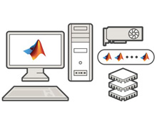

* Built-in multithreading (implicit)
  * Automatically enabled in MATLAB
  * Multiple threads in a single MATLAB computation engine
  * Functions such as fft,eig, svd, and sort are multithreaded in MATLAB
* Parallel computing using explicit techniques
  * Multiple computation engines (workers)  controlled by a single session
  * Perform MATLAB computations on GPUs
  * High-level constructs to let you parallelize MATLAB applications
  * Scale parallel applications beyond a single machine to clusters and clouds

---

It's important to note that MATLAB does offer implicit multi-core support with its built-in multithreading.   A growing number of core MATLAB functions, as well as  some specific functions in the Image Processing Toolbox take advantage of underlying multi-threaded library support.   Other toolboxes get the benefit of implicit multi-threading through their use of core MATLAB function.  This implicit support  has been part of  our products since 2008.   The disadvantage of implicit multithreading is that not every MATLAB function is able to be multi-threading, and any advantage is limited to your local workstation.

MathWorks parallel computing tools provide an explicit way to support multi-core computers.  With Parallel Computing Toolbox syntax, like parfor, you control which portions of your workflow are distributed to multiple cores.   Not only is the explicit support controllable, but it is extensible to clusters using MATLAB Parallel Server


## Utilizing multiple cores on a desktop computer

### Parallel Computing Paradigm Multicore Desktops


---

MathWorks offers two parallel computing tools.   The first is Parallel Computing Toolbox which is our desktop solution that allows users to be more productive with their multicore processors by utilizing headless MATLAB sessions called workers to use the full potential of their hardware and speed up their workflow.  The Toolbox provides easy to use syntax that allows users to stay in their familiar desktop environment while our solution takes care of the details of using multiple sessions in the background. We make the tough aspects of parallelism easy for users:  GPU, Deep Learning, Big Data, Clusters, Clouds

Parallel ComputingToolbox also provides support for NVIDIA CUDA-based GPUs, and provides the syntax used by our second tool, MATLAB Parallel Server.

Under the hood the parallel computing products divide the tasks/computations/simulations and assigns them to these workers in the background - enabling the computations to execute in parallel.

A key concept for parallel computing with MATLAB is the ability to run multiple MATLAB computational engines that are controlled by a single MATLAB session and that are licensed as workers. A collection of these workers with inter-process communication is what we call a parallel pool. 

The parallel computing products provide features that can divide tasks/computations/simulations and assigns them to MATLAB computational engines in the background - enabling execution in parallel.
 
In general you should not run more MATLAB computational engines than the number of physical cores available.   Otherwise, you are likely to have resource contention.

Note that Parallel Computing Toolbox provides licensing for enough workers to cover all of the physical cores in a single machine.

See also:  https://www.mathworks.com/discovery/matlab-multicore.html 

## Accelerating MATLAB and Simulink Applications

Easiest to use: Parallel-enabled toolboxes ('UseParallel', true)

Moderate ease of use, moderate control: Common programming constructs

Greatest control: Advanced programming constructs

---

Let's focus first on built in support that can be enabled simply in MATLAB toolboxes. In these toolboxes, all you have to do is indicate that you wish to go parallel using the UseParallel flag.


## Demo: Classification Learner AppAnalyze sensor data for human activity classification


* Objective: visualize and classify cellphone sensor data of human activity
* Approach:
  * Load human activity dataset
  * Leverage multicore resources to train multiple classifiers in parallel

---

https://insidelabs-git.mathworks.com/ltc-ae/demos/HumanActivityRecognition
Let's open MATLAB and try out a demonstration of using built in parallel functionality invoked by setting a toggle to invoke parallel. 
In this demo, we are loading IOT sensor data from a mobile phone and then using this sensor data to classify the data into activity-standing, sitting, running, etc. 
The demo will utilize the multiple cores in my parallel pool to train multiple classifiers simultaneously. 


## Demo: Cell Phone Tower OptimizationUsing Parallel-Enabled Functions

* Parallel-enabled functions in Optimization Toolbox
* Set flags to run optimization in parallel
* Use pool of MATLAB workers to enable parallelism


Parallel-enabled Toolboxes (MATLAB® Product Family)

*Enable parallel computing support by setting a flag or preference*

**Image Processing**


Batch Image Processor, Block Processing, GPU-enabled functions

---

Across a wide range of MATLAB toolboxes, all you have to do is indicate that you wish to use parallel using the UseParallel flag or via a toggle switch preference.

**Statistics and Machine Learning**

Resampling Methods, k-Means clustering, GPU-enabled functions

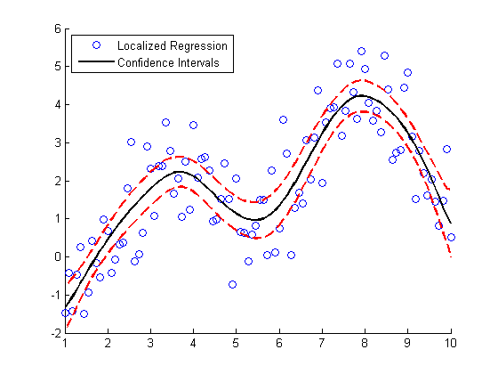

Deep Learning, Neural Network training and simulation


---

**Signal Processing and Communications **

GPU-enabled FFT filtering, cross correlation, BER simulations

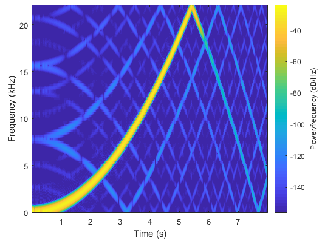

---

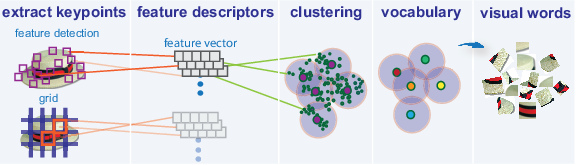

Bag-of-words workflow, object detectors

**Optimization & Global Optimization**

Estimation of gradients, parallel search

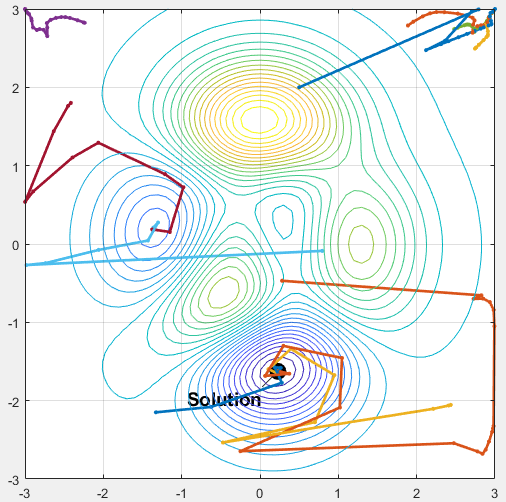

---

## Accelerating MATLAB and Simulink Applications

Easiest to use: Parallel-enabled toolboxes

Moderate ease of use, moderate control: Common programming constructs (parfor, batch)

Greatest control: Advanced programming constructs

---


If you want a bit more control, then Parallel Computing Toolbox adds some parallel keywords into the MATLAB language.  An example of this is Parfor or batch commands.


## Explicit Parallelism: Independent Tasks or IterationsSimple programming constructs: parfor

Examples: parameter sweeps, Monte Carlo simulations

No dependencies or communications between tasks


---

How do we express parallelism in code?

If you are dealing with problems that are computationally intensive and are just taking too long because there are multiple tasks/iterations/simulations you need to execute to gain deeper insight   these are ideal problems for parallel computing and the easiest way to address these challenges is to use parallel for loops.

Real-world examples of such problems are parameter sweeps or Monte Carlo simulations.

For example, lets say you have 5 tasks to be completed - If you run these in a FOR loop, they run serially one after the other - you wait for one to get done, then start the next iteration - However if they're all independent tasks with no dependencies or communication between individual iterations - you can distribute these tasks to the MATLAB workers we spoke about - multiple tasks can execute simultaneously  you'll maximize the utilization of the cores on your desktop machine and save up on a lot of time !
Requirements for parfor loops 
Task independent
Order independent

Constraints on the loop body
Cannot “introduce” variables (e.g. load, etc.)
Cannot contain break or return statements
Cannot contain another parfor loop


## Explicit Parallelism: Independent Tasks or Iterations

```
for i = 1:5
  y(i) = myFunc(myVar(i));
end
```

```
parfor i = 1:5
  y(i) = myFunc(myVar(i));
end
```


---

For example, lets say you have 5 tasks to be completed - If you run these in a FOR loop, they run serially one after the other - you wait for one to get done, then start the next iteration- However if they're all independent tasks with no dependencies or communication between individual iterations - you can distribute these tasks to the MATLAB workers we spoke about - multiple tasks can execute simultaneously  you'll maximize the utilization of the cores on your desktop machine and save up on a lot of time !

## Mechanics of parfor Loops

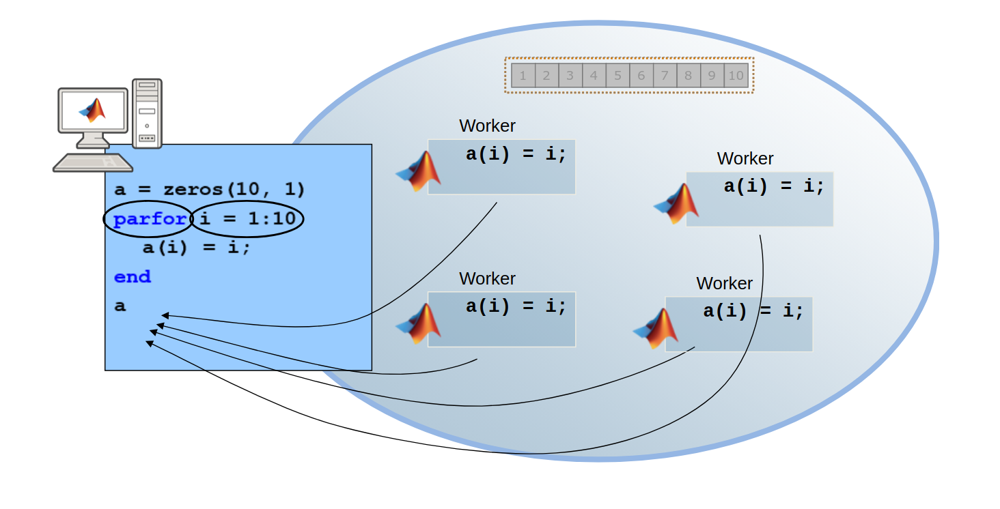

## Tips for Leveraging parfor

Consider creating smaller arrays on each worker versus one large array prior to the parfor loop

Take advantage of parallel.pool.Constant to establish variables on pool workers prior to the loop

Encapsulate blocks as functions when needed

## Accelerating MATLAB and Simulink Applications

|  | Easiest to use: Parallel-enabled toolboxes |  |
| :-: | :-: | :-: |
|  | Moderate ease of use, moderate control: Common programming constructs |  |
|  | Greatest control: Advanced programming constructs(spmd, createJob, labSend,..) |  |

---

Finally, if you need lots of control in your program, then we have some advanced programming constructs that will let you do things like send messages between workers.

Spmd, arrayfun, CUDAKernel,labsend, 

# Scaling up to cluster and cloud resources

## Take Advantage of Cluster Hardware


* Offload computation:
  * Free up desktop
  * Access better computers
* Scale speed-up:
  * Use more cores
  * Go from hours to minutes
* Scale memory:
  * Utilize tall arrays and distributed arrays
  * Solve larger problems without re-coding algorithms

---

There are a few primary reasons to move your Parallel Computing Toolbox workflow from a Desktop computer to a cluster:
You might want to perform computations on a cluster to free up your desktop computer for other work.   You can submit jobs to a cluster and retrieve the results when they're done.   You can even shut down your local computer while you wait.
You can also use a cluster to scale an application that you've developed on your desktop.   Getting computations to take minutes rather than hours allows you to make updates to code and execute multiple runs all in the same day. 
If you have an array that is too large for your computer's memory, you can use distributed arrays to store the data across multiple computers, so that each computer contains only a part of the array.   A growing number of MATLAB matrix operations and functions have been enhanced to work with distributed arrays using the Parallel Computing Toolbox.   These enhanced functions allow you to use your desktop session to operate on the entire distributed array as a single entity.   [See the Release Notes for recent releases of Parallel Computing Toolbox for more details regarding which functions have been enhanced]

## Parallel Computing ParadigmClusters and Clouds

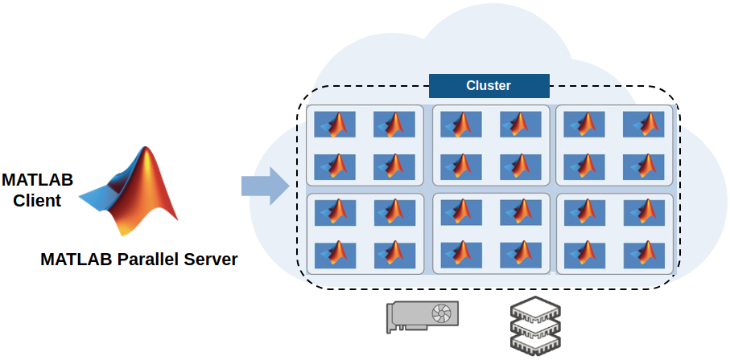

---

The problems or challenges you work on might need additional computational resources or memory than what is available on a single multicore desktop computer

You can also scale up and access additional computational power or memory of multiple computers in a cluster in your organization or on the cloud. When we say scale up it essentially means that your pool or workers are now located on the cluster computers instead of the cores of your desktop computer. Irrespective of where your pool of workers are, your interface remains in the MATLAB Desktop. We've separated the algorithm from the infrastructure so you can write your code as you always do. 

You might want to perform computations on a cluster to free up your desktop computer for other work.   You can submit jobs to a cluster and retrieve the results when they're done.   You can even shut down your local computer while you wait.   

You can also use a cluster to scale an application that you've developed on your desktop.   Getting computations to take minutes rather than hours allows you to make updates to code and execute multiple runs all in the same day. 


## batch Simplifies Offloading Serial ComputationsSubmit jobs from MATLAB and free up MATLAB for other work

`job = batch('myfunc');`

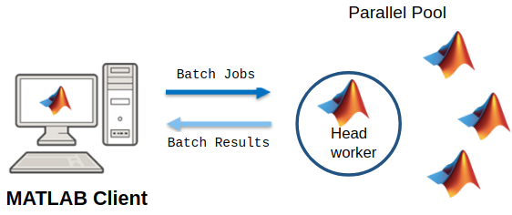

---

To offload work from your MATLAB session to run in the background in another session, you can use the batch command inside a script.
Just submit your jobs and they will run in the background, you can then access results later


## batch Simplifies Offloading Serial ComputationsSubmit jobs from MATLAB, free up MATLAB for other work, access results later

`job = batch('myfunc','Pool',3);`


## Why parallel computing mattersScaling with a compute cluster

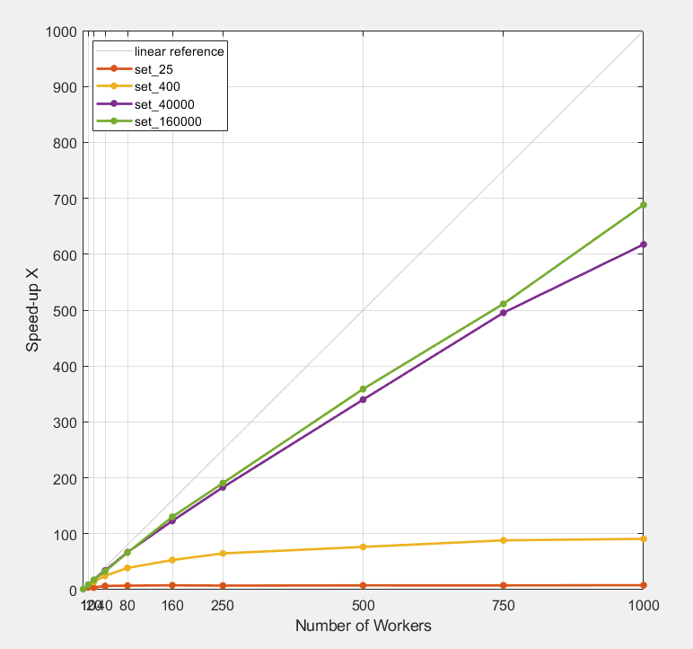

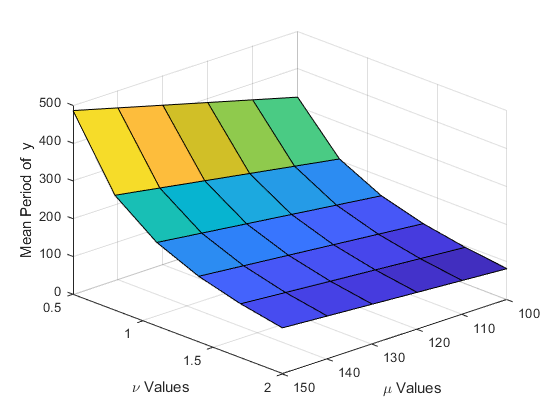

---

In this example, you see a parameter sweep in which we run up to 160,000 different configurations
Doc example https://www.mathworks.com/help/distcomp/examples/plot-progress-during-parallel-computations-using-parfor-and-dataqueue.html?searchHighlight=dataqueue&s_tid=doc_srchtitle
If my problem is well-sized, I can get more than a 90x speed-up with 100 workers.

Just adding more workers is not a guarantee of more speed-up, though.  Every application has its limits, and eventually overhead will dominate.

When choosing how many workers you should use, it's best to think about your overall needs,  in this case, even with 64 workers, I can go from 4 hours to just 4 minutes, which might be good enough.  

As mentioned previously, the sweet spot is ultimate execution  on the order of a few minutes.

Notes:
Computation time is from tic/toc around just the parfor
Ran this on Amazon EC2 (no need to advertise that, but it is true!)

XB=frameworkSubmit(50,200,1,3,'R2014a_c3_192_2hr');

% Add links to blackjack and a\b
% might want to mention partictoc, or pull it from code
 % all demos need html version

## Parallel Computing with MatlabUseful Links

**[Scale Up from Desktop to Cluster](https://www.mathworks.com/help/parallel-computing/scale-up-from-desktop-to-cluster.html)**

**[Choose a Parallel Computing Solution](https://www.mathworks.com/help/parallel-computing/choosing-a-parallel-computing-solution.html)**

**[Parallel Computing Toolbox Documentation](https://www.mathworks.com/help/parallel-computing/)**

**[Benchmarks for Matlab Parallel Code](https://www.mathworks.com/help/parallel-computing/benchmarks.html)**

**[Parallel Computing Toolbox Release Notes](https://www.mathworks.com/help/parallel-computing/release-notes.html)**

## Key functionality

|  | Description | Functionality | Ease of use | Control |
| :-: | :-: | :-: | :-: | :-: |
| Parallel Enabled Toolboxes | Ready to use parallelized functions in MathWorks tools | MATLAB and Simulink parallel enabled functions<br />Toolbox integration | Turnkey-automatic | Minimal (presets) |
| Common programming constructs | Constructs that enable you to easily parallelize your code | parfor<br />gpuArray<br />batch<br />distributed/tall<br />parsim<br />parfeval | Simple | Some |
| Advanced programming constructs | Advanced parallelization techniques | spmd<br />arrayfun/pagefun<br />CUDAKernel<br />MapReduce<br />MATLAB Spark API | Advanced | Extensive |

## Migrate to Cluster / Cloud

Use MATLAB Parallel Server

Change hardware without changing algorithm


## Use Multiple Nodes to Quickly Find the Optimal Network

* Experiment Manager App
  * Manage experiments and reduce manual coding
  * Sweep through a range of hyperparameter values
  * Compare the results of using different data sets
  * Test different neural network architectures
* MATLAB Parallel Server
  * Enables multiple nodes to train networks in parallel -> greatly reduce testing time
  * Running many experiments to train networks and compare the results in parallel

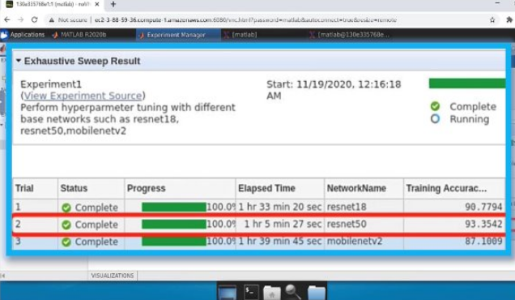

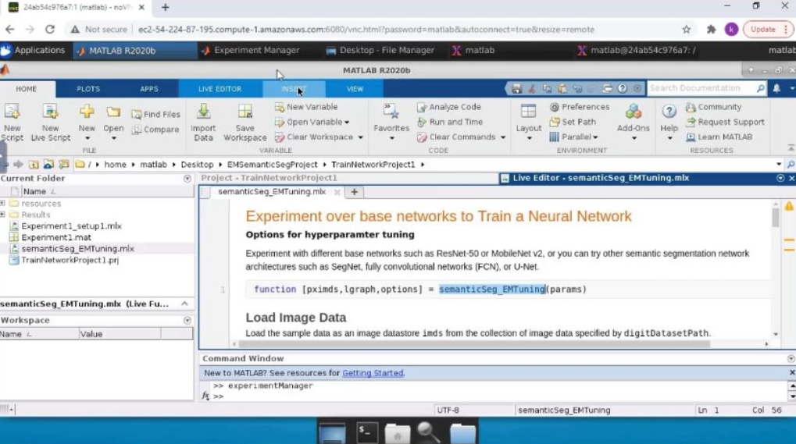

## Broad Range of Needs and Cloud Environments Supported


| Access requirements | Desktop in the cloud | Cluster in the cloud<br />(Client can be any cloud on on-premise desktop) |
| :-: | :-: | :-: |
| Any user could set up | NVIDIA GPU Cloud  | MathWorks Cloud Center |
| Customizable template-based set up |  MathWorks Cloud Reference Architecture |  |
| Full set-up in custom environment | Custom installation - DIY |  |

Learn More: [Parallel Computing on the Cloud](http://www.mathworks.com/products/parallel-computing/parallel-computing-on-the-cloud/index.html)

---


Parallel Computing Toolbox and MATLAB Parallel Server allow you to easily extend your execution of  MATLAB and Simulink to more resources.

In the parallel computing workflow, you start with MATLAB on the desktop, and incorporate parallel features from Parallel Computing Toolbox to use more resources.   

You can use Parallel Computing Toolbox in a range of environments, from those which can be set up by users on their own laptop to cloud installations for enterprise deployment.

When you need to scale beyond the desktop, you will need access to a cluster that has MATLAB Parallel Server installed.  This might be a cluster managed by your IT department, or it could be a cloud cluster that you set up on your own with Cloud Center or a MathWorks reference architecture.

Again, there are a range of environments and ways you can access MATLAB Parallel Server, from self-serve options like Cloud Center and the customizable reference architectures to integration with your existing cluster and cloud infrastructure.

…and once you have access to MATLAB Parallel Server, you can use parallel resources on the cluster in the same way you did on the desktop, without needing to re-code algorithms.

Note: NVIDIA GPU Cloud is actually a container, and can be run in the cloud or on-premise.

For MATLAB Parallel Server, see: https://www.mathworks.com/products/matlab-parallel-server/get-started.html


# Tackling data-intensive problems on desktops and clusters

## Extend Big Data Capabilities in MATLAB with Parallel Computing


---

MATLAB provides a single, high-performance environment for working with big data. You can: 
Access data that does not fit in memory from standard big data sources Use data from a Hadoop Distributed File System (HDFS) in MATLAB 
Create repositories of large amounts of images, spreadsheets, and custom files (datastore) 

Use capabilities customized for beginners and power users of big data applications Use tall arrays for working with columnar data with millions or billions of rows 
Partition data, too big for a single computer, across computers in a cluster using distributed arrays 
Use hundreds of MATLAB and toolbox functions supported with tall, distributed, and sparse arrays 
Create your own big data algorithms using MATLAB MapReduce or MATLAB API for Spark 

Program once, and scale to many execution environments: desktop machines, compute clusters, and Spark clusters 
Easily access data however it is stored

Prototype algorithms quickly using small data sets

Scale up to big data sets running on large clusters

Using the same intuitive MATLAB syntax you are used to
Parallel Computing Toolbox extends the tall array and MapReduce capabilities built into MATLAB so that you can run on local workers for improved performance. You can then scale Tall array and MapReduce up to additional resources with MATLAB Parallel Server, on traditional clusters or Apache Spark™ and Hadoop® clusters

## Overcoming Single Machine Memory Limitations Distributed Arrays

* Distributed Data
  * Large matrices using the combined memory of a cluster
* Common Actions
  * Matrix Manipulation
  * Linear Algebra and Signal Processing
* A large number of standard MATLAB functions work with distributed arrays just as they do for normal variables

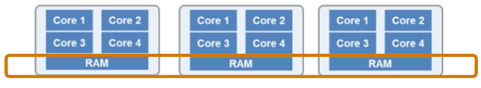

---

Parallel Computing Toolbox provides something called a “distributed” array. On your desktop this looks just like a normal MATLAB variable but it's data is distributed across MATLAB workers on the cluster. When you perform an operation on a distributed array the work happens out in the cluster but nothing much else changes from your normal workflow.
You can prototype distributed array on the desktop and then scale up to additional resources with MATLAB Parallel Server.

A large number of standard MATLAB functions work with distributed arrays just as they do for normal variables. That means you can program a distributed-array algorithm just how you would program a normal in-memory algorithm.

Just like we do for the GPU, we have overloaded functions that work transparently with variables that are stored across the memory of multiple physical computers.   With the overloaded functions, you can write one application that can work with local data or distributed data without needing to be an expert in message passing.   Our goal is to make difficult things easy, so you can focus on your algorithms and research

## Tall Arrays


* Applicable when:
  * Data is  **columnar**  - with  **many**  rows
  * Overall data size is  **too big to fit into memory**
  * Operations are mathematical/statistical in nature
* Statistical and machine learning applications
  * Hundreds of functions supported in MATLAB andStatistics and Machine Learning Toolbox


Automatically breaks data up into small “chunks” that fit in memory

Tall arrays scan through the dataset one “chunk” at a time

Processing code for tall arrays is the same as ordinary arrays

---

Tall arrays wrap around one of these datastores and treat the entire set of data as one continuous table or array. When we need to run calculations, the underlying datastore let's us work through the array one piece at a time. However, that's all under the hood, and when you're using a tall array you just write normal MATLAB code. 

In this example we started with CSV files, which contain tabular data. The resulting tall array is actually a tall table, so we can use standard table functions like summary or dot references to get to the columns and then use max, min, plus, minus just as we would if it wasn't a tall table.

## Demo: Predicting Cost of Taxi Ride in NYCWorking with tall arrays in MATLAB

* **Objective:** Create a model to predict the cost of a taxi ride in New York City
* **Inputs:**
  * Monthly taxi ride log files
  * The local data set contains > 2 million rows
* **Approach:**
  * Preprocess and explore data
  * Work with subset of data for prototyping
  * Fit linear model
  * Predict fare and validate model


# Accelerating applications with NVIDIA GPUs

## Why MATLAB with NVIDIA GPUs

Easy access to NVIDA GPUs with 990+ GPU-enabled functions

Matlab users can work with NVIDIA GPUs without CUDA programming

NVIDIA GPUs accelerate many applications like AI/Deep Learning

## Graphics Processing Units (GPUs)

For graphics acceleration and scientific computing

Many parallel processors

Dedicated high speed memory


## GPU Requirements

Parallel Computing Toolbox requires NVIDIA GPUs

[nvidia.com/object/cuda_gpus.html](http://www.nvidia.com/object/cuda_gpus.html)

| MATLAB Release | Required Compute Capability |
| :-: | :-: |
| MATLAB R2018a and later releases | 3.0 or greater |
| MATLAB R2014b - MATLAB R2017b | 2.0 or greater |
| MATLAB R2014a and earlier releases | 1.3 or greater |

## GPU Computing ParadigmNVIDIA CUDA-enabled GPUs


---

Our tools can both be used to speed up your calculation using multiple CPUs and by using GPUs.  

Although GPUs have hundreds of cores, we treat the GPU as a single  unit, and access directly from a  MATLAB computation engine.   For example,  any single Worker can access the entire GPU.       

Expected speed-up varies with problem specifics as well as the avaialable hardware.

## Programming with GPUs

|  | Easiest to use: Parallel-enabled toolboxes |  |
| :-: | :-: | :-: |
|  | Moderate ease of use and moderate control: Common programming constructs(gpuArray, gather)<br /> |  |
|  | Greatest control: Advanced programming constructs |  |

## Demo: Wave EquationAccelerating scientific computing in MATLAB with GPUs

* Objective: Solve 2nd order wave equation with spectral methods
* Approach:
  * Develop code for CPU
  * Modify the code to use GPUcomputing using gpuArray
  * Compare performance ofthe code using CPU and GPU


---

## Speed-up using NVIDIA GPUs

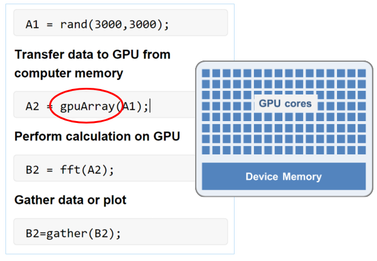

* Ideal Problems
  * Massively Parallel and/or Vectorized operations
  * Computationally Intensive
* 500+ GPU-enabled MATLAB functions
* Simple programming constructs
  * gpuArray, gather

---

In the case of GPUs, it's slightly different.  
Ideal problems for GPU computing :

1. Massively parallel—The computations can be broken down into hundreds or thousands of independent units of work.  You will see the best performance all of the cores are kept busy, exploiting the inherent parallel nature of the GPU. 
2. Computationally intensive—The time spent on computation significantly exceeds the time spent on transferring data to and from GPU memory. Because a GPU is attached to the host CPU via the PCI Express bus, the memory access is slower than with a traditional CPU. This means that your overall computational speedup is limited by the amount of data transfer that occurs in your algorithm. 
3. Algorithm consists of supported functions

Our developers have written CUDA versions of key MATLAB and toolbox functions and presented them as overloaded  functions - We have over 500 GPU-enabled functions in MATLAB and a growing number of GPU-enabled functions in additional toolboxes as well.

The diagram pretty much sums up the easiest way to do GPU computing in MATLAB - Transfer/create data on the GPU using the “gpuArray”, run your function as you would normally - if the inputs are available on the GPU, we do the right thing and run on the GPU and then “gather” the data back to the CPU. This seamless support allows you to run the same code on both the CPU and the GPU.

## GPU Computing with Matlab

**Useful Links**

**[GPU Computing](https://www.mathworks.com/help/parallel-computing/gpu-computing.html?s_tid=CRUX_lftnav)**

**[GPU Computing in MATLAB](https://www.mathworks.com/help/parallel-computing/gpu-computing-in-matlab.html)**

**[MATLAB GPU Computing Support for NVIDIA CUDA-Enabled GPUs](https://www.mathworks.com/solutions/gpu-computing.html)**

**[Run MATLAB Functions on Multiple GPUs](https://www.mathworks.com/help/parallel-computing/run-matlab-functions-on-multiple-gpus.html)**

**[Boost MATLAB algorithms using NVIDIA GPUs](https://www.mathworks.com/videos/boost-matlab-algorithms-using-nvidia-gpus-1624894710218.html)**

## Programming with GPUs

|  | Easiest to use: Parallel-enabled toolboxes |  |
| :-: | :-: | :-: |
|  | Moderate ease of use, moderate control: Common programming constructs |  |
|  | Greatest control: Advanced programming constructs(spmd,arrayfun,CUDAKernel,mex) |  |

# Summary and resources

## Summary

* Easily develop parallel MATLAB applications without being a parallel programming expert
* Run many Simulink simulations at the same time on multiple CPU cores.
* Speed up the execution of your applications using additional hardware including GPUs, clusters and clouds
* Develop parallel applications on your desktop and easily scale to a cluster when needed

---

In this presentation, I've shown you how easy it can be to use cluster hardware with your MATLAB workflow

I've also shown you the specific steps needed.   MathWorks provides tools and infrastructure to let you prototype on the desktop, easily start the Amazon resources you need, and extend your workflow to additional hardware.


## Some Other Valuable Resources

* MATLAB Documentation
  * [MATLAB  Advanced Software Development  Performance and  Memory](http://www.mathworks.com/help/matlab/performance-and-memory.html)
  * [Parallel Computing Toolbox](http://www.mathworks.com/help/distcomp/index.html)
* Parallel and GPU Computing Tutorials
  * [https://www.mathworks.com/videos/series/parallel-and-gpu-computing-tutorials-97719.html](https://www.mathworks.com/videos/series/parallel-and-gpu-computing-tutorials-97719.html)
* Parallel Computing on the Cloud with MATLAB
  * [http://www.mathworks.com/products/parallel-computing/parallel-computing-on-the-cloud/](http://www.mathworks.com/products/parallel-computing/parallel-computing-on-the-cloud/)

## MATLAB Central Community

Every month, over  **2 million ** MATLAB & Simulink users visit MATLAB Central to get questions answered, download code and improve programming skills.


**[MATLAB Answers](http://www.mathworks.com/matlabcentral/answers/index)** : Q&A forum; most questions get answered in only  **60**   **minutes**

**[File Exchange](http://www.mathworks.com/matlabcentral/fileexchange)** : Download code from a huge repository of free code including  **tens of thousands ** of open source community files

**[Cody](http://www.mathworks.com/matlabcentral/cody)** : Sharpen programming skills while having fun

**[Blogs](http://blogs.mathworks.com/)** : Get the inside view from Engineers who build and support MATLAB & Simulink

**[ThingSpeak](https://thingspeak.com/)** : ** ** Explore IoT Data

And more for you to explore…

## Get Help


Quick access to:

Self-serve tools

Community knowledge base

Support engineers

## Part II: Matlab Parallel Computing On Rivanna

* Upload the file Rivanna.zip to your Rivanna account using any of the methods outlined in the following URL.
* [https://www.rc.virginia.edu/userinfo/data-transfer/#data-transfer-methods](https://www.rc.virginia.edu/userinfo/data-transfer/#data-transfer-methods)
* Log into Rivanna using the FastX web interface and launch the Mate Desktop.
* [http://rivanna-desktop.hpc.virginia.edu](http://rivanna-desktop.hpc.virginia.edu/)
* If you are off-grounds, you will have to run the UVA Anywhere VPN before logging in through FastX.
* [https://](https://www.rc.virginia.edu/userinfo/linux/uva-anywhere-vpn-linux/)[www.rc.virginia.edu](https://www.rc.virginia.edu/userinfo/linux/uva-anywhere-vpn-linux/)[/](https://www.rc.virginia.edu/userinfo/linux/uva-anywhere-vpn-linux/)[userinfo](https://www.rc.virginia.edu/userinfo/linux/uva-anywhere-vpn-linux/)[/](https://www.rc.virginia.edu/userinfo/linux/uva-anywhere-vpn-linux/)[linux](https://www.rc.virginia.edu/userinfo/linux/uva-anywhere-vpn-linux/)[/](https://www.rc.virginia.edu/userinfo/linux/uva-anywhere-vpn-linux/)[uva](https://www.rc.virginia.edu/userinfo/linux/uva-anywhere-vpn-linux/)[-anywhere-](https://www.rc.virginia.edu/userinfo/linux/uva-anywhere-vpn-linux/)[vpn](https://www.rc.virginia.edu/userinfo/linux/uva-anywhere-vpn-linux/)[-](https://www.rc.virginia.edu/userinfo/linux/uva-anywhere-vpn-linux/)[linux](https://www.rc.virginia.edu/userinfo/linux/uva-anywhere-vpn-linux/)[/](https://www.rc.virginia.edu/userinfo/linux/uva-anywhere-vpn-linux/)
* In the Mate Desktop, open two terminal windows, one to start the Matlab Desktop and one to work from the Rivanna command line.
* In the second terminal window, go to the location where you uploaded the Rivanna.zip file and unzip it with the command 'unzip Rivanna.zip' to create a folder Rivanna.

* In the first terminal window, load and launch the Matlab Desktop with the commands,
* module load matlab;
* matlab
* Make the current directory for Matlab the Rivanna folder and open example1.slurm file in tthe Matlab editor.
* Modify the slurm script with your own id and allocation, save it. Do this for each of the slurm example files.
* In the second terminal window, submit the slurm script to run on Rivanna with the command, e.g.
* sbatch example1.slurm
* Check that the job is in the queue with the command
* squeue -u <your id>
* [https://www.rc.virginia.edu/userinfo/rivanna/slurm/#displaying-job-status](https://www.rc.virginia.edu/userinfo/rivanna/slurm/#displaying-job-status)

* Once the job is running, it should finish in a few minutes. The error file (.err) should not contain anything and the output file (.out) should contain what Matlab would normally send to the Matlab command window.
* If for some reason you need to cancel your job, use the scancel command with the job id
* [https://](https://www.rc.virginia.edu/userinfo/rivanna/slurm/#canceling-a-job)[www.rc.virginia.edu](https://www.rc.virginia.edu/userinfo/rivanna/slurm/#canceling-a-job)[/](https://www.rc.virginia.edu/userinfo/rivanna/slurm/#canceling-a-job)[userinfo](https://www.rc.virginia.edu/userinfo/rivanna/slurm/#canceling-a-job)[/](https://www.rc.virginia.edu/userinfo/rivanna/slurm/#canceling-a-job)[rivanna](https://www.rc.virginia.edu/userinfo/rivanna/slurm/#canceling-a-job)[/](https://www.rc.virginia.edu/userinfo/rivanna/slurm/#canceling-a-job)[slurm](https://www.rc.virginia.edu/userinfo/rivanna/slurm/#canceling-a-job)[/#canceling-a-job](https://www.rc.virginia.edu/userinfo/rivanna/slurm/#canceling-a-job)
* For the examples of running Matlab using multiple compute nodes, those jobs are submitted from within Matlab rather than with an external slurm script. Matlab creates its own slurm script to submit the job.
* The reference for this material is at the URL
* [https://www.rc.virginia.edu/userinfo/rivanna/software/matlab/](https://www.rc.virginia.edu/userinfo/rivanna/software/matlab/)

Using multiple cores on one node:

```
#!/bin/bash
# This slurm script file runs
# a multi-core parallel Matlab job (on one compute node)
#SBATCH -p standard
#SBATCH -A hpc_build
#SBATCH -t time=1:00:00
#SBATCH -mail-type=END
#SBATCH [--mail-user=teh1m@virginia.edu](mailto:--mail-user=teh1m@virginia.edu)
#SBATCH --job-name=runParallelTest
#SBATCH -o output=runParallelTest_%A.out
#SBATCH -e error=runParallelTest_%A.err
#SBATCH --nodes=1 # Number of nodes
#SBATCH --ntasks-per-node=8 # Number of cores per node

# Load Matlab environment
module load matlab

# Create and export variable for slurm job id
export slurm_ID="${SLURM_JOB_ID}"

# Set workers to one less that number of tasks (leave 1 for master process)
export numWorkers=$((SLURM_NTASKS-1))

# Input parameters
nLoops=400; # number of iterations to perform
nDim=400; # Dimension of matrix to create

# Run Matlab parallel program
matlab -nodisplay -r \
"setPool1; pcalc2(${nLoops}, ${nDim}, '${slurm_ID}'); exit;"
```

## SLURM Script end-of-job email


* When the job finishes, the end-of-job email sent by SLURM will contain the output of the SLURM seff command.

GPU Computations

The gpu queue provides access to compute nodes equipped with RTX2080Ti, RTX3090, A6000, V100, and A100 NVIDIA GPU device

```
#!/bin/bash

#SBATCH -A mygroup
#SBATCH --partition=gpu
#SBATCH --gres=gpu:1
#SBATCH --ntasks=1
#SBATCH --time=12:00:00

module load singularity tensorflow/2.10.0
singularity run --nv $CONTAINERDIR/tensorflow-2.10.0.sif myAI.py
```

The second argument to gres can be rtx2080, rtx3090, v100, or a100 for the different GPU architectures. The third argument to gres specifies the number of devices to be requested. If unspecified, the job will run on the first available GPU node with a single GPU device regardless of architecture.

### NVIDIA GPU BasePOD™

As artificial intelligence (AI) and machine learning (ML) continue to change how academic research is conducted, the NVIDIA DGX BasePOD, or BasePOD, brings new AI and ML functionality to Rivanna, UVA's High-Performance Computing (HPC) system. The BasePOD is a cluster of high-performance GPUs that allows large deep-learning models to be created and utilized at UVA.

* The NVIDIA DGX BasePOD™ on Rivanna and Afton, hereafter referred to as the POD, is comprised of:
* 10 DGX A100 nodes with
  * 2TB of RAM memory per node
  * 80 GB GPU memory per GPU device
  * Compared to the regular GPU nodes, the POD contains  **advanced features**  such as:
* NVLink for fast multi-GPU communication
* GPUDirect RDMA Peer Memory for fast multi-node multi-GPU communication
* GPUDirect Storage with 200 TB IBM ESS3200 (NVMe) SpectrumScale storage array
* which makes it ideal for the following types of jobs:
* The job needs multiple GPUs on a single node or even multiple nodes.
* The job (can be single- or multi-GPU) is I/O intensive.
* The job (can be single- or multi-GPU) requires more than 40 GB GPU memory. (The non-POD nodes with the highest GPU memory are the regular A100 nodes with 40 GB GPU memory.)

[https://](https://www.rc.virginia.edu/userinfo/rivanna/basepod/)[www.rc.virginia.edu](https://www.rc.virginia.edu/userinfo/rivanna/basepod/)[/](https://www.rc.virginia.edu/userinfo/rivanna/basepod/)[userinfo](https://www.rc.virginia.edu/userinfo/rivanna/basepod/)[/](https://www.rc.virginia.edu/userinfo/rivanna/basepod/)[rivanna](https://www.rc.virginia.edu/userinfo/rivanna/basepod/)[/](https://www.rc.virginia.edu/userinfo/rivanna/basepod/)[basepod](https://www.rc.virginia.edu/userinfo/rivanna/basepod/)[/](https://www.rc.virginia.edu/userinfo/rivanna/basepod/)


Slurm script additional constraint

```
#SBATCH -p gpu
#SBATCH --gres=gpu:a100:X # replace X with the number of GPUs per node
#SBATCH -C gpupod
```

Remarks

Before running on multiple nodes, please make sure the job can scale well to 8 GPUs on a single node.

Multi-node jobs on the POD should request all GPUs on the nodes, i.e. --gres=gpu:a100:8.

You may have already used the POD by simply requesting an A100 node without the constraint, since 18 out of the total 20 A100 nodes are POD nodes.

As we expand our infrastructure, there could be changes to the Slurm directives and job resource limitations in the future. Please keep an eye out for our announcements and documentation.

**Constructing Resource-Efficient SLURM scripts**

Strategy for submitting jobs to busy queues?

Request fewer cores, less time, or less memory (and corresponding cores).

Important to know exactly what compute/memory resources you job needs, as detailed in the seff output.

**Constructing Resource-Efficient SLURM scripts**

Shell script to monitor and record cpu/memory usage using top

```
#!/bin/bash
# This script takes four command line arguments, samples the output of the top command
# and stores the output of the sampling in the file named Top.out.
# $1 is the user ID of the owner of the processes to sample from the top output
# $2 is the name to include in the top output filename
# $3 is the top sampling interval
# $4 is the name of the code to be tracked (as shown in top)
# Example of line to include in slurm script submission before executable invoked
# ./sampleTop.sh <user_id> <filename> 10 <code_name> &
```

**Constructing Resource-Efficient SLURM scripts**

Shell script to monitor job resource usage output file


## Parallel/GPU Computing

**Running parallel applications**

So far, we've covered the basics concepts of parallel computing - hardware, threads, processes, hybrid applications, implementing parallelization (MPI and OpenMP), Amdahl's law and other factors that affect scalability.

Theory and background are great, but how do we know how many CPUs/GPUs to use when running our parallel application?

The only way to definitively answer this question is to perform a scaling study where a representative problem is run on different number of processors.

**A representative problem is one with the same size (grid dimensions; number of particles, images, genomes, etc.) and complexity (e.g., level of theory, type of analysis, physics, etc.) as the research problems you want to solve.**

## Presenting scaling results (the right way)

Plotting the same data on log axes gives a lot more insight. Note the different scales for the left axes on the two plots. Including a line showing linear scaling and plotting the parallel efficiency on the right axis adds even more value


## Where should I be on the scaling curve?

If your work is not particularly sensitive to the time to complete a single run, consider using a CPU/GPU count at or very close to 100% efficiency, even if that means running on a single core.

This specially makes sense for parameter sweep workloads where the same calculation is run many times with a different set of inputs


Go a little further out on the scaling curve if the job would take an unreasonably long time at lower core counts or if a shorter time to solution helps you make progress in your research.

If code does not have checkpoint-restart capabilities and the run time would exceed queue limits, you'll have no choice but to run at higher core counts.


If the time to solution is absolutely critical, it's okay to run at lower efficiency.

Examples might include calculations that need to run on a regular schedule (data collected during day must be processed overnight) or severe weather forecasting.