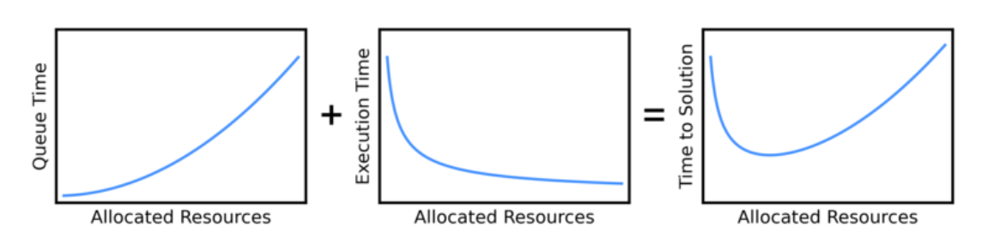
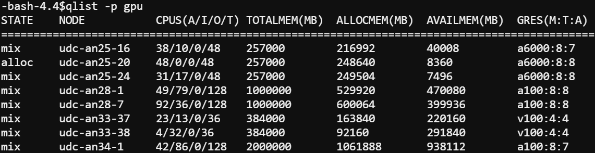
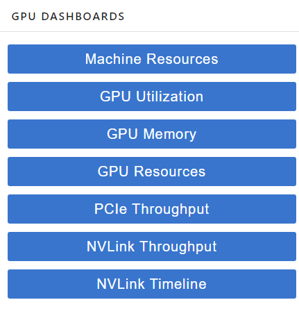
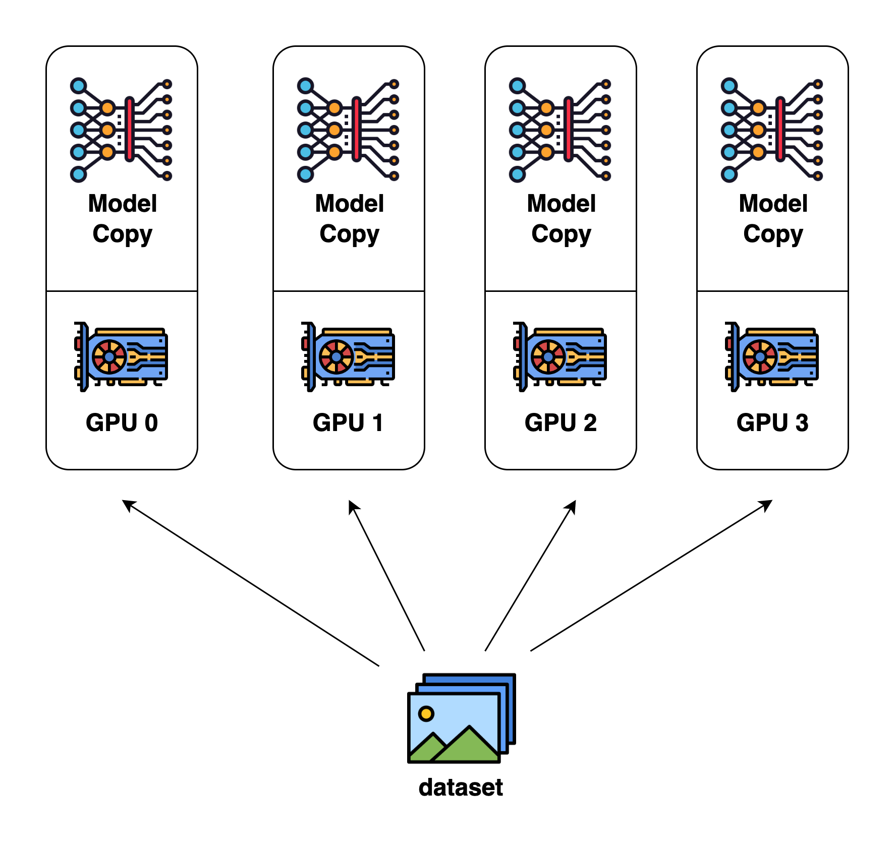
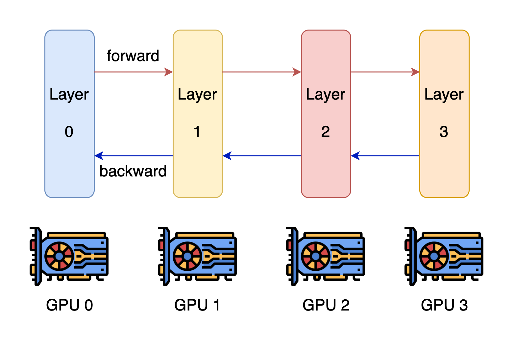
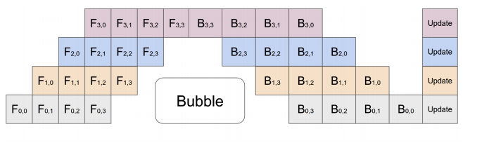
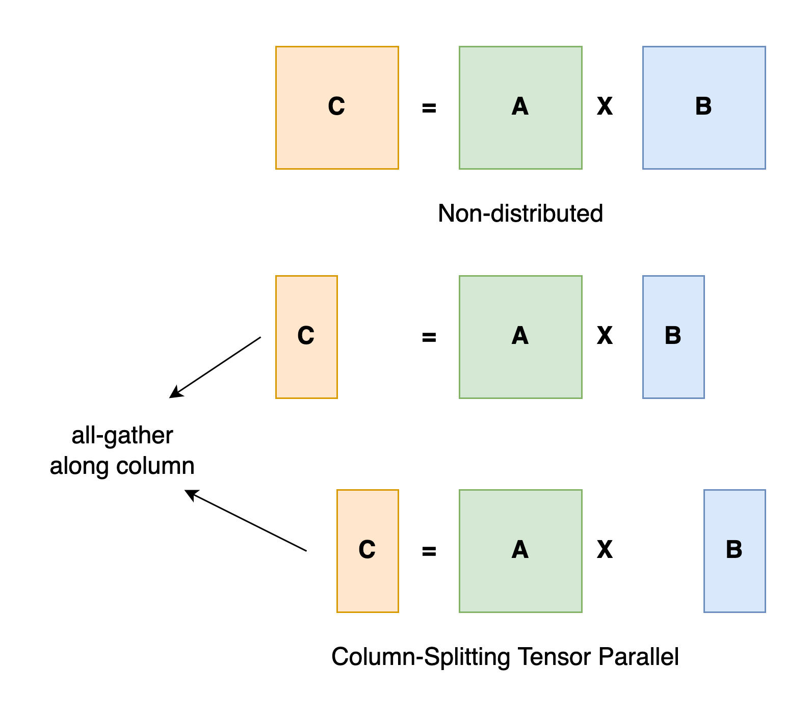
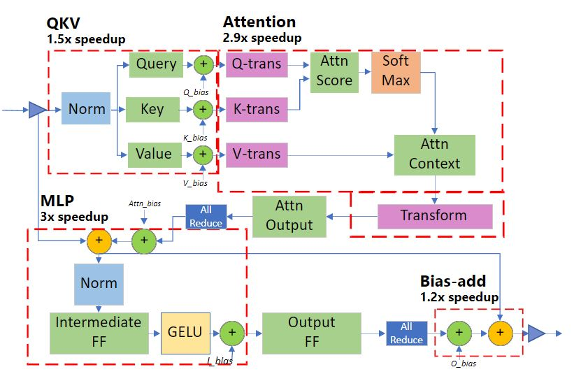
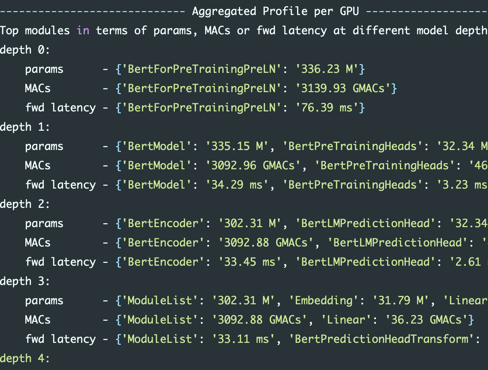

Multi\-GPU LLM Inference

RC Workshop

Kathryn Linehan\, Bruce Rushing

June 3rd\, 2025

Workshop Overview

* __The first draft outline of this workshop was created by ChatGPT\! __
* Introduction
* UVA HPC
* Multi\-GPU Strategies
* Accelerate
* DeepSpeed
* vLLM
* Best Practices
* Wrap Up

# INTRODUCTION

# Terminology

* __VRAM: __ Video RAM \(GPU Memory\)
* __Context window: __ the maximum number of tokens an LLM can keep “in\-memory”
* __Precision: __ the amount of storage used for an LLM parameter
  * Examples: fp32 is 4 bytes/parameter\, fp16 is 2 bytes/parameter
* __Quantization: __ technique to lower the amount of storage used by LLM parameters
* __Embedding Dimension: __ length of embedding vector
* __QKV Cache __ \(Query Key Value Cache\): short term memory of LLM

# Why Multi-GPU LLM inference?

* LLMs are getting larger and larger as are context windows
* More recent LLMs generally do not fit in a single GPU due to VRAM limits
  * This is the case we will focus on today

# GPU Memory Requirements for Google’s Gemma 3

| __Model__ | __Context Window__ |  |  |  |
| :-: | :-: | :-: | :-: | :-: |
|  | __4K Tokens__ | __8K Tokens__ | __32K Tokens__ | __128K Tokens__ |
| 4B @ FP16 | __11 GB__ | __12\.4 GB__ | __20\.8 GB__ | __54\.4 GB__ |
| 12B @ FP16 | __31\.9 GB__ | __35 GB__ | __53\.6 GB__ | __128 GB__ |
| 27B @ FP16 | __70\.3 GB__ | __75\.8 GB__ | __108\.8 GB__ | __241 GB__ |
| 4B @ INT4 | __2\.8 GB__ | __3\.2 GB__ | __5\.3 GB__ | __14 GB__ |
| 12B @ INT4 | __8 GB__ | __8\.8 GB__ | __13\.6 GB__ | __32\.8 GB__ |
| 27B @ INT4 | __17\.6 GB__ | __19 GB__ | __27\.4 GB__ | __61 GB__ |

Models given in parameter counts \(billions\) at specific precisions \(i\.e\.\, floating point 16 or integer 4 quantization\) and variable context windows\.

# UVA HPC

# UVA HPC – H200 GPUs

More info: https://www\.rc\.virginia\.edu/2025/05/new\-nvidia\-h200\-gpu\-node\-added\-to\-afton/

# UVA HPC - GPUs

| GPU | HPC System | Partition | Memory |
| :-: | :-: | :-: | :-: |
| H200 | Afton and Rio | gpu\* | 141GB |
| A100 | Afton | gpu | 40GB or 80GB |
| A40 | Afton | gpu | 48GB |
| A6000 | Afton | gpu | 48GB |
| V100 | Afton | gpu | 32GB |
| RTX3090 | Afton | Interactive | 24GB |
| RTX2080Ti | Afton | Interactive | 11GB |

__\*Only available through batch job requests \(not Open OnDemand\)__

More info: https://www\.rc\.virginia\.edu/userinfo/computing\-environments/\,

https://www\.rc\.virginia\.edu/userinfo/hpc/\#system\-details

# GPU access on UVA HPC

\*\*When you request memory for HPC\, that is CPU memory\.\*\*

* __Open OnDemand \(OOD\)__
* Choose “GPU” or “Interactive” as the Rivanna/Afton Partition
* Optional: choose GPU type and number of GPUs
* __Cannot use H200 GPUs __
* __SLURM__
* Specify GPU partition: \#SBATCH \-p gpu
* Request n GPUs: \#SBATCH \-\-gres=gpu:<optional\_gpu\_name>:n
  * Ex\) 	Request 1 GPU: \#SBATCH \-\-gres=gpu:1
  * Ex\) 	Request 4 A100s: \#SBATCH \-\-gres=gpu:a100:4
* To request 80GB A100\,  __additionally__  use:
  * \#SBATCH \-\-constraint=a100\_80gb

More info: https://www\.rc\.virginia\.edu/userinfo/hpc/slurm/\#gpu\-intensive\-computation

---

As of now: only one person can be using a GPU at a time. If you request a GPU, you will receive all of the GPU memory. 

# UVA HPC – NVIDIA DGX BasePOD on Rivanna/Afton

__Cluster of high\-performance GPUs that can be used for large deep\-learning models__

__18 DGX A100 nodes __ with:

2TB of RAM memory per node

8 A100s per node

80 GB GPU memory per GPU device

__Advanced Features __ \(compared to regular GPU nodes\):

NVLink for fast multi\-GPU communication

GPUDirect RDMA Peer Memory for fast multi\-node multi\-GPU communication

GPUDirect Storage with 200 TB IBM ESS3200 \(NVMe\) SpectrumScale storage array

__Ideal Scenarios:__

Job needs multiple GPUs on a single node or even multiple nodes

Job \(single or multi\-GPU\) is I/O intensive

If you have ever used an A100 with 80 GB on our system\, you were using a POD node\!

More info: https://www\.rc\.virginia\.edu/userinfo/hpc/basepod/

\*\*When you request memory for HPC\, that is CPU memory\.\*\*

# POD access on UVA HPC

__Open OnDemand \(OOD\)__

Choose “GPU” as the Rivanna/Afton Partition

Choose “NVIDIA A100” as GPU type and fill in number of GPUs

Select “Yes” for Show Additional Options and type                                        “\-\-constraint=gpupod” in the Slurm Option textbox

__SLURM__

\#SBATCH \-p gpu

\#SBATCH \-\-gres=gpu:a100:n   n: requested \# of GPUs/node

\#SBATCH \-C gpupod

More info: https://www\.rc\.virginia\.edu/userinfo/hpc/basepod/\#accessing\-the\-pod

---

As of now: only one person can be using a GPU at a time. If you request a GPU, you will receive all of the GPU memory. 

# POD on UVA HPC

Before running a multi\-node job\, please make sure the job can scale well to 8 GPUs on a single node\.

Multi\-node jobs on the POD should request all GPUs on the nodes\, i\.e\. \-\-gres=gpu:a100:8\.

More info: https://www\.rc\.virginia\.edu/userinfo/hpc/basepod/\#accessing\-the\-pod

# GPU Limit on UVA HPC

The maximum number of GPUs you can request for a UVA HPC job is 32\.

The maximum number of nodes is 4\.

More info: https://www\.rc\.virginia\.edu/userinfo/hpc/\#job\-queues

# Wait Time in the Queue

* You may not need to request A100\(s\)\!
* Requesting A100\(s\) may mean you wait in the queue for a much longer time than using another GPU\,
* This could give you a slower overall time \(wait time \+ execution time\) than if you had used another GPU\.

Graphic Source: [https://researchcomputing\.princeton\.edu/support/knowledge\-base/scaling\-analysis](https://researchcomputing.princeton.edu/support/knowledge-base/scaling-analysis)

Photo Source: [https://researchcomputing\.princeton\.edu/support/knowledge\-base/scaling\-analysis](https://researchcomputing.princeton.edu/support/knowledge-base/scaling-analysis)

# Viewing Available GPUs

The gpu partition can be very busy\!

To view information about the gpu partition including total \(T\) and allocated \(A\) GPUs\, type qlist –p gpu at the command line

# GPU Dashboard in OOD JupyterLab

* This will be demoed during today’s workshop
* Includes GPU and CPU memory and utilization tracking in real time
* Helpful for GPU selection

# GPU Dashboard: Memory Usage

__PyTorch__

Correct GPU memory usage will be reported

__TensorFlow/__  __Keras__

By default\, TF automatically allocates ALL of the GPU memory so GPU Dashboard may show that all \(or almost all\) of the GPU memory is being used

To track the amount of GPU memory actually used\, you can add these lines to your python script:

import os

os\.environ\['TF\_FORCE\_GPU\_ALLOW\_GROWTH'\] = 'true'

More Info: [https://www\.tensorflow\.org/guide/gpu\#limiting\_gpu\_memory\_growth](https://www.tensorflow.org/guide/gpu#limiting_gpu_memory_growth)

---

Homework for Keras users: try out GPU dashboard and see if it reports all of the GPU memory as used

# Calculating GPU Memory Requirements

# GPU Memory Requirements for Google’s Gemma 3

| __Model__ | __Context Window__ |  |  |  |
| :-: | :-: | :-: | :-: | :-: |
|  | __4K Tokens__ | __8K Tokens__ | __32K Tokens__ | __128K Tokens__ |
| 4B @ FP16 | 9\.6 \+ 1\.4 =  __11 GB__ | 9\.6 \+ 2\.8 =  __12\.4 GB__ | 9\.6 \+ 11\.2 =  __20\.8 GB__ | 9\.6 \+ 44\.8 =  __54\.4 GB__ |
| 4B @ INT4 | 2\.4 \+ 0\.4 =  __2\.8 GB__ | 2\.4 \+ 0\.8 =  __3\.2 GB__ | 2\.4 \+ 2\.9 =  __5\.3 GB__ | 2\.4 \+ 11\.6 =  __14 GB__ |
| 12B @ FP16 | 28\.8 \+ 3\.1 =  __31\.9 GB__ | 28\.8 \+ 6\.2 =  __35 GB__ | 28\.8 \+ 24\.8 =  __53\.6 GB__ | 28\.8 \+ 99\.2 =  __128 GB__ |
| 12B @ INT4 | 7\.2 \+ 0\.8 =  __8 GB__ | 7\.2 \+ 1\.6 =  __8\.8 GB__ | 7\.2 \+ 6\.4 =  __13\.6 GB__ | 7\.2 \+ 25\.6 =  __32\.8 GB__ |
| 27B @ FP16 | 64\.8 \+ 5\.5 =  __70\.3 GB__ | 64\.8 \+ 11 =  __75\.8 GB__ | 64\.8 \+ 44 =  __108\.8 GB__ | 64\.8 \+ 176 =  __241 GB__ |
| 27B @ INT4 | 16\.2 \+ 1\.4 =  __17\.6 GB__ | 16\.2 \+ 2\.8 =  __19 GB__ | 16\.2 \+ 11\.2 =  __27\.4 GB__ | 16\.2 \+ 44\.8 =  __61 GB__ |

Models given in parameter counts \(billions\) at specific precisions \(i\.e\.\, floating point 16 or integer 4 quantization\) and variable context windows\.

4B: 34 Layers\, 2560 Embedding Dim

12B: 48 Layers\, 3840 Embedding Dim

27B: 62 Layers\, 5376 Embedding Dim

---

Each calculation is a breakdown of M + N (from previous slide)

# CPU Resource Allocation for LLM Inference

* __CPU memory__
  * Have enough RAM to fit LLM
    * Accelerate will offload computations to the CPU after GPUs are full
* __CPU cores__
  * Use enough cores for any data preprocessing
  * Use a GPU\!

Source: [https://timdettmers\.com/2018/12/16/deep\-learning\-hardware\-guide/](https://timdettmers.com/2018/12/16/deep-learning-hardware-guide/)

---

Check your resource usage using GPU Dashboard, seff (completed jobs), or sstat (running jobs)

It may be the case that even if CPU Efficiency is a low percentage, you need all of the requested CPU cores for a specific part of the code, e.g., data preprocessing.
In this case, request the number of CPU cores that you need for the compute intensive part of the code.

# MULTI-GPU STRATEGIES

# Overview of Multi-GPU Parallelism Strategies

* __Data Parallelism__ : __ __ data is split across GPUs
* __Model Parallelism__ : model is split across GPUs
  * Pipeline Parallelism
  * Tensor Parallelism

| Parallelism Type | What is Split? | When Used? |
| :-: | :-: | :-: |
| Data Parallelism | Input data | Long prompts/inputs |
| Pipeline Parallelism | Model layers | LLM exceeds single GPU memory: LLM is deep but not too wide |
| Tensor Parallelism | Inside model layers \(tensors\) | LLM exceeds single GPU memory: LLM layers are too large for one device |

# Data Parallelism

Each GPU contains the full model

Data is split across GPUs and inference is performed on GPUs in parallel

Provides inference speed up

Source: [https://colossalai\.org/docs/concepts/paradigms\_of\_parallelism/\#data\-parallel](https://colossalai.org/docs/concepts/paradigms_of_parallelism/#data-parallel)

# Pipeline Parallelism (Inter-Layer)

* Each GPU contains a different model stage \(1\+ layers\)\.
* GPUs compute on batches of data in parallel but must wait for previous stage to complete\.
* Pros:
  * Reduces per\-GPU memory use
  * Improves inference throughput
* Con:
  * Adds inference latency

Source: [https://colossalai\.org/docs/concepts/paradigms\_of\_parallelism/\#pipeline\-parallel](https://colossalai.org/docs/concepts/paradigms_of_parallelism/#pipeline-parallel)\, [https://arxiv\.org/abs/1811\.06965](https://arxiv.org/abs/1811.06965)

# Tensor Parallelism (Intra-Layer)

Matrix Multiplication Example

* Splits tensor computations across GPUs
  * Each GPU contains part of the tensor
  * GPUs compute on their part in parallel
* Good for transformer layers
* Frequent communication
  * Requires fast interconnect \(e\.g\.\, NVLink\, which UVA HPC has in the BasePOD\)

Source: [https://colossalai\.org/docs/concepts/paradigms\_of\_parallelism/\#tensor\-parallel](https://colossalai.org/docs/concepts/paradigms_of_parallelism/#tensor-parallel)

# Key Tools and Frameworks

Hugging Face  __Accelerate__ : easy interface with transformers and PyTorch\.

__DeepSpeed__ : good for large scale \(thousand\+ GPUs\) well\-optimized training and inference\.

__vLLM__ : focus on high\-speed\, efficient LLM inference\.

__Megatron__ : low\-level\, open source API for custom development frameworks\.

# Key Tools and Frameworks cont.

* We will focus on Accelerate in this workshop\.
  * RC’s resources are best used for Accelerate\, unless there are specific inference/training\-centric memory management or speed\-ups required from DeepSpeed or vLLM\.
  * Accelerate will set up model parallelism for you
  * Code examples will be provided
* We will present some basic information about DeepSpeed and vLLM\.

More information: https://huggingface\.co/docs/accelerate/en/concept\_guides/big\_model\_inference

# ACCELERATE

# What is Accelerate?

Popular\, easy\-to\-use library built to work with PyTorch models\.

Very straightforward API that wraps with PyTorch and transformers code\.

Automatically can allocate GPU memory usage across nodes\.

Used for both training and inference\.

Built on top of Megatron and can interface with DeepSpeed\.

# Why use Accelerate?

If you need to prototype or are expecting to run models on “fewer” GPUs\, Accelerate is the preferred framework\.

It is mostly plug\-and\-play with existing code\, with options already built\-in to transformers and classes that easily wrap with torch\.

You can use it both for inference and for training\.

There is some fine\-grained control of GPU and CPU usage\, allowing a degree of customization for improved performance depending on your use case\.

# Accelerate Code Demo

The notebook is available on Rivanna/Afton in the folder /project/hpc\_training/multigpu\_llm\_inf

# DeepSpeed

# What is DeepSpeed?

Microsoft’s open source that focuses on large\-scale training and inference operation through efficient memory management for PyTorch\.

Key components for inference are custom CUDA kernels for common LLM operations like attention and MLP and tensor parallelism for efficient memory usage and low latency\.

Also has several architecture and quantization specific optimizations\.

Upshot: allows you to load larger models that would not ordinarily fit within GPU memory\, though your mileage may vary\.

# Transformer-specific Latency Advantages

Transformer module latency reductions per module

# Why use DeepSpeed?

You should use DeepSpeed if you need to either perform large\-scale inference \(hundreds\+ GPUs\)\, you need fast service\, or every MB in GPU memory counts\.

Remark: the maximum number of GPUs you can request for a UVA HPC job is 32 \(max number of nodes is 4\)\.

The inference latency reductions can matter if you only have X amount of time for experiments\.

DeepSpeed also offers very efficient large\-scale training parallelism\, which we won’t discuss here\.

Source: https://www\.rc\.virginia\.edu/userinfo/hpc/\#job\-queues

---

For most users: accelerate is probably better due to ease of use.  DeepSpeed does improve inference, but is mainly used for training.  If serving an LLM, vLLM is a good choice.

# vLLM

# What is vLLM (Virtual Large Language Model)?

Open source from UC Berkeley\.

Key innovation for inference is PagedAttention: an efficient virtual memory/page method for storing the KV cache\, which in longer contexts can end up committing more memory than the models themselves\.

Also allows continuous batching: a method for handling multiple requests to LLMs that enables less idle time\.

Like DeepSpeed\, also supports optimized CUDA kernels for lower latency inference\.

Built on top of Megatron and can interface with DeepSpeed\.

# Why use vLLM?

You should use vLLM if you expect to serve lots of requests to LLMs for inference or if you have particularly long generated sequences\.

Can cut memory usage in some applications by 60\-80% compared to vanilla transformers\, though your mileage may vary\.

Compatible with most Hugging Face models\.

Generally used for large\-scale serving; benefits over Accelerate are likely to be less pronounced in small use\-cases\.

---

Small: less than 1 million calls.  Looking at number of calls and length of calls.

# BEST PRACTICES

* Plan first
  * Calculate how much GPU memory you will need to run inference
  * Check the gpu queue to see which GPUs are available
  * Determine how many GPUs and which types \(A40\, A100\, etc\.\) you will need
* Need fast GPU to GPU communication? Use the BasePOD
* If you would like to use fewer GPUs\, you can try using a quantized model\, an LLM with a lower precision and/or a smaller number of parameters\, etc\. and see if performance is acceptable
* Use a well\-established framework such as Accelerate\.  If you need extra gains\, you can try DeepSpeed or vLLM\.

# Identifying Bottlenecks

Accelerate and DeepSpeed offer methods for identifying GPU usage\.

DeepSpeed’s tools are considerably more in\-depth\, so consider using it for real fine\-grained monitoring of your code usage\.

# WRAP UP

# Recap

* Modern LLMs cannot fit into a single GPU and thus multi\-GPU jobs are needed for LLM inference
* UVA HPC provides a variety of GPUs as well as the NVIDIA BasePOD
  * H200s were recently added
* Plan how many and which GPUs you will need before running your LLM inference job
* Use a well\-established framework to implement model parallelism

# References

Hugging Face: [https://huggingface\.co/docs](https://huggingface.co/docs)

Accelerate: [https://huggingface\.co/docs/accelerate](https://huggingface.co/docs/accelerate)

DeepSpeed: [https://www\.deepspeed\.ai/inference/](https://www.deepspeed.ai/inference/)

vLLM: [https://docs\.vllm\.ai/en/latest/](https://docs.vllm.ai/en/latest/)

GPU Memory allocation: [https://ksingh7\.medium\.com/calculate\-how\-much\-gpu\-memory\-you\-need\-to\-serve\-any\-llm\-67301a844f21](https://ksingh7.medium.com/calculate-how-much-gpu-memory-you-need-to-serve-any-llm-67301a844f21)

QKV Cache Memory allocation: [https://unfoldai\.com/gpu\-memory\-requirements\-for\-llms/](https://unfoldai.com/gpu-memory-requirements-for-llms/)

# Need more help?

_Office Hours via Zoom_

Tuesdays:       	3 pm \- 5 pm

Thursdays:     	10 am \- noon

Zoom Links are available at  https://www\.rc\.virginia\.edu/support/\#office\-hours

  * Website:  https://rc\.virginia\.edu

