</img>


# Introduction

From the [OpenCV project documentation](https://docs.opencv.org/master/d1/dfb/intro.html):

> OpenCV (Open Source Computer Vision Library: http://opencv.org) is an open-source library that includes several hundreds of computer vision algorithms.

This workshop assumes a working knowledge of the Python programming language and basic understanding of image processing concepts.

Introductions to Python can be found [here](/courses/programming_python_scientists_engineers/python-interpreter/) and [here](/courses/python_introduction/).

---

# Getting Started

**Python code examples**

The Python scripts and data files for this workshop can be [downloaded from here](/notes/opencv/data/opencv-examples.zip). On your computer, unzip the downloaded folder and use it as working directory for this workshop.

**Python programming environment**

The Anaconda environment from [Anaconda Inc.](https://anaconda.com/) is widely used because it bundles a Python interpreter, most of the popular packages, and development environments. It is cross platform and freely available. There are two somewhat incompatible versions of Python; version 2.7 is deprecated but still fairly widely used. Version 3 is the supported version. 

**Note: We are using Python 3 for this workshop.**

## Option 1: Using the UVA HPC platform

If you have a Rivanna account, you can work through this tutorial using an [Open OnDemand](https://www.rc.virginia.edu/userinfo/rivanna/ood/overview/) Desktop session.

1. Go to https://rivanna-portal.hpc.virginia.edu.

2. Log in with your UVA credentials.

3. Go to `Interactive Apps` > `Desktop`

4. On the next screen, specify resources as shown in this screenshot: 

    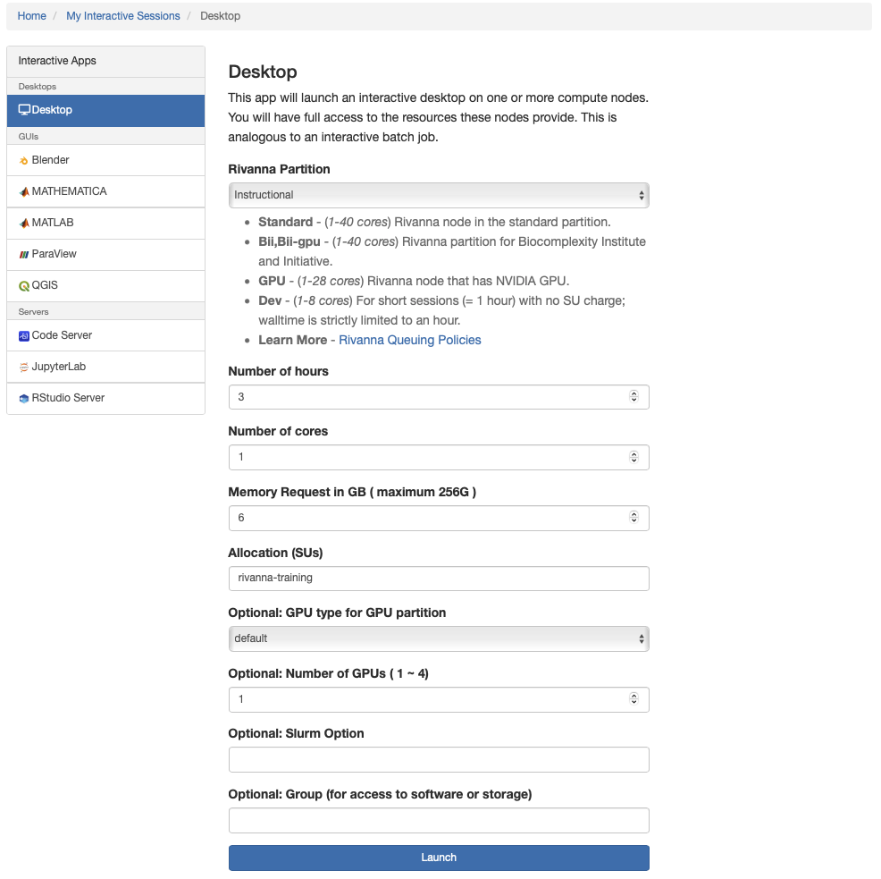

    >**Note:** Workshop participants may specify `rivanna-training` in the `Allocation (SUs)` field. Alternatively, you may use any other Rivanna allocation that you are a member of.  

5. Click `Launch` at the bottom of the screen. Your dekstop session will be queued up -- this may take a few minutes until the requested resources become available.

## Option 2 - Use your own computer

1. Visit the [Anaconda download website](https://www.anaconda.com/products/individual#Downloads) and download the installer for Python 3 for your operating system (Windows, Mac OSX, or Linux). We recommend to use the graphical installer for ease of use.

2. Launch the downloaded installer, follow the onscreen prompts and install the Anaconda distribution on your local hard drive.

The [Anaconda Documentation](https://docs.anaconda.com/anaconda/user-guide/getting-started/) provides an introduction to the Ananconda environment and bundled applications. For the purpose of this workshop we focus on the `Anaconda Navigator` and `Spyder`. 

# Using Anaconda

## Navigator

Once you have installed Anaconda, start the Navigator application: 
* [Instructions for Windows](https://docs.anaconda.com/anaconda/user-guide/getting-started/#open-nav-win)
* [Instructions for Mac](https://docs.anaconda.com/anaconda/user-guide/getting-started/#open-nav-mac)
* [Instructions for Linux](https://docs.anaconda.com/anaconda/user-guide/getting-started/#open-nav-lin)

You should see a workspace similar to the screenshot, with several options for working environments, some of which are not installed. We will use `Spyder` which should already be installed. If not, click the button to install the package.


## Spyder

Now we will switch to Spyder. Spyder is an Integrated Development Environment, or IDE, aimed at Python. It is well suited for developing longer, more modular programs. 

1. To start it, return to the `Anaconda Navigator` and click on the `Spyder` tile. It may take a while to open (watch the lower left of the Navigator). 
2. Once it starts, you will see a layout with an editor pane on the left, an explorer pane at the top right, and an iPython console on the lower right. This arrangement can be customized but we will use the default for our examples. Type code into the editor. The explorer window can show files, variable values, and other useful information. The iPython console is a frontend to the Python interpreter itself. It is comparable to a cell in JupyterLab.


## Installation of OpenCV

It is recommended to install the `opencv-python` package from PyPI using the `pip install` command. 

**On your own computer:**
Start the `Anaconda Prompt` command line tool following the instructions for your operating system.
* Start Anaconda Prompt on [Windows](https://docs.anaconda.com/anaconda/user-guide/getting-started/#open-prompt-win)
* Start Anaconda Prompt on [Mac](https://docs.anaconda.com/anaconda/user-guide/getting-started/#open-prompt-mac), or open a terminal window.
* [Linux:](https://docs.anaconda.com/anaconda/user-guide/getting-started/#open-prompt-lin) Just open a terminal window.

At the prompt, type the following command and press enter/return:
```bash
pip install opencv-python matplotlib scikit-image pandas
```
This command will install the latest `opencv-python` package version in your current Anaconda Python environment.  The `matplotlib` package is used for plotting and image display. It is part of the Anaconda default packages. The `scikit-image` and `pandas` packages are useful for additional image analysis and data wrangling, respectively. 

**On Rivanna (UVA's HPC platform):**

[Rivanna](https://www.rc.virginia.edu/userinfo/rivanna/overview/) offers several Anaconda distributions with different Python versions. Before you use Python you need to load one of the **Anaconda** software modules and then run the `pip install` command in a terminal. 

```bash
module load anaconda
pip install --user opencv-python matplotlib scikit-image pandas
```
> **Note:** You have to use the `--user` flag which instructs the interpreter to install the package in your home directory. Alternativley, create your own custom [Conda environment](https://docs.conda.io/projects/conda/en/latest/user-guide/tasks/manage-environments.html) first and run the `pip install opencv-python matplotlib` command in that environment (without the `--user` flag) 

To confirm successful package installation, start the **Spyder IDE** by typing the following command in the terminal:
```bash
spyder &
```
In the **Spyder IDE**, go to the `IPython console` pane, type the following command and press `enter/return`:

```python:
import cv2
print (cv2.__version__)
```

If the package is installed correctly, the output will show the openCV version number.

## Example scripts and images

Download the example scripts and images from [this link](/notes/opencv/data/opencv-examples.zip). Unzip the downloaded file and start your Python IDE, e.g Spyder.

If you are on Rivanna, run the following command to copy the examples to your home directory:
```bash
cp -R /share/resources/tutorials/opencv-examples ~/
```

---

# Basic Operations

## Loading Images

The `imread` function is used to read images from files. Images are represented as a multi-dimensional [NumPy](https://numpy.org) arrays. Learn more about NumPy arrays [here](/courses/python_introduction/numpy/). The multi-dimensional properties are stored in an image's `shape` attribute, e.g. number of rows (height) x number of columns (width) x number of channels (depth).


```python:
import cv2

# load the input image and show its dimensions
image = cv2.imread("clown.png")
(h, w, d) = image.shape
print('width={}, height={}, depth={}'.format(w, h, d))
```

**Output:**
```
width=320, height=200, depth=3
```

## Displaying Images

We can use an openCV function to display the image to our screen. 

```python:
# open with OpenCV and press a key on our keyboard to continue execution
cv2.imshow('Image', image)
cv2.waitKey(0)
cv2.destroyAllWindows()
```


The `cv2.imshow()` method displays the image on our screen. The `cv2.waitKey()` function waits for a key to be pressed. This is important otherwise our image would display and immediately disappear before we even see the image. The call of `destroyAllWindows()` should be placed at the end of any script that uses the `imshow` function.

>**Note:** Before you run the code through the Spyder IDE, go to `Run` > `Run configuration per file` and select `Execute in dedicated console` first. Then, when you run the code uyou need to actually click the image window opened by OpenCV and press a key on your keyboard to advance the script. OpenCV cannot monitor your terminal for input so if you a press a key in the terminal OpenCV will not notice.  

Alternatively, we can use the `matplotlib` package to display an image.

```python:
plt.imshow(cv2.cvtColor(image,cv2.COLOR_BGR2RGB))
```

> Note that OpenCV storeschannels of an RGB image in Blue, Green, Red order. We use the `cv2.cvtColor(image,cv2.COLOR_BGR2RGB)` function to convert from BGR --> RGB channel ordering for display purposes. 


## Saving Images

We can use the `imwrite()` function to save images. For example:

```python:
filename = 'clown-copy.png'
cv2.imwrite(filename, image)
```

## Accessing Image Pixels

Since an image's underlying pixel information is stored in multi-dimensional numpy arrays, we can use common numpy operations to slice and dice image regions, including the images channels.

We can use the following code to extract the red, green and blue intensity values of a specific image pixel at position x=100 and y=50.

```
(b, g, r) = image[100, 50]
print("red={}, green={}, blue={}".format(r, g, b))
````

**Output:**
```
red=184, green=35, blue=15
```

> Remember that OpenCV stores the channels of an RGB image in Blue, Green, Red order.  

## Slicing and Cropping

It is also very easy to extract a rectangular region of interest from of an image and storing it as a cropped copy. Let's extract the pixels for 60<=x<160 and 320<=y<420 from our original image. The resulting cropped image has a width and height of 100x100 pixels.

```python:
roi = image[60:160, 320:420]
plt.imshow(cv2.cvtColor(roi,cv2.COLOR_BGR2RGB))
```

## Resizing

It is very easy to resize images. It just takes a single line of code. In this case we are resizing the input image to 500x500 (width x height) pixels.

```python:
resized = cv2.resize(image,(500,500))
```

Note that we are _forcing_ the resized image into a square 500x500 pixel format. To avoid distortion of the resized image, we can calculate the width/height aspect ratio of the original image and use it to calculate the new height based on the original width * aspect ratio (or new width based on original height / aspect ratio). 

```
# resize width while preserving height proportions
height = image.shape[0]
width = image.shape[1]
aspect = height/width
new_width = 640
new_height = int(new_width * aspect)
resized2 = cv2.resize(image,(new_width,new_height))
```

```
# display the two resized images
_,ax = plt.subplots(1,2)
ax[0].imshow(cv2.cvtColor(resized, cv2.COLOR_BGR2RGB))
ax[0].axis('off')
ax[1].imshow(cv2.cvtColor(resized2, cv2.COLOR_BGR2RGB))
ax[1].axis('off')
```


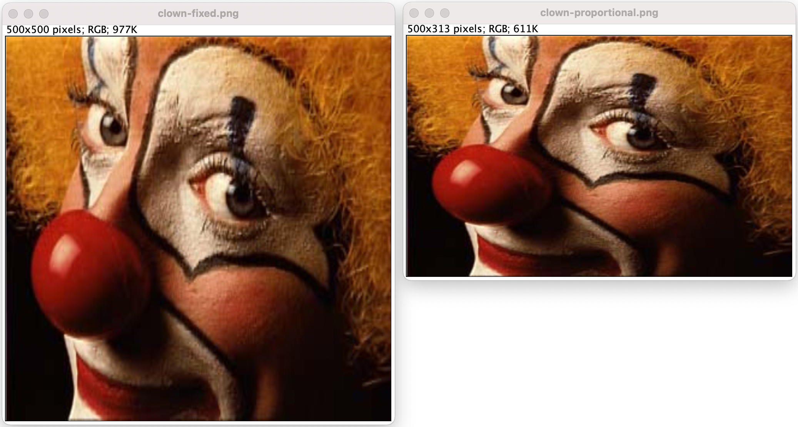

## Splitting and Merging of Color Channels

The `split()` function provides a convenient way to split multi-channel images (e.g. RGB) into its channel components.

```python:
# Split color channels
(B, G, R) = cv2.split(image)
# create 2x2 grid for displaying images
_, axarr = plt.subplots(2,2)
axarr[0,0].imshow(R, cmap='gray')
axarr[0,0].axis('off')
axarr[0,0].set_title('red')

axarr[0,1].imshow(G, cmap='gray')
axarr[0,1].axis('off')
axarr[0,1].set_title('green')

axarr[1,0].imshow(B, cmap='gray')
axarr[1,0].axis('off')
axarr[1,0].set_title('blue')

axarr[1,1].imshow(cv2.cvtColor(image, cv2.COLOR_BGR2RGB))
axarr[1,1].axis('off')
axarr[1,1].set_title('RGB')
```

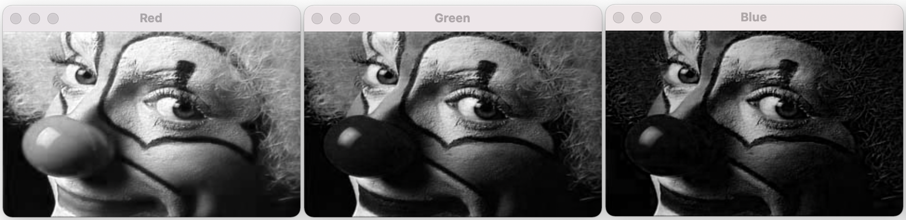

Let's take the blue and green channel only and merge them back into a new RGB image, effectively masking the red channel. For this we'll define a new numpy array with the same width and height as the original image and a depth of 1 (single channel), all pixels filled with zero values. Since the indiviudal channels of an RGB image are 8-bit numpy arrays, we choose the numpy uint8 data type.

```python:
import numpy as np
zeros = np.zeros((image.shape[0], image.shape[1]), dtype=np.uint8)
print (B.shape, zeros.shape)
merged = cv2.merge([B, G, zeros])
_,ax = plt.subplots(1,1)
ax.imshow(cv2.cvtColor(merged, cv2.COLOR_BGR2RGB))
ax.axis('off')
```


# Exercises

1. In the clown.png image, inspect the pixel value for x=300, y=25.
2. Crop the clown.png image to a centered rectangle with half the width and half the height of the original.
3. Extract the green channel, apply the values to the red channel and merge the original blue, original red and new red channel into a new BGR image.  Then display this image as an RGB image using matplotlib.

---

# Filters

## Denoising

OpenCV provides four simple to use denoising tools:

1. `cv2.fastNlMeansDenoising()` - works with a single grayscale images
2. `cv2.fastNlMeansDenoisingColored()` - works with a color image.
3. `cv2.fastNlMeansDenoisingMulti()` - works with image sequence captured in short period of time (grayscale images)
4. `cv2.fastNlMeansDenoisingColoredMulti()` - same as above, but for color images.

Common arguments are:
* `h`: parameter deciding filter strength. Higher h value removes noise better, but removes details of image also. (10 may be a good starting point)
* `hForColorComponents`: same as h, but for color images only. (normally same as h)
* `templateWindowSize`: should be odd. (recommended 7)
* `searchWindowSize`: should be odd. (recommended 21)

Let's try this with a noisy version of the clown image. This is a color RGB image and so we'll try the `cv2.fastNlMeansDenoisingColored()` filter. Here is the noisy input image `clown-noisy.png`.


The `denoising.py` script demonstrates how it works.

```python:
import cv2
from matplotlib import pyplot as plt

noisy = cv2.imread('clown-noisy.png')

# define denoising parameters
h = 15  
hColor = 15
templateWindowSize = 7
searchWindowSize = 21

# denoise and save
denoised = cv2.fastNlMeansDenoisingColored(noisy,None,h,hColor,templateWindowSize,searchWindowSize)
cv2.imwrite('clown-denoised.png', denoised)

# display
plt.subplot(121),plt.imshow(cv2.cvtColor(noisy, cv2.COLOR_BGR2RGB), interpolation=None)
plt.subplot(122),plt.imshow(cv2.cvtColor(denoised, cv2.COLOR_BGR2RGB), interpolation=None)
plt.show()
```


Additional useful filters for smoothing images:
 * `GaussianBlur` - blurs an image using a Gaussian filter
 * `medianBlur` - blurs an image using a median filter

There are many other image smoothing filters [described here](https://docs.opencv.org/4.5.3/dc/dd3/tutorial_gausian_median_blur_bilateral_filter.html). 

## Morphological Filters

Morphological filters are used for smoothing, edge detection or extraction of other features. The principal inputs are an image and a structuring element also called a kernel.

The two most basic operations are dilation and erosion on binary images (pixels have value 1 or 0; or 255 and 0). The kernel slides through the image pixel by pixel (as in 2D convolution). 

* During _dilation_, a pixel in the original image (either 1 or 0) will be considered 1 **if at least one pixel** under the kernel is 1. The dilation operation is implemented as  `cv2.dilate(image,kernel,iterations = n)`.
* During _erosion_, a pixel in the original image (either 1 or 0) will be considered 1 only **if all the pixels** under the kernel is 1, otherwise it is eroded (set to zero). The erosion operation is implemented as  `cv2.erode(image,kernel,iterations = n)`. 

The `erode-dilate.py` script provides an example:

```python:
import cv2
import numpy as np
import matplotlib.pyplot as plt

image = cv2.imread('morph-input.png',0)
# create square shaped 7x7 pixel kernel
kernel = np.ones((7,7),np.uint8)

# dilate, erode and save results
dilated = cv2.dilate(image,kernel,iterations = 1)
eroded = cv2.erode(image,kernel,iterations = 1)
cv2.imwrite('morph-dilated.png', dilated)
cv2.imwrite('morph-eroded.png', eroded)

# display results
_,ax = plt.subplots(1,3)
ax[0].imshow(image, cmap='gray')
ax[0].axis('off')
ax[1].imshow(dilated, cmap='gray')
ax[1].axis('off')
ax[2].imshow(eroded, cmap='gray')
ax[2].axis('off')
```

Original             | Dilation               | Erosion
:-------------------:|:----------------------:|:----------------------:
 | 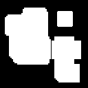 |  |

> By increasing the kernel size or number of iterations we can dilate or erode more of the original object.

Elementary morphological filters may be chained together to define composite operations.

**Opening** is just another name of erosion followed by dilation. It is useful in removing noise. 

```python:
opening = cv2.morphologyEx(img, cv2.MORPH_OPEN, kernel)
```

**Closing** is reverse of opening, i.e. dilation followed by erosion. It is useful in closing small holes inside the foreground objects, or small black points on the object.

```
closing = cv2.morphologyEx(img, cv2.MORPH_CLOSE, kernel)
```

Original             | Opening               | Closing
:-------------------:|:----------------------:|:----------------------:
 | 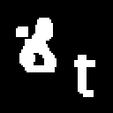 | 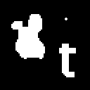 |

> Note how the opening operation removed the small dot in the top right corner.  In contrast the closing operation retained that small object and also filled in the black hole in the object on the left side of the input image.

**Morphological Gradients** can be calculated as the difference between dilation and erosion of an image. It is used to reveal object's edges.

```python:
kernel = np.ones((2,2),np.uint8)
gradient = cv2.morphologyEx(image, cv2.MORPH_GRADIENT, kernel)
```

Original             | Gradient (edges)
:-------------------:|:----------------------:
 | 

# Exercises

1. Experiment with different kernel sizes an number of iterations. What do you observe?

--- 

# Segmentation & Quantification

Image Segmentation is the process that groups related pixels to define higher level objects. The following techniques are commonly used to accomplish this task:

1. Thresholding - conversion of input image into binary image
2. Edge detection - see above
3. Region based - expand/shrink/merge object boundaries from object seed points
4. Clustering  - use statistal analysis of proximity to group pixels as objects
5. Watershed - separates touching objects
6. Artificial Neural Networks - train object recognition from examples

Let's try to identify and measure the area of the nuclei in this image with fluorescently labeled cells. This is the `fluorescent-cells.png` image in the examples folder. We will explore the use of morphology filters, thresholding and watershed to accomplish this.

The complete code is in the `segmentation.py` script.


## Preprocessing

First, we load the image and extract the blue channel which contains the labeling of the nuclei. Since OpenCV reads RGB images in BGR order, the blue channel is at index position 0 of the third image axis.

```python:
import cv2

image = cv2.imread('fluorescent-cells.png')
nuclei = image[:,:,0] # get blue channel
```


To eliminate noise, we apply a Gaussian filter with 3x3 kernel, then apply the Otsu thresholding alogorithm. The thresholding converts the grayscale intensity image into a black and white binary image. White pixels represent nuclei; black pixel represent background. 

```python:
# apply Gaussian filter to smoothen image, then apply Otsu threshold
blurred = cv2.GaussianBlur(nuclei, (3, 3), 0)
ret, thresh = cv2.threshold(blurred,0,255,cv2.THRESH_BINARY+cv2.THRESH_OTSU)
```

Next, we'll apply an opening operation to exclude small non-nuclear particles in the binary image. Furthermore we use scikit's `clear_border()` function to exclude objects (nuclei) touching the edge of the image. 

```python:
# fill small holes
import numpy as np
from skimage.segmentation import clear_border

kernel = np.ones((3,3),np.uint8)
opening = cv2.morphologyEx(thresh,cv2.MORPH_OPEN,kernel, iterations=7)

# remove image border touching objects
opening = clear_border(opening)
```

The resulting image looks like this.

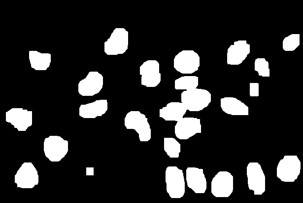

A tricky issue is that some of the nuclei masks are touching each other.  We need to find a way to break up these clumps. We do this in several steps. First, we will dilate the binary nuclei mask. The black areas in the resulting image represent pixels that certainly do not contain any nuclear components. We call it the `sure_bg`.

```python:
# sure background area
sure_bg = cv2.dilate(opening,kernel,iterations=10)
```


The nuclei are all fully contained inside the white pixel area. The next step is to find estimates for the center of each nucleus. Some of the white regions may contain more than one nucleus and we need to separate the joined ones. We calculate the distance transform to do this.

> The result of the distance transform is a graylevel image that looks similar to the input image, except that the graylevel intensities of points inside foreground (white) regions are changed to show the distance to the closest boundary from each point.

We can use the intensity peaks in the distance transform map (a grayscale image) as proxies and seeds for the individual nuclei. We isolate the peaks by applying a simple threshold. The result is the `sure_fg` image.

```python:
# calculate distance transform to establish sure foreground
dist_transform = cv2.distanceTransform(opening,cv2.DIST_L2,5)
ret, sure_fg = cv2.threshold(dist_transform,0.6*dist_transform.max(),255,0)
```

Distance Transform               | Sure Foreground (nuclei seeds)
:-------------------------------:|:------------------------:
| 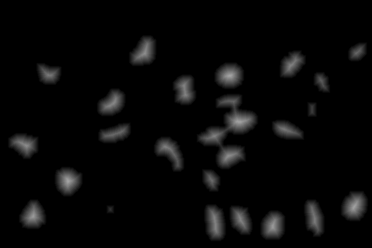 | 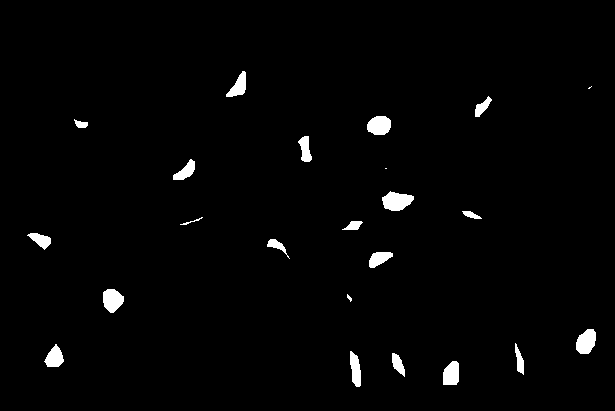 |


By subtracting the sure foreground regions from the sure background regions we can identify the regions of unknown association, i.e. the pixels that we have not assigned to be either nuclei or background.

```python:
# sure_fg is float32, convert to uint8 and find unknown region
sure_fg = np.uint8(sure_fg)
unknown = cv2.subtract(sure_bg,sure_fg)
```

Sure Background         | Sure Foreground (nuclei seeds)  | Unknown
:----------------------:|:-------------------------------:|:-----------------------:
 |          | 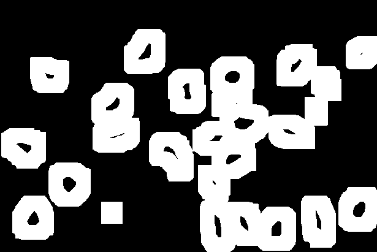 |


## Watershed

Now we can come back to the sure foreground and create markers to label individual nuclei. First, we use OpenCV's `connectedComponents` function to create different color labels for the set of regions in the `sure_fg` image. We store the label information in the `markers` image and add 1 to each color value. The pixels that are part of the `unknown` region are set to zero in the `markers` image. This is critical for the following `watershed` step that separates connected nuclei regions based on the set of markers. 

```python:
# label markers 
ret, markers = cv2.connectedComponents(sure_fg)

# add one to all labels so that sure background is not 0, but 1
markers = markers + 1

# mark the region of unknown with zero
markers[unknown==255] = 0
markers = cv2.watershed(image,markers)
```

Lastly, we overlay a yellow outline to the original image for all identified nuclei.

```
image[markers == -1] = [0,255,255]
```

The resulting `markers` (pseudo-colored) and input images with segmentation overlay look like this:

Markers                 | Segmentation
:----------------------:|:-------------------------:
 | 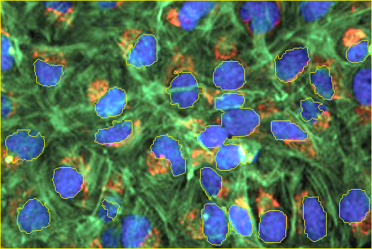 |


## Measure

With the markers in hand, it is very easy to extract pixel and object information for each identified object. We use the `scikit-image` package (`skimage`) for the data extraction and `pandas` for storing the data in csv format.

```
from skimage import measure, color
import pandas as pd

# compute image properties and return them as a pandas-compatible table
p = ['label', 'area', 'equivalent_diameter', 'mean_intensity', 'perimeter']
props = measure.regionprops_table(markers, nuclei, properties=p)
df = pd.DataFrame(props)

# print data to screen and save
print (df)
df.to_csv('nuclei-data.csv')
```

**Output:**
```
    label    area  equivalent_diameter  mean_intensity    perimeter
0       1  204775           510.614951       72.078891  6343.194406
1       2    1906            49.262507      218.294334   190.716775
2       3    1038            36.354128      204.438343   148.568542
3       4    2194            52.853454      156.269827   215.858910
4       5    2014            50.638962      199.993545   177.432504
5       6    1461            43.130070      185.911020   168.610173
6       7    2219            53.153726      170.962596   212.817280
7       8    1837            48.362600      230.387044   184.024387
8       9    1032            36.248906      228.920543   135.769553
9      10    2433            55.657810      189.083436   218.781746
10     11    1374            41.826202      214.344978   167.396970
11     12    1632            45.584284      191.976716   196.024387
12     13    1205            39.169550      245.765145   141.639610
13     14    2508            56.509157      153.325359   229.894444
14     15    2086            51.536178      195.962608   244.929978
15     16    1526            44.079060      243.675623   163.124892
16     17    1929            49.558845      217.509072   174.124892
17     18    1284            40.433149      165.881620   150.710678
18     19    2191            52.817306      174.357827   190.331998
19     20    2218            53.141747      170.529306   210.260931
20     21    2209            53.033821      164.460842   203.858910
21     22    2370            54.932483      193.639241   206.296465
22     23    1426            42.610323      249.032959   157.296465
23     24    2056            51.164250      194.098735   181.396970
```


# Exercises

1. Experiment with different kernel sizes during the preprocessing step.
2. Experiment with different iteration numbers for the opening and dilation operation. 
3. Experiment with different thresholding values for isolating the nuclei seeds from the distance transform image.
4. Change the overlay color from yellow to magenta. Tip: magenta corresponds to BGR (255,255,0).

How do these changes affect the segmentation?

---

# Resources

* [Introduction to OpenCV](https://docs.opencv.org/master/d1/dfb/intro.html)
* [OpenCV Python Tutorial](https://opencv24-python-tutorials.readthedocs.io/en/latest/index.html)