# Alphafold on rivanna

Caitlin Jagla & Marcus Bobar
UVA Research Computing

# Agenda

Intro to GPU Computing

Intro to Alphafold

Running Alphafold on Rivanna Live Demo

# CPU vs. GPU

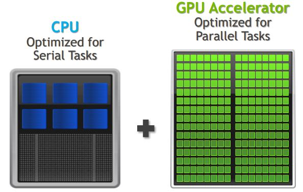

CPU: central processing unit

GPU: graphics processing unit

GPU computing uses a GPU as a co-processor to accelerate CPUs

GPU accelerates applications running on the CPU by offloading compute-intensive, time-consuming portions of code onto the GPU

CPU

GPU

100s-1000s of cores

High throughput

Good for parallel processing

Breaks jobs into separate tasks to process simultaneously

Requires additional software to convert CPU functions to GPU functions for parallel execution

4-8 cores (on laptop/workstation PC)

Up to 48 cores (on Rivanna)

Low latency

Good for serial processing

Quickly process interactive tasks

Traditional programs written for CPU sequential execution

---

CPUs = scooters
GPUs = sports car

Best choice depends on your use case!

Alphafold is designed for GPU computing

# The protein folding problem

https://www.allthescience.org/how-many-proteins-exist.htm
https://en.wikipedia.org/wiki/Protein_Data_Bank

How many proteins do you guess exist in the world (across all species)?

How many structures do you think we’ve experimentally solved (across all species)?

# CASP competitions

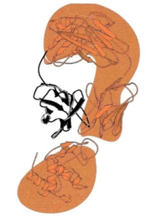

CASP = Critical Assessment of protein Structure Prediction

Started in 1994

Biennial competition for testing protein structure predictions

Predicted models are tested against recently experimentally solved structures not yet published or deposited in PDB

Uses Global Distance Test – Total Score (GDT-TS): measures what percentage of α-carbons are within a threshold distance (in angstroms) of the experimental structure

---

https://predictioncenter.org/

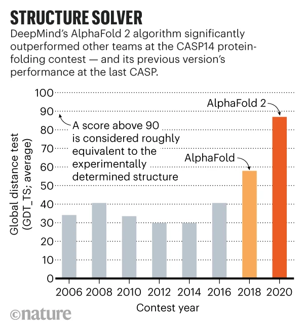

# Alphafold - A game-changer

https://www.nature.com/articles/d41586-020-03348-4

# What is alphafold?

DeepMind: an artificial intelligence company

Neural network

Multiple different modules trained simultaneously using end-to-end learning

Has monomer & multimer versions

Based largely on coevolutionary information

2 steps: genetic database search for homologues, then pre-trained neural network & molecular dynamics simulations refinement to generate PDB files

“directly predicts 3D coordinates of all heavy atoms for a given protein using the primary amino acid sequence and aligned sequences of homologues as input”

# Steps

1. user inputs FASTA file (containing 1 sequence for monomer, multiple sequences for multimer)
2. database search: genetic and structural
	- multiple sequence alignment (MSA) via:
		1. JackHMMER on Mgnify (keep top 5000 matches)
		2. UniRef90 (keep top 10000)
		3. HHBlits on UniClust30 & BFD (keep all matches)
		+ essential to have deep MSA, < 30 sequences leads to significant loss of accuracy
	- template search of PDB70 with HHSearch, top 4 templates chosen as starting position for prediction models
3. prediction model
	- MSA & templates given to 5 AlphaFold models with same architecture but different parameters based on different randomization seeds
	- architecture: Evoformer blocks (pairwise updates to numberical MSA representation and 2D amino acid pair representation) & Structure module blocks which do actual folding
	- modules are recycled 3 times iteratively (predicted structure is used as template for next iteration)
4. Relaxation
	- AMBER relaxation eliminates side chain stereochemical violations (clashing side chains)
	- Exact enforcement of peptide bond geometry is only achieved in the post-prediction relaxation of the structure by gradient descent in the Amber32 force field.
	- Empirically, this final relaxation does not improve the accuracy of the model as measured by the global distance test (GDT)33 or lDDT-Cα34 but does remove distracting stereochemical violations without the loss of accuracy.

5. Ranking

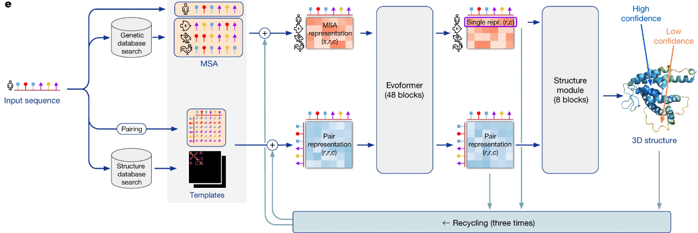

# Architecture

1. user inputs FASTA file (containing 1 sequence for monomer, multiple sequences for multimer)
2. database search: genetic and structural
	- multiple sequence alignment (MSA) via:
		1. JackHMMER on Mgnify (keep top 5000 matches)
		2. UniRef90 (keep top 10000)
		3. HHBlits on UniClust30 & BFD (keep all matches)
		+ essential to have deep MSA, < 30 sequences leads to significant loss of accuracy
	- template search of PDB70 with HHSearch, top 4 templates chosen as starting position for prediction models
3. prediction model	- architecture: Evoformer blocks (pairwise updates to numberical MSA representation and 2D amino acid pair representation) & Structure module blocks which do actual folding
	- modules are recycled 3 times iteratively (predicted structure is used as template for next iteration)
4. Relaxation
	- AMBER relaxation
5. Ranking

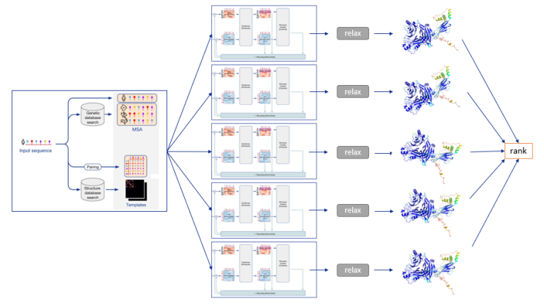

Evoformer module and structural module are run 5 times in parallel, generating 5 separate models which are then relaxed & ranked

---

MSA & templates given to 5 AlphaFold models with same architecture but different parameters based on different randomization seeds

# Outputs

* msas directory (multiple sequence alignments)
* features.pkl (machine-readable pickle file)
* ranking_debug.json
* relax_metrics.json
* timings.json
* 5 models:
  * ranked PDB structure
  * relaxed PDB structure
  * unrelaxed PDB structure
  * .pkl file

# QC METRICS

---

https://alphafold.ebi.ac.uk/entry/Q9Y223 , see "Predicting aligned error tutorial" section

https://www.ncbi.nlm.nih.gov/pmc/articles/PMC3799472/

# Running AlphaFold On Rivanna

# Steps

---

Added alphapickle/python scripts after alphafold run command in main slurm script -> all-in-one example

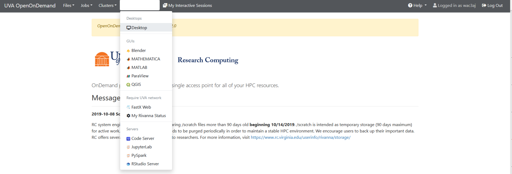

[https://rivanna-portal.hpc.virginia.edu/](https://rivanna-portal.hpc.virginia.edu/)

# Logging on to OOD Desktop

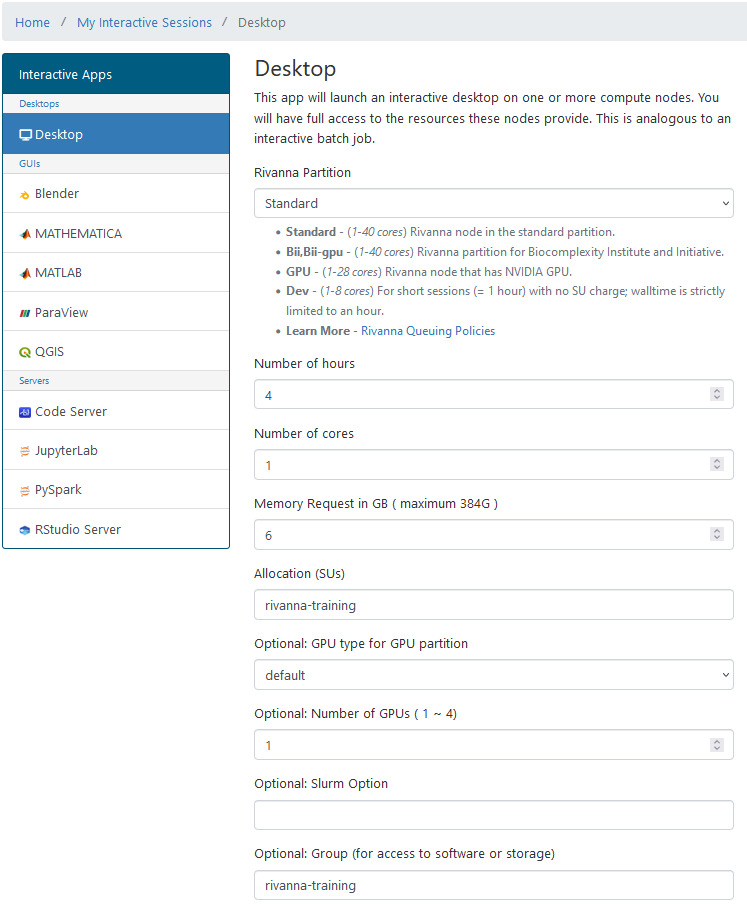

OOD Desktop

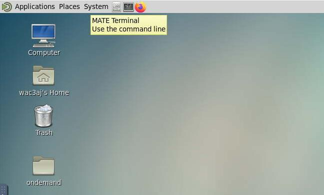

# Prep Working Directory

#inside terminal on OOD desktop:

#navigate to your scratch directory

cd /scratch/$USER

#copy working directory to your scratch

cp –r /project/rivanna-training/alphafold .

#view files in new working directory

cd alphafold

ls -lh

# Working Directory Contents

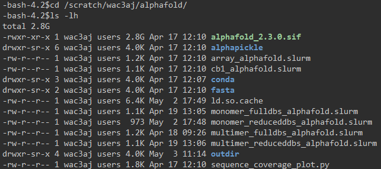

.sif = singularity container file
Slurm scripts for various use cases
Fasta files for both monomer and multimer versions in subdirectory /fasta
Conda environment with python packages necessary for running alphapickle & sequence_coverage_plot.py
Alphapickle is a package from github, makes QC plots and human-readable QC metric files (csv/txt) from the pickle file output of alphafold

Sequence_coverage_plot_fxn.py is a script I modified to generate sequence coverage plots by deriving info from the features.pkl file (from https://raw.githubusercontent.com/jasperzuallaert/VIBFold/main/visualize_alphafold_results.py )

Outdir is just a directory in which the output files will go  - contains cb1 and ubb_multimer output files from previous runs of alphafold, since they take too long to run today

# Submit Slurm Job

sbatch monomer_reduceddbs_alphafold.slurm

---

While this is running, we will walk through the steps using an example protein for which the results of the run are already in your ‘outdir’ subdirectory

# Input - FASTA File

* Generate a FASTA file in your preferred manner
* [https://rest.uniprot.org/uniprotkb/P21554.fasta](https://rest.uniprot.org/uniprotkb/P21554.fasta)
  * P21554: UniProt unique ID for human Cannabinoid Receptor 1 GPCR
* Get your FASTA file onto Rivanna in your working directory
  * OOD, Globus, scp, make file directly on Rivanna with nano/vim, etc.

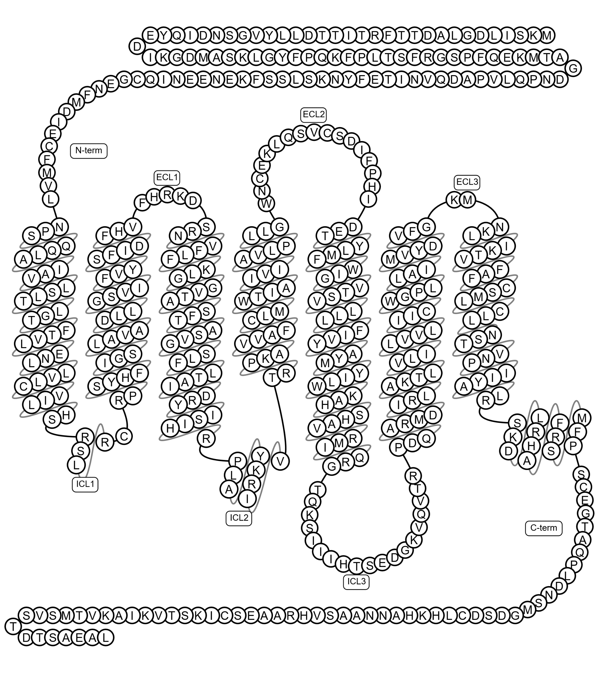

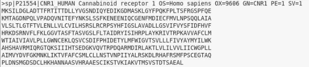

# Slurm Script for monomers (Full Database)

#!/bin/bash

#SBATCH -A rivanna-training    # your allocation account

#SBATCH -p gpu          # partition

#SBATCH --gres=gpu:1    # number of GPUs (only 1 because Alphafold isn’t multi-GPU enabled)

#SBATCH -C "v100|a100"  # request a V100 or A100 GPU

#SBATCH -N 1            # number of nodes

#SBATCH -c 8            # number of cores (jackhmmr is hardcoded to use 8 cores, more does not speed it up)

#SBATCH -t 10:00:00     # time

module purge

module load singularity alphafold

module load anaconda

run --fasta_paths=$PWD/fasta/cb1.fasta \

--output_dir=$PWD/outdir \

--model_preset=monomer_ptm \

--db_preset=full_dbs \

--bfd_database_path=/data/bfd/bfd_metaclust_clu_complete_id30_c90_final_seq.sorted_opt \

--pdb70_database_path=/data/pdb70/pdb70 \

--uniref30_database_path=/data/uniref30/UniRef30_2021_03 \

--max_template_date=2023-03-29 \

--use_gpu_relax=True

conda run -p "/scratch/$USER/alphafold/conda/env" python $PWD/alphapickle/run_AlphaPickle.py -od outdir/cb1

conda run -p "/scratch/$USER/alphafold/conda/env" python $PWD/sequence_coverage_plot.py --input_dir outdir/cb1 --output_dir outdir/cb1 --name CB1

---

It’s in a singularity container with a custom wrapper run script, so you need follow our documentation rather than official deepmind github repo or other google-able resources

8 cores are requested because jackhmmr is hardcoded to have 8 cores so adding more cores won’t speed up
Alphafold isn’t multi-GPU enabled so we will only request 1 GPU

As a consequence of the Singularity --pwd flag, the fasta and output paths must be full paths (e.g. /scratch/$USER/mydir, not relative paths (e.g. ./mydir). You may use $PWD as demonstrated. 
Remember $PWD points to the directory your slurm script is in

Change red text to point to your chosen proteins’ fasta file & output directories
Yellow: parameters to change if desired
	monomer_ptm = to generate monomer models including the PAE QC metric (have to use monomer_ptm, not plain monomer, or else PAE info isn’t generated)
	max_template_date = You must provide a value for --max_template_date. If you are predicting the structure of a protein that is already in PDB and you wish to avoid using it as a template, then max_template_date must be set to be before the release date of the structure. If you do not need to specify a date, by default you can set today’s date. For example, if you are running the simulation on August 7th 2021, set -–max_template_date = 2021-08-07. 

--model_preset=

__monomer__ : This is the original model used at CASP14 with no ensembling.

__monomer_casp14__ : This is the original model used at CASP14 with num_ensemble=8, matching our CASP14 configuration. This is largely provided for reproducibility as it is 8x more computationally expensive for limited accuracy gain (+0.1 average GDT gain on CASP14 domains).

_monomer_ptm_ : This is the original CASP14 model fine tuned with the pTM head, providing a pairwise confidence measure. It is slightly less accurate than the normal monomer model.  _Required to generate PAE values useful for QC purposes._

_multimer_ : This is the [AlphaFold](https://github.com/deepmind/alphafold#citing-this-work)[-Multimer](https://github.com/deepmind/alphafold#citing-this-work) model. To use this model, provide a multi-sequence FASTA file. In addition, the UniProt database should have been downloaded.

---

Running with monomer_ptm is required to get QC metric PAE which can be important / necessary to plot and visualize QC metrics 
Otherwise you can run with plain monomer, which seems to be faster

Only one option for multimers, which we will cover later on in the workshop

--max_template_date=

You must provide a value for --max_template_date. If you are predicting the structure of a protein that is already in PDB and you wish to avoid using it as a template, then max_template_date must be set to be before the release date of the structure. If you do not need to specify a date, by default you can set today’s date. For example, if you are running the simulation on August 7th, 2021, set --max_template_date = 2021-08-07.

---

https://nostrumbiodiscovery.github.io/nbd_central_docs/software/alphafold/alphafold.html

--db_preset=

controls MSA speed/quality tradeoff

__reduced_dbs__ : This preset is optimized for speed and lower hardware requirements. It runs with a reduced version of the BFD database. It requires 8 CPU cores (vCPUs), 8 GB of RAM, and 600 GB of disk space.

__full_dbs__ : This runs with all genetic databases used at CASP14.

If you change db_preset, you must change database path arguments too

See example scripts for different use-cases

---

You can control MSA speed/quality tradeoff by adding --db_preset=reduced_dbs or --db_preset=full_dbs to the run command. We provide the following presets:
reduced_dbs: This preset is optimized for speed and lower hardware requirements. It runs with a reduced version of the BFD database. It requires 8 CPU cores (vCPUs), 8 GB of RAM, and 600 GB of disk space.
full_dbs: This runs with all genetic databases used at CASP14.

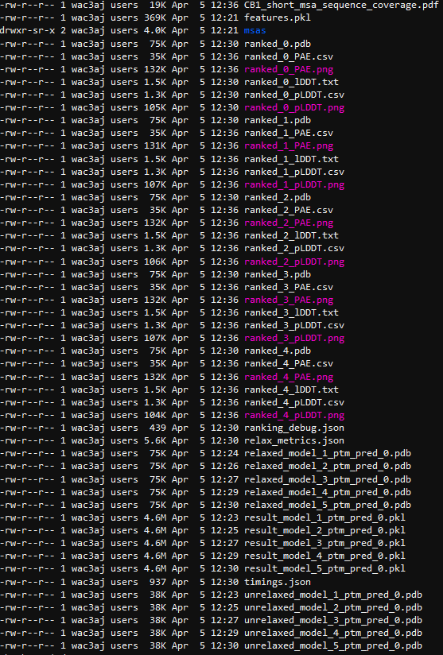

# Outputs

---

The csv, txt, and png files are from alphapickle
The pdf is from sequence_coverage_plot_fxn.py
The rest is from base alphafold (msas, pdb, pkl, json)
Ranked_0 is the best

# output1 CB1_short_msa_sequence_coverage.pdf

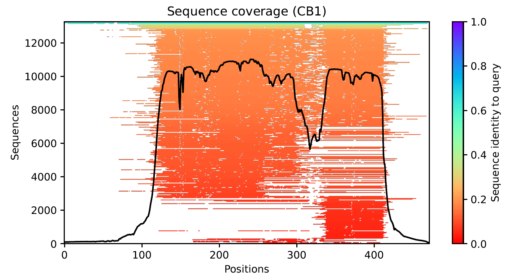

---

Shows sequence coverage along the length of the protein
Here we have a depth of about 13000 sequences with varying ranges of homology with the query sequence 

7TM septa-helical protein with less-structured tails on both termini  reflected in 3D structure

# output2 pLDDT plot: ranked_0_pLDDT.png

ranked_0.pdb (best model)

7-transmembrane domain septa-helical protein with less-structured tails on both termini  reflected in plot

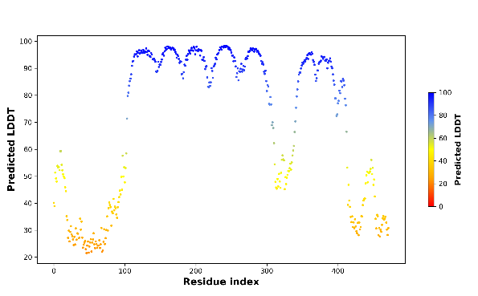

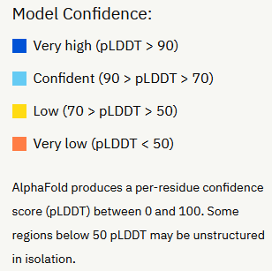

---

GPCR N-terminus (5’/start of protein) is extracellular, C-terminus (3’/end of protein) is intracellular. There is a loop between each transmembrane alpha-helix, one loop is longer than the others which is why you see it is more unstructured. This GPCR happens to have a couple short helices in its C terminal structure as well, but mostly the tails are disordered/unstructured

Arnold, M. J. (2021) AlphaPickle doi.org/10.5281/zenodo.5708709

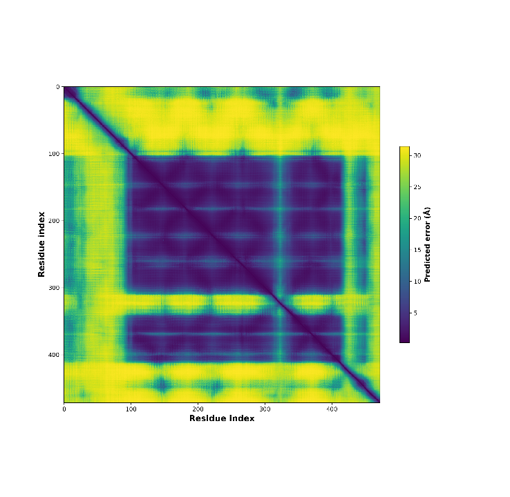

# output3? PAE plot: ranked_0_PAE.png

ranked_0.pdb (best model)

Color at position (x, y) indicates expected position error at residue x, when the predicted and true structures are aligned on residue y

Color indicates  _expected distance error _ in angstroms

Purple = good (low error)

Yellow = bad (high error)

7-transmembrane domain septa-helical protein with less-structured tails on both termini  reflected in plot

---

Arnold, M. J. (2021) AlphaPickle doi.org/10.5281/zenodo.5708709

https://alphafold.ebi.ac.uk/entry/Q9Y223 , see "Predicting aligned error tutorial" section

# Csv outputs from alphapickle

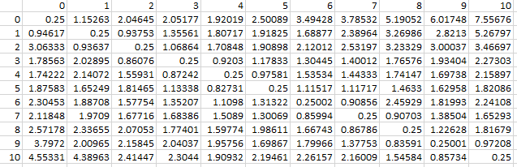

PAE.csv: n_residue x n_residue matrix for generating PAE heatmaps

pLDDT.csv: n_residue-long list for generating pLDDT plots

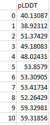

You can use these files to generate your own custom plots! Try Python, R, or your favorite plotting method.

---

Can use these files to generate your own custom plots in python, R, even excel if you want

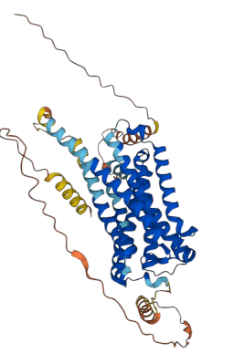

# Pdb structure

ranked_0.pdb (best model)

Colored by pLDDT

Dark blue = high confidence

Red = low confidence

7-transmembrane domain septa-helical protein with less-structured tails on both termini  reflected in 3D structure

Disordered regions (“ribbons”) are low-confidence

Helices are high-confidence

---

GPCR N-terminus (5’/start of protein) is extracellular, C-terminus (3’/end of protein) is intracellular. There is a loop between each transmembrane alpha-helix, one loop is longer than the others which is why you see it is more unstructured. This GPCR happens to have a couple short helices in its C terminal structure as well, but mostly the tails are disordered/unstructured

# Visualizing 3D Structure in vmd

* Open On Demand ([https://rivanna-portal.hpc.virginia.edu/](https://rivanna-portal.hpc.virginia.edu/))
* Choose ‘Desktop’ interactive app  fill out webform
* Launch desktop
* Open terminal:
  * module load vmd
  * vmd
* VMD windows will launch

# OOD Desktop

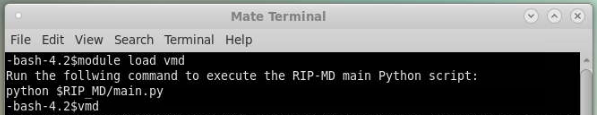

# VMD - Visual Molecular Dynamics

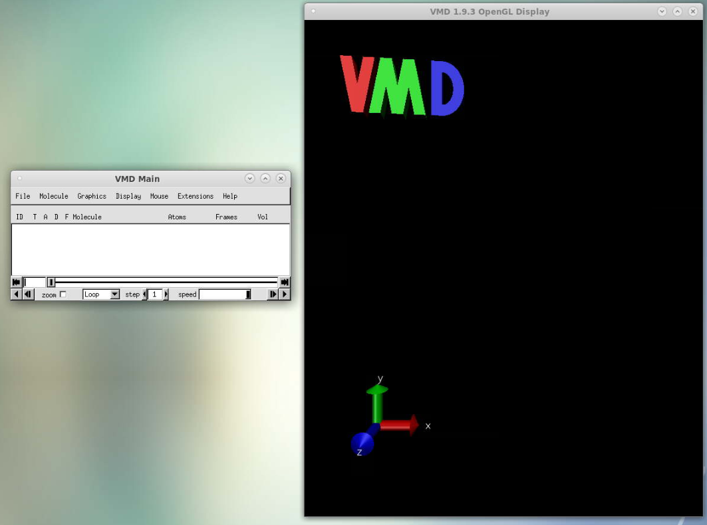

# VMD - Load your pdb file

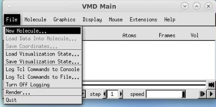

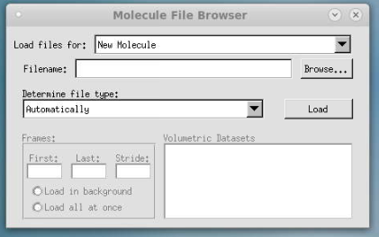

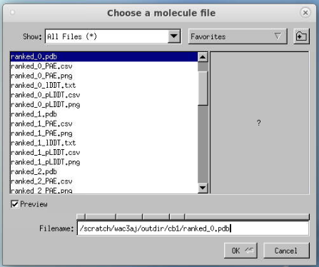

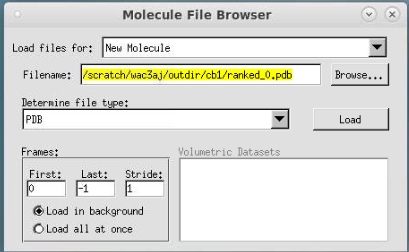

# VMD -  Modify Visualization

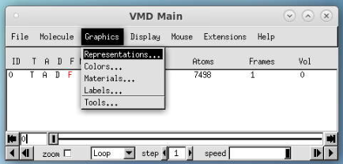

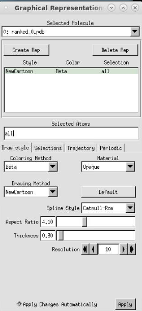

---

pLDDT is stored in the “beta” slot 

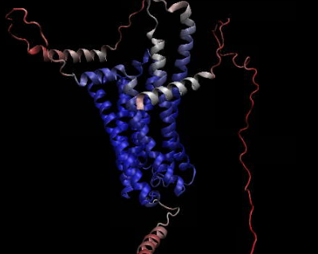

# VMD - Result

---

Colored by pLDDT via “beta” slot (blue = good, red = bad) 

VMD -  Export

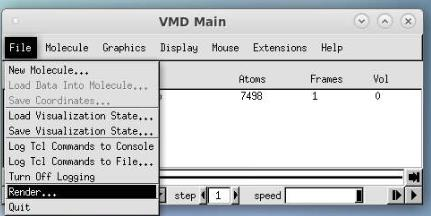

---

Screen Capture Using Snapshot 
The simplest way to produce raster image files in VMD is to use the ``Snapshot'' feature. The snapshot feature captures the contents of the VMD graphics window, and saves them to a raster image file. On Unix systems, the captured image is written to a 24-bit color Truevision ``Targa'' file. On Windows systems, the captured image is written to a 24-bit color Windows Bitmap, or ``BMP'' file. To use the snapshot feature, simply open the Render form and choose the snapshot option. VMD will capture the contents of the graphics window, and attempt to save the resulting image to the filename given in the Render form. You may find that it is important not to have other windows or cursors in front of the VMD graphics display when using snapshot, since the resulting images may include obscuring windows or cursors. This is a platform-dependent behavior, so you will need to determine if your system does this or not. 

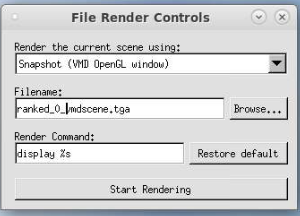

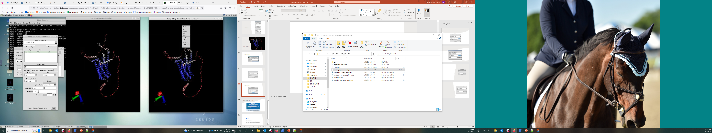

---

Right click on pop-up imagemagick window, then hit save

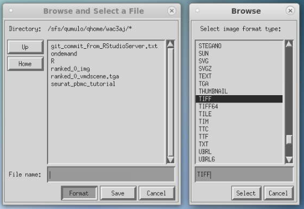

---

Hit format, a new popup appears
Select your image format (I recommend TIFF or PNG)  hit select
Type file name INCLUDING EXTENSION
Hit save
Now you will have a high-quality image for use in presentations, publications, etc.

# VMD -  Change Background Color

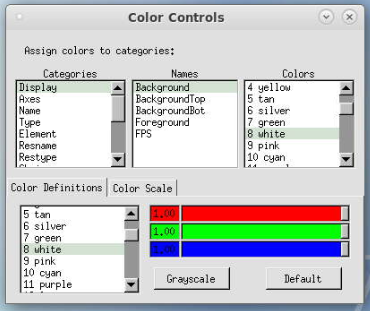

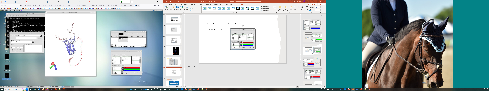

---

VMD is very customizable, you can change colors of almost anything, select different parts of your molecule, etc. This isn’t a VMD tutorial so I won’t go into the details but I encourage you to play around with it as needed to help you in your research

# alphafold protein structure database
www.alphafold.ebi.ac.uk

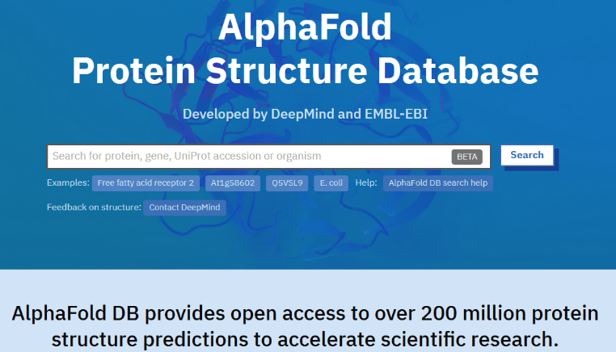

---

Alphafold has a database of 200 million structure predictions, so why do we need to bother running monomer version anymore?
	special use-cases such as: engineered proteins, chimeric proteins, novel proteins translated from newly recognized ORFs, etc. 
	OR protein complexes = use alphafold multimer

DeepMind and EMBL’s European Bioinformatics Institute (EMBL-EBI) have partnered to create AlphaFold DB to make these predictions freely available to the scientific community. The latest database release contains over 200 million entries, providing broad coverage of UniProt (the standard repository of protein sequences and annotations). We provide individual downloads for the human proteome and for the proteomes of 47 other key organisms important in research and global health. We also provide a download for the manually curated subset of UniProt (Swiss-Prot). 

# Limitations

Limitations of Alphafold DB
The AlphaFold DB uses a monomeric model similar to the CASP14 version. As a result, many of the same limitations are expected:[75] 
The DB model only predicts monomers, missing some important context in the form of protein complexes. The AlphaFold Multimer model is published separately as open-source, but pre-run models are not available.
The model is unreliable for intrinsically disordered proteins, although it does convey the information via a low confidence score.
The model is not validated for mutational analysis.
The model relies to some extent upon co-evolutionary information across similar proteins, and thus may not perform well on synthetic proteins or proteins with very low homology to anything in the database.[76]
The model can only output one conformation of proteins with multiple conformations, with no control of which.
The model only predicts protein structure without cofactors and co- and post-translational modifications. This can be a significant shortcoming for a number of biologically-relevant systems:[65] between 50% and 70% of the structures of the human proteome are incomplete without covalently-attached glycans.[77] On the other hand, since the model is trained from PDB models often with these modifications attached, the predicted structure is "frequently consistent with the expected structure in the presence of ions or cofactors".[75]
The database does not include proteins with fewer than 16 or more than 2700 amino acid residues,[69] but for humans they are available in the whole batch file.
On its potential as a tool for drug discovery, Stephen Curry notes that while the resolution of AlphaFold 2's structures may be very good, the accuracy with which binding sites are modelled needs to be even higher: typically molecular docking studies require the atomic positions to be accurate within a 0.3 Å margin, but the predicted protein structure only have at best an RMSD of 0.9 Å for all atoms.

* unreliable for [intrinsically disordered proteins](https://en.wikipedia.org/wiki/Intrinsically_disordered_protein), but does convey that information via a low confidence score
* not validated for mutational analysis
  * relies to some extent upon co-evolutionary information across similar proteins, and thus may not perform well on synthetic proteins or proteins with very low homology to anything in the database
* can only output one conformation of proteins with multiple conformations, with no control of which
* only predicts protein structure without cofactors and co- and post-translational modifications.
  * 50% - 70% of the structures in the human proteome are incomplete without covalently-attached glycans
  * however, since the model is trained from PDB models often with these modifications attached, the predicted structure is "frequently consistent with the expected structure in the presence of ions or cofactors"
* drug discovery: typical molecular docking studies require atomic positions to be accurate within a 0.3 Å margin, but the predicted protein structures only have at best an RMSD of 0.9 Å for all atoms
* AlphaFold-multimer has a limit of nine chains or 1536 residues in its training and testing data
* Not multi-GPU enabled (limited acceleration possibilities)
---

From Wikipedia

Evolved proteins are not subject to random changes, only changes which allow the organism to survive. Mutations which significantly destabilize or change the structure of the protein are unlikely to be advantageous and outcompete the existing protein. CASP14 seems to be the prime source of validation for the model. This consists entirely of evolved proteins, so does not provide any evidence of performance against non-evolved (i.e. engineered) proteins. This strongly limits the usage of AlphaFold for protein engineering and design.

https://www.lesswrong.com/posts/6vybojuDEqaHeg8aN/a-confused-chemist-s-review-of-alphafold-2
https://www.blopig.com/blog/2021/07/alphafold-2-is-here-whats-behind-the-structure-prediction-miracle/

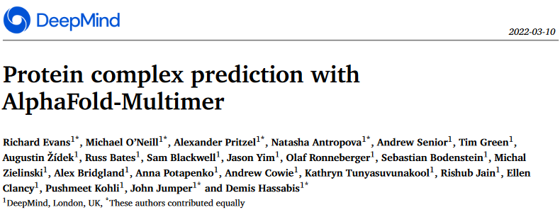

# Other options

* Openfold
  * PyTorch reproduction of AlphaFold
  * Trainable
  * has “long sequences” argument that allows you to run longer sequences that Alphafold can’t fit into memory on a single GPU
  * Does not support multi-GPU for model inference, only for training
* Fastfold
  * Trainable
  * Supports multi-GPU utilization for training & model inference
* Parafold
  * Divides CPU (MSA & template searching) from GPU (prediction model) to accelerate prediction of multiple sequences

# Slurm Script for MULTIMERS (Reduced databases)
#!/bin/bash

#SBATCH -A rivanna-training      # your allocation account

#SBATCH -p gpu          # partition

#SBATCH --gres=gpu:1    # number of GPUs

#SBATCH -C "v100|a100"  # request a V100 or A100 GPU

#SBATCH -N 1            # number of nodes

#SBATCH -c 8            # number of cores

#SBATCH -t 10:00:00     # time

module purge

module load singularity alphafold

module load anaconda

run --fasta_paths=$PWD/fasta/ubb_multimer.fasta \

--output_dir=$PWD/outdir \

--model_preset=multimer \

--db_preset=reduced_dbs \

--pdb_seqres_database_path=/data/pdb_seqres/pdb_seqres.txt \

--uniprot_database_path=/data/uniprot/uniprot.fasta \

--small_bfd_database_path=/data/small_bfd/bfd-first_non_consensus_sequences.fasta \

--max_template_date=2023-04-10 \

--use_gpu_relax=True

conda run -p "/scratch/$USER/alphafold/conda/env" python $PWD/alphapickle/run_AlphaPickle.py -od outdir/ubb_multimer

conda run -p "/scratch/$USER/alphafold/conda/env" python $PWD/sequence_coverage_plot.py --input_dir outdir/ubb_multimer \

--output_dir outdir/ubb_multimer --name ubb_multimer

---

As a consequence of the Singularity --pwd flag, the fasta and output paths must be full paths (e.g. /scratch/$USER/mydir, not relative paths (e.g. ./mydir). You may use $PWD as demonstrated.

Remember $PWD points to the directory your slurm script is in

Change red text as needed

# Multimer with full_dbs slurm script

#!/bin/bash

#SBATCH -A rivanna-training      # your allocation account

#SBATCH -p gpu          # partition

#SBATCH --gres=gpu:1    # number of GPUs

#SBATCH -C "v100|a100"  # request a V100 or A100 GPU

#SBATCH -N 1            # number of nodes

#SBATCH -c 8            # number of cores

#SBATCH -t 10:00:00     # time

module purge

module load singularity alphafold

module load anaconda

run --fasta_paths=$PWD/fasta/ubb_multimer.fasta \

--output_dir=$PWD/outdir \

--model_preset=multimer \

--db_preset=full_dbs \

--pdb_seqres_database_path=/data/pdb_seqres/pdb_seqres.txt \

--uniprot_database_path=/data/uniprot/uniprot.fasta \

--bfd_database_path=/data/bfd/bfd_metaclust_clu_complete_id30_c90_final_seq.sorted_opt \

--uniref30_database_path=/data/uniref30/UniRef30_2021_03 \

--max_template_date=2023-04-10 \

--use_gpu_relax=True

conda run -p "/scratch/$USER/alphafold/conda/env" python $PWD/alphapickle/run_AlphaPickle.py \

-od outdir/ubb_multimer

conda run -p "/scratch/$USER/alphafold/conda/env" python $PWD/sequence_coverage_plot.py \

--input_dir outdir/ubb_multimer --output_dir outdir/ubb_multimer --name ubb_multimer

## Monomer_PTM with Reduced_dbs

#!/bin/bash

#SBATCH -A rivanna-training      # your allocation account

#SBATCH -p gpu          # partition

#SBATCH --gres=gpu:1    # number of GPUs

#SBATCH -C "v100|a100"  # request a V100 or A100 GPU

#SBATCH -N 1            # number of nodes

#SBATCH -c 8            # number of cores

#SBATCH -t 10:00:00     # time

module purge

module load singularity alphafold

module load anaconda

run --fasta_paths=$PWD/fasta/ubb.fasta \

--output_dir=$PWD/outdir \

--model_preset=monomer_ptm \

--db_preset=reduced_dbs \

--small_bfd_database_path=/data/small_bfd/bfd-first_non_consensus_sequences.fasta \

--pdb70_database_path=/data/pdb70/pdb70 \

--max_template_date=2023-04-17 \

--use_gpu_relax=True

conda run -p "/scratch/$USER/alphafold/conda/env" python $PWD/alphapickle/run_AlphaPickle.py \

-od outdir/ubb

conda run -p "/scratch/$USER/alphafold/conda/env" python $PWD/sequence_coverage_plot.py \

--input_dir outdir/ubb --output_dir outdir/ubb --name UBB

---

UBB reduced_dbs = 39 minutes (job 49062003)
UBB full_dbs = 54 minutes (job 49066363)

UBB reduced_dbs with 16 cores (job 49472327): 00:46:38
UBB reduced_dbs with 8 cores (job 49474005): 00:35:26

# Parallelization - Job Array

#!/bin/bash

#SBATCH -A rivanna-training      # your allocation account

#SBATCH -p gpu          # partition

#SBATCH --gres=gpu:1    # number of GPUs

#SBATCH -C "v100|a100"  # request a V100 or A100 GPU

#SBATCH -N 1            # number of nodes

#SBATCH -c 8            # number of cores

#SBATCH -t 10:00:00     # time

#SBATCH --array=1-2     # number of jobs to run

module purge

module load singularity alphafold

module load anaconda

run --fasta_paths=$PWD/fasta/seq${SLURM_ARRAY_TASK_ID}.fasta \

--output_dir=$PWD/outdir \

--model_preset=monomer_ptm \

--db_preset=full_dbs \

--bfd_database_path=/data/bfd/bfd_metaclust_clu_complete_id30_c90_final_seq.sorted_opt \

--pdb70_database_path=/data/pdb70/pdb70 \

--uniref30_database_path=/data/uniref30/UniRef30_2021_03 \

--max_template_date=2023-03-29 \

--use_gpu_relax=True

conda run -p "/scratch/$USER/alphafold/conda/env" python $PWD/alphapickle/run_AlphaPickle.py \

-od outdir/seq${SLURM_ARRAY_TASK_ID}

conda run -p "/scratch/$USER/alphafold/conda/env" python $PWD/sequence_coverage_plot.py \

--input_dir outdir/seq${SLURM_ARRAY_TASK_ID} \

--output_dir outdir/seq${SLURM_ARRAY_TASK_ID} \

--name seq${SLURM_ARRAY_TASK_ID}

---

For files named “seq1, seq2, seq3…seqN”

import argparse

parser = argparse.ArgumentParser()

parser.add_argument('--input_dir',dest='input_dir',required=True)

parser.add_argument('--name',dest='name')

parser.set_defaults(name='')

parser.add_argument('--output_dir',dest='output_dir')

parser.set_defaults(output_dir='')

args = parser.parse_args()

def generate_seq_cov_plot(name, in_dir, out_dir):

import pickle

import numpy as np

import matplotlib.pyplot as plt

feature_dict = pickle.load(open(f'{in_dir}/features.pkl','rb'))

msa = feature_dict['msa']

seqid = (np.array(msa[0] == msa).mean(-1))

seqid_sort = seqid.argsort()

non_gaps = (msa != 21).astype(float)

non_gaps[non_gaps == 0] = np.nan

final = non_gaps[seqid_sort] * seqid[seqid_sort, None]

###################### PLOT MSA WITH COVERAGE ####################

plt.figure(figsize=(8, 4), dpi=100)

plt.title(f"Sequence coverage ({name})")

plt.imshow(final,

interpolation='nearest', aspect='auto',

cmap="rainbow_r", vmin=0, vmax=1, origin='lower')

plt.plot((msa != 21).sum(0), color='black')

plt.xlim(-0.5, msa.shape[1] - 0.5)

plt.ylim(-0.5, msa.shape[0] - 0.5)

plt.colorbar(label="Sequence identity to query", )

plt.xlabel("Positions")

plt.ylabel("Sequences")

plt.savefig(f"{out_dir}/{name}_msa_sequence_coverage.pdf")

generate_seq_cov_plot(args.name, args.input_dir, args.output_dir)

# Python Script for Sequence Coverage

# Prep - build a working directory

* Navigate to your chosen directory (e.g., cd /scratch/$USER/alphafold)
* Make a directory to hold fasta files (mkdir fasta)
* Make an output directory to hold alphafold outputs (mkdir outdir)
* Make a directory to hold conda environment (mkdir conda)
* Alphafold doesn’t output QC metrics in plot or human-readable formats
* We can access this info with an add-on, alphapickle, which we must install from github:
    * git clone [https://github.com/mattarnoldbio/alphapickle.git](https://github.com/mattarnoldbio/alphapickle.git)
* I have modified a python script to generate a sequence coverage plot, put this in your alphafold directory as well (sequence_coverage_plot.py)
---

Alphapickle is a python package from github, makes QC plots and human-readable QC metric files (csv/txt) from the pickle file output of alphafold
Sequence_coverage_plot_fxn.py is a script I modified from https://raw.githubusercontent.com/jasperzuallaert/VIBFold/main/visualize_alphafold_results.py to generate sequence coverage plots by deriving info from the features.pkl file
Outdir is just an empty directory in which the output files will go 

# Prep - build a Conda Environment

    * module load anaconda
    * conda create –-prefix /scratch/$USER/alphafold/conda/env python=3.8
    * source activate /scratch/$USER/alphafold/conda/env
    * conda install biopython matplotlib pandas
    * source deactivate
* You can call this conda environment inside a slurm script:
* conda run –p “/scratch/$USER/alphafold/conda/env” <command to run in env>
