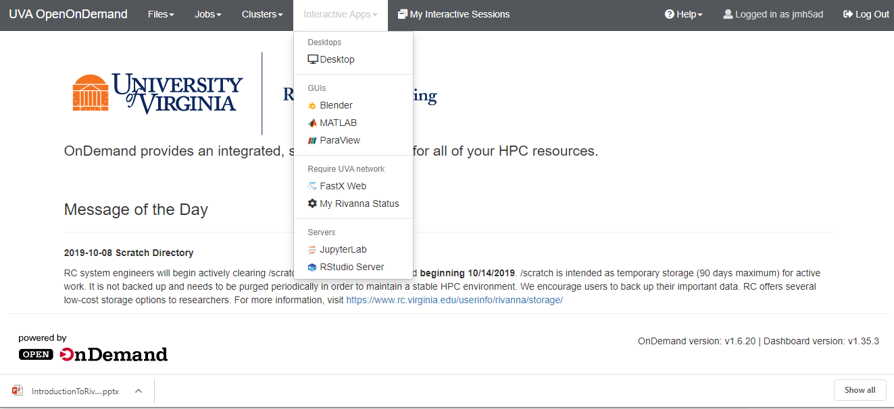
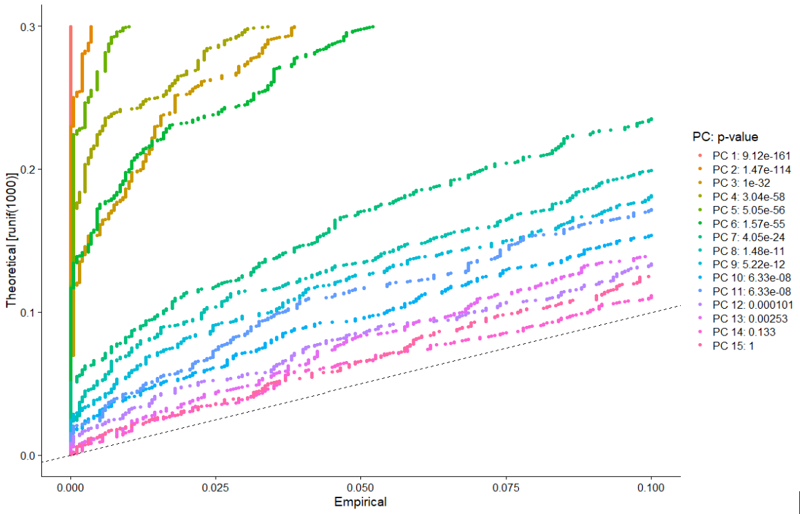
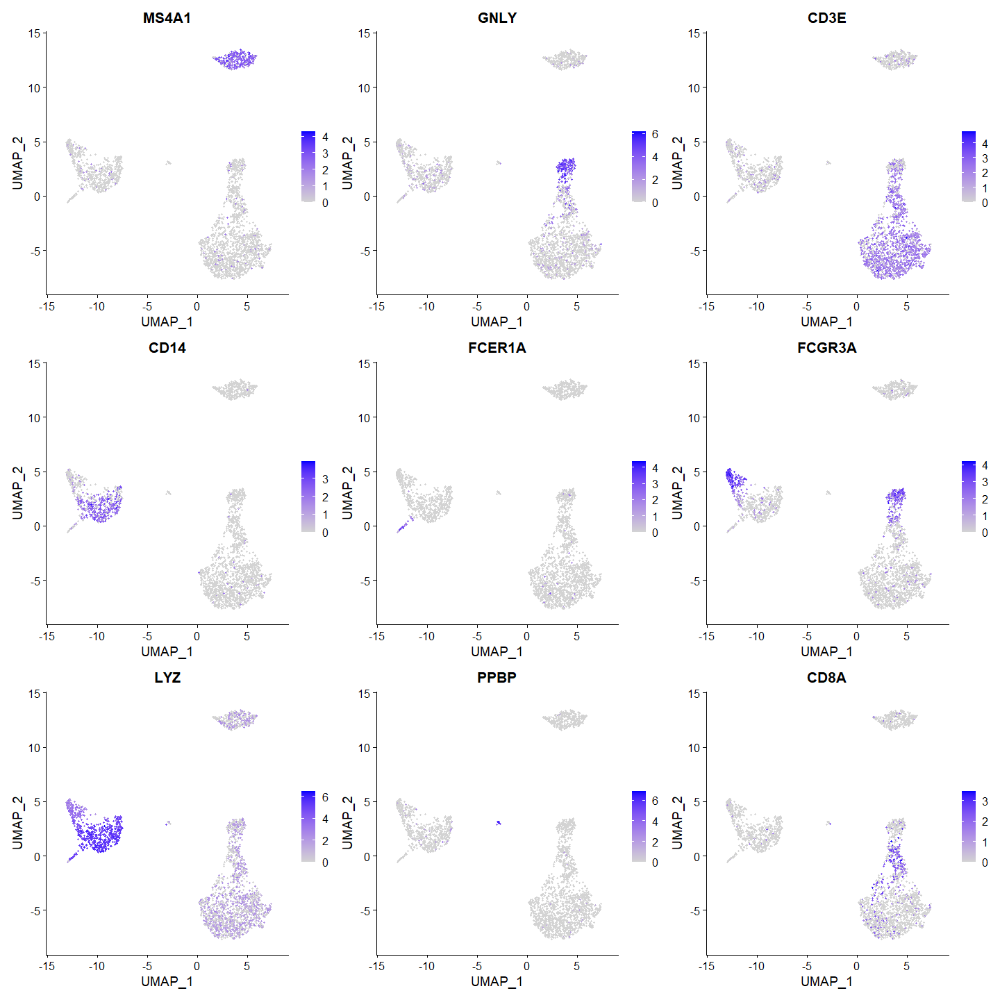
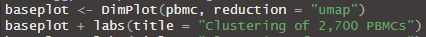

# Single Cell RNA Sequencing \(scRNA\-seq\)

https://learn\.gencore\.bio\.nyu\.edu/single\-cell\-rnaseq/

# 10X Genomics Cell Ranger Pipeline

10X Genomics is a company that pioneered scRNA\-seq

Chromium platform for sequencing  Cell Ranger pipeline for data processing

Align reads  filter  count barcodes  count UMIs  generate matrices

https://support\.10xgenomics\.com/single\-cell\-gene\-expression/software/pipelines/latest/what\-is\-cell\-ranger

---

We have Cell Ranger on Rivanna so you can use it to process your scRNAseq data but we aren't going into details about that today – focusing on visualization / downstream analysis 

10X Genomics Cell Ranger Output

__barcodes\.tsv__

1 barcode per cell

__genes\.tsv__

Ensembl IDs & gene symbols

__matrix\.mtx__

actual data

---

We have Cell Ranger on Rivanna so you can use it to process your scRNAseq data but we aren't going into details about that today – focusing on visualization / downstream analysis 

# Intro to Seurat

* An R package that takes the output from Cell Ranger and other pipelines for QC\, analysis\, and visualization of single cell data
* Capabilities:
  * Basics: preprocessing\, QC\, dimensional reduction\, clustering\, differential expression
  * Multimodal analysis \(e\.g\.\, paired scRNA\-seq & scATAC\-seq\)
  * Spatial datasets \(transcriptomic or multiplexed imaging\-based\)
  * Data integration \(multiple sources of single cell data\)
* [https://satijalab\.org/seurat/](https://satijalab.org/seurat/)

A dataset of 2\,700 Peripheral Blood Mononuclear Cells \(PBMCs\) made publicly available by 10X Genomics\.

This tutorial implements the major components of a standard unsupervised clustering workflow including QC and data filtration\, calculation of high\-variance genes\, dimensional reduction\, graph\-based clustering\, and the identification of cluster markers\.

---

This tutorial implements the major components of a standard unsupervised clustering workflow including QC and data filtration, calculation of high-variance genes, dimensional reduction, graph-based clustering, and the identification of cluster markers.

# UVA OpenOnDemandRSTUDIO SERVER

https://rivanna\-portal\.hpc\.virginia\.edu/

# RStudio Server

# RStudio Web Form

RStudio Web Form

* Let’s take a quick look at some of the fields\.
  * Rversion: Rstudio 1\.3\.1073 – R 4\.0\.2
  * Rivanna Partition: Instructional
  * Number of hours: 3 hours
  * Number of cores: 1
  * Memory Request in GB \( maximum 384G \): 10G
  * Allocations \(SUs\): rivanna\-training
  * Slurm option: \-\-reservation=seminar
  * Launch

# Interactive Workshop - Setup/Loading Seurat

We already installed Seurat on Rivanna for your use at this workshop

\# set working space

user <\- Sys\.getenv\("USER"\)

setwd\(paste0\("/scratch/"\, user\)\)

\# copy data and libraries

system\("cp \-r /project/rivanna\-training/bio\-data\-viz\-seurat \./ "\)

\# Move to the data directory on your scratch space

setwd\(paste0\("/scratch/"\, user\, "/bio\-data\-viz\-seurat"\)\)

dir\(\)

\# Set the libraries path

\.libPaths\("\./R\_libs"\)

\.libPaths\(\)

\# load the libraries

library\(Seurat\)

library\(dplyr\)

library\(patchwork\)

---

Gladys needs to update this one

# Interactive Workshop - Data Access & Loading

We already downloaded the data on Rivanna for your use at this workshop

\# Load the PBMC dataset

pbmc\.data <\- Read10X\(data\.dir = "\./data\_seurat/filtered\_gene\_bc\_matrices/hg19/"\)

nrow\(pbmc\.data\)

print\(pbmc\.data\[1\,1:5\]\)

\# Initialize the Seurat object with the raw \(non\-normalized data\)\.

pbmc <\- CreateSeuratObject\(counts = pbmc\.data\, project = "pbmc3k"\, min\.cells = 3\, min\.features = 200\)

pbmc

# Interactive Workshop - Preprocessing/QC

* __Main steps we will cover:__
* selection and filtration of cells based on QC metrics
* data normalization and scaling
* detection of highly variable features

Interactive Workshop: Preprocessing/QC

* __A few QC metrics commonly used by the community include:__
* The number of unique genes detected in each cell
  * Low\-quality cells or empty droplets will often have very few genes
  * Cell doublets or multiplets may exhibit an aberrantly high gene count
* Similarly\, the total number of molecules detected within a cell \(correlates strongly with number of unique genes\)
* The percentage of reads that map to the mitochondrial genome
  * Low\-quality / dying cells often exhibit extensive mitochondrial contamination

Interactive Workshop: Preprocessing/QC

<\-\- Adding % mitochondrial column to metadata dataframe

<\-\- visualize metadata dataframe

---

We're adding slots to the pbmc data object

Interactive Workshop: Preprocessing/QC

* Violin plot: visualize distribution of numerical data & show summary statistics
* VlnPlot\(pbmc\, features = c\("nFeature\_RNA"\, "nCount\_RNA"\, "percent\.mt"\)\, ncol = 3\)

---

Features (genes) density

A violin plot is a hybrid of a box plot and a kernel density plot, which shows peaks in the data. It is used to visualize the distribution of numerical data. Unlike a box plot that can only show summary statistics, violin plots depict summary statistics and the density of each variable.

Interactive Workshop: Preprocessing/QC

---

nCount_RNA & nFeature_RNA are highly correlated (0.95) while percent mitochondrial & nCount are not correlated at all (-0.13)

What can we infer from this? How does it help QC?

# Interactive Workshop - Filter & Normalize

* Visualized QC metrics \-\-> use them to filter cells:
  * Remove cells with unique features \(genes\) over 2\,500 or less than 200
  * Remove cells that have >5% mitochondrial counts
  * Note that subset\(\) arguments define cells you want to  _keep_  \(e\.g\.\, percent\.mt < 5\)
* Normalize the data
  * Global\-scaling normalization\, “LogNormalize”:
    * normalize feature expression measurements for each cell by total expression  multiply by scale factor \(10000\)  log\-transform
  * Stored in pbmc\[\[“RNA”\]\]@data

---

QC metrics from previous slides are what we use to filter the cells
Why is it important to normalize?

Remove cells with unique features (genes) over 2,500 or less than 200

# Interactive Workshop - Identify Highly Variable Features

* Identify subset of features that exhibit high cell\-to\-cell variation
  * i\.e\, they are highly expressed in some cells\, and lowly expressed in others
  * focusing on these genes in downstream analysis helps to highlight biological signal in single\-cell datasets
  * directly modeling the mean\-variance relationship inherent in single\-cell data
  * FindVariableFeatures\(\) function
    * Default returns 2\,000 features per dataset
  * Use in downstream analysis like PCA

---

directly modeling the mean-variance relationship inherent in single-cell data --> genes with higher mean expression have higher variance across cells

Interactive Workshop - Identify Highly Variable Features

---

Why are we measuring average expression vs standardized variance?

Normalized data = removed relationship between expression and variation

PPBP Gene - Pro-Platelet Basic Protein - only expressed in platelets 

Interactive Workshop - Scale the Data

* linear transformation\, standard pre\-processing step prior to dimensional reduction \(PCA\, etc\.\)
* ScaleData\(\) function:
  * Shifts the expression of each gene\, so that the mean expression across cells is 0
  * Scales the expression of each gene\, so that the variance across cells is 1
  * This step gives equal weight in downstream analyses\, so that highly\-expressed genes do not dominate
  * The results of this are stored in pbmc\[\["RNA"\]\]@scale\.data

---

ScaleData now incorporates the functionality of the function formerly known as RegressOut (which regressed out given the effects of provided variables and then scaled the residuals). To make use of the regression functionality, simply pass the variables you want to remove to the vars.to.regress parameter.

Setting center to TRUE will center the expression for each feature by subtracting the average expression for that feature. Setting scale to TRUE will scale the expression level for each feature by dividing the centered feature expression levels by their standard deviations if center is TRUE and by their root mean square otherwise.

# Interactive Workshop - Linear Dimension Reduction \(PCA\)

* PCA: Principal Components Analysis
  * Reduce number of variables in dataset while preserving as much info as possible
  * first principal component accounts for the  __largest possible variance__  in the data set
  * [https://builtin\.com/data\-science/step\-step\-explanation\-principal\-component\-analysis](https://builtin.com/data-science/step-step-explanation-principal-component-analysis)
* Perform PCA on the scaled data
  * By default\, only the previously determined variable features are used as input \(top 2000\)
  * can be defined using \`features\` argument if you wish to choose a different subset

---

Reduce number of variables, where each gene is a variable

When you run a PCA you get the PCs and the loadings

# Interactive Workshop - Visualize PCA Results

---

Genes that contribute to each PC --> positive or negatively correlated 

These values are called the loadings, and they describe how much each variable contributes to a particular principal component. Large loadings (positive or negative) indicate that a particular variable has a strong relationship to a particular principal component. The sign of a loading indicates whether a variable and a principal component are positively or negatively correlated.

http://strata.uga.edu/8370/lecturenotes/principalComponents.html 

Interactive Workshop: Visualize PCA Results

---

These values are called the loadings, and they describe how much each variable contributes to a particular principal component. Large loadings (positive or negative) indicate that a particular variable has a strong relationship to a particular principal component. The sign of a loading indicates whether a variable and a principal component are positively or negatively correlated.

http://strata.uga.edu/8370/lecturenotes/principalComponents.html 

Dims = 1:2 <- PC1 & PC2

Interactive Workshop: Visualize PCA Results

---

Note that the cells form distinct clusters in PC1vPC2 dimensional space

Interpretation: earlier PCs have greater variation \(brighter yellow\, darker purple\) while later PCs are more homogenous\, indicating that the later PCs do not explain much of the variance in the dataset

Interactive Workshop: Visualize PCA Results

---

Interpretation: earlier PCs have greater variation (brighter yellow, darker purple) while later PCs are more homogenous, shows that the later PCs do not explain much of the variance in the dataset

can see which genes are positive and negative loadings 

Balanced = Plot an equal number of genes with both + and - scores.

# Interactive Workshop - Determine Dimensionality via PCA Results

* _How many components should we choose to include? _
* top principal components represent a robust compression of the dataset
* JackStraw procedure\-inspired resampling test
  * randomly permute a subset of the data \(1% by default\) and rerun PCA  construct ‘null distribution’ of feature scores  repeat this procedure
  * identify ‘significant’ PCs as those who have a strong enrichment of low p\-value features
  * Computationally intense
* Elbow plot
  * Ranking of PCs based on percentage of variance explained by each one
  * Much less computationally intense

Interactive Workshop:

Determine Dimensionality via PCA Results

Compare distribution of p\-values for each PC with a uniform distribution \(dashed line\)

‘Significant’ PCs show a strong enrichment of features with low p\-values \(curve above the dashed line\)

drop\-off in significance after the first 10\-12 PCs

---

JackStraw test: Randomly permutes a subset of data, and calculates projected PCA scores for these 'random' genes. Then compares the PCA scores for the 'random' genes with the observed PCA scores to determine statistical significance. End result is a p-value for each gene's association with each principal component.

Plot provides a visualization of the statistical test that calculates the significance of your principal components

Significant PCs should show a p-value distribution (black curve) that is strongly skewed to the left compared to the null distribution (dashed line) The p-value for each PC is based on a proportion test comparing the number of genes with a p-value below a particular threshold (score.thresh), compared with the proportion of genes expected under a uniform distribution of p-values

First 6 PC's are very highly significant ; next ones are less so but the blue/green lines are higher above the uniform distribution dashed line

Interactive Workshop:

Determine Dimensionality via PCA Results

ranking of principle components based on the percentage of variance explained by each one

observe ‘elbow’ around PC9\-10\, suggesting that the majority of true signal is captured in the first 10 PCs

---

'elbow' starts at ~PC 7, definitely flattens off by PC 10, so we will choose PC10 as our cutoff for significant PCs 

# Interactive Workshop - Clustering

* “distance” metric drives clustering analysis based on previously identified PCs
* Embed cells in a graph structure \(i\.e\.\, K\-nearest neighbor \(KNN\)\)  draw edges between cells with similar feature expression patterns  partition graph into highly interconnected ‘communities’ or ‘quasi\-cliques’
* FindNeighbors\(\)
  * construct KNN graph based on Euclidean distance in PCA space
  * refine edge weights between any two cells based on shared overlap in local neighborhoods \(Jaccard similarity\)
  * input = previously defined dimensionality of dataset \(first 10 PCs\)
* FindClusters\(\)
  * Apply modularity optimization techniques \(Louvain algorithm by default\) to iteratively group cells together
  * ‘resolution’ parameter = set granularity of downstream clustering \(higher resolution = more clusters; 0\.4\-1\.2 is optimal for datasets of ~3000 cells\)

[https://blog\.bioturing\.com/2022/02/15/the\-essence\-of\-scrna\-seq\-clustering/](https://blog.bioturing.com/2022/02/15/the-essence-of-scrna-seq-clustering/)

---

clustering helps you to zoom in your scRNA-Seq data like a microscope and find interesting observations through noises

https://blog.bioturing.com/2022/02/15/the-essence-of-scrna-seq-clustering/ 

Interactive Workshop: Clustering

---

FindNeighbors() dims parameter = number of PCs you determined to be significant based on elbow plot and jackstraw plot

Interactive Workshop:

Non\-Linear Dimensionality Reduction \(UMAP\)

* __Goal = learn the underlying manifold of the data in order to place similar cells together in low\-dimensional space__
* tSNE and UMAP
  * [https://blog\.bioturing\.com/2022/01/14/umap\-vs\-t\-sne\-single\-cell\-rna\-seq\-data\-visualization/](https://blog.bioturing.com/2022/01/14/umap-vs-t-sne-single-cell-rna-seq-data-visualization/)
* Cells within the graph\-based clusters determined previously should co\-localize on these dimension reduction plots
* Input the same PCs as used in the clustering analysis
---

Seurat can do tSNE and UMAP but we will only show UMAP today

https://blog.bioturing.com/2022/01/14/umap-vs-t-sne-single-cell-rna-seq-data-visualization/

# Interactive Workshop - Non\-Linear Dimensionality Reduction \(UMAP\)

Interactive Workshop:

Non\-Linear Dimensionality Reduction \(UMAP\)

Colored by clusters previously identified in KNN clustering\, note colocalization of cells in each cluster

 _[https://pair\-code\.github\.io/understanding\-umap/](https://pair-code.github.io/understanding-umap/)_    

# Interactive Workshop - Differential Expression \(Identify Biomarkers\)

---

Now that we have clustered the data, we want to identify biomarkers for each cluster

Table shows output from last 3 lines of code (find markers for every cluster compared to all remaining cells, report only the positive ones, show top 2 for each cluster)

# Interactive Workshop - Visualize Expression Across Clusters

---

Cluster 3 is heavily expressing MS4A1 & CD79A, cluster 8 heavily expressing PF4, NKG7 is expressed by clusters 4 & 6 mostly

Interactive Workshop:

Visualize Expression Across Clusters

8

7

6

5

4

3

2

1

0

Interactive Workshop:

Visualize Expression Across Clusters

---

Can overlay gene expression on the UMAP

Cropped image to only show first 3 plots so you can see them better

Interactive Workshop:

Visualize Expression Across Clusters

---

Heatmap showing expression levels of the top 20 markers for each cluster

# Interactive Workshop - Known Biomarkers

Our dataset has known canonical biomarkers \(PBMC = peripheral blood mononuclear cells\)

| Cluster ID | Markers | Cell Type |
| :-: | :-: | :-: |
| 0 | IL7R\, CCR7 | Naive CD4\+ T |
| 1 | CD14\, LYZ | CD14\+ Mono |
| 2 | IL7R\, S100A4 | Memory CD4\+ |
| 3 | MS4A1 | B |
| 4 | CD8A | CD8\+ T |
| 5 | FCGR3A\, MS4A7 | FCGR3A\+ Mono |
| 6 | GNLY\, NKG7 | NK |
| 7 | FCER1A\, CST3 | DC |
| 8 | PPBP | Platelet |

---

We can use these canonical biomarkers to name our clusters based on cell type

# Interactive Workshop - Modifying Plots

All Seurat plots are ggplot2\-compatible\, so you can add titles \(as shown here\)\, change themes\, etc\.

# Recap 

Data preprocessing

QC & selecting cells for further analysis

Linear dimensional reduction \(PCA\)

Clustering

Non\-linear dimensional reduction \(UMAP\)

Differential expression between clusters

Visualization

Loading Seurat on your own

* To install into your own home directory through Open On Demand RStudio Server \(do this later to work on your own\):
  * install\.packages\("Seurat"\)
  * install\.packages\("Matrix"\)
  * BiocManager::install\("limma"\)
  * reticulate::py\_install\(packages = 'umap\-learn’\)
* [https://satijalab\.org/seurat/articles/install\.html](https://satijalab.org/seurat/articles/install.html)
  * R version 4\.0 or greater is required

---

Gladys needs to update this one

