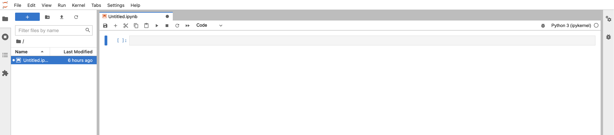

 
 

# Intro to ACCORD

---

ACCORD is a web\-accessible secure platform which allows researchers from Virginia public universities to analyze their sensitive data in a central location

---

### ACCORD projects

 

 <ul>
    <li>ACCORD is project-based:</li>
      <ul>
      <li>Investigators can have multiple projects</li>
        <ul>
          <li>Example: One for a grant on kidney research, and another for an RNA-seq study</li>
        </ul>
      <li>Projects are isolated, you cannot transfer or access data between them</li>
      </ul>
    <li>Invite co-investigators</li>
      <ul>
      <li>To add researchers to your project, submit a request here: <a href="https://www.rc.virginia.edu/form/accord/">Add a researcher</a></li>
      </ul>
 </ul>
 

 

    
 

---

### Storage on ACCORD

 

 <ul>
  
   <li>ACCORD projects come with a default of:</li>
     <ul>
      
       <li>Home directory of 50GB</li>
       <li>Project directory of 1TB</li?
     </ul>
 </ul>
 

 

    
 

---

### Data on ACCORD

 

 <ul>
   <li>ACCORD supports:</li>
     <ul>
       <li>De-identified PII</li>
       <li>FERPA</li>
       <li>Business Confidential</li>
       <li>Other types of sensitive data</li>
     </ul>
   <li>ACCORD _does not_ support:</li>
     <ul>
       <li>Identifiable HIPAA</li>
       <li>CUI</li>
       <li>FISMA</li>
       <li>PCI</li>
     </ul>
 

 

    
     
    If you have a question about whether your data is suitable for ACCORD, please submit a support ticket <a href="https://www.rc.virginia.edu/form/accord/">here</a>
 

---

### Data retention slide

- How long do we keep data?

---

### Globus data transfer slide

---

### Requirements to access ACCORD

- To access ACCORD, you will need the following:
	- A modern web browser such as Chrome, Firefox, Safari, or Edge.
	- You must be logged into your institution’s VPN
		- If you have a sponsored account or are a UVA researcher, you will need the HSVPN
	- Install and register OPSWAT, a posture-checking client.

---

### ACCORD Portal

 

  * ACCORD can be accessed via:[https://accord\-portal\.uvarc\.io/home](https://accord-portal.uvarc.io/home)
 
  * This link can also be found on our website\, along with a User Guide\, FAQs\, and additional documentation:[https://www\.rc\.virginia\.edu/userinfo/accord](https://www.rc.virginia.edu/userinfo/accord)

---

### Logging into ACCORD

 

    
 

 

    <ul>
      <li>To access ACCORD, you will need to login through InCommon</li>
 
      <li>Select your home institution from the dropdown menu (or UVA if you have a sponsored account)</li>
    </ul>
 

---

### Logging into ACCORD

 

    
 

 

    <ul>
      <li>This will prompt you to login through your home institution’s credentials</li>
 
      <li>In this example, UVA will ask you to login usingNetBadge. If you're from another institution, this will be different</li>
    </ul>
 

---

### ACCORD dashboard

  * Once you login\, you will see the ACCORD dashboard\.
  * Your name will appear in the top right corner\, along with any recent or currently running sessions

---

### Start a new session

  * A session is an individual instance running one of the available containers \(RStudio\,JupyterLab\, etc\.\)
  * To create a new session\, click on the ”Start A New Session” button in the top right

---

### Select a project

  * To create a new session\, you will need to select a project\.
  * Projects are isolated\, so you will only be able to access data you’ve uploaded to the project you’ve selected

---

### Select an environment

  * After selecting a project\, you will select the environment you want to use
  * To start your new environment\, click on the “Start” button for the environment you want to use

---

### Connecting to a session

  * Once you start your session\, you will be redirected back to the dashboard
  * You will see your new session in the “Current Sessions” section
  * __Note:__ Your session could show pending as the system waits for resources to become available
  * Once you session is ready\, the “Connect” button will appear
  * Click “Connect” to launch your session\, which will open in a new tab

---

### Working in a session

  * If aJupyterenvironment was selected\, you will be taken to the Notebook interface
  * Once you’re finished working with a session\, you can close the tab and return to the dashboard

---

### Stopping a session

  * When you’re done working in a session\, __always__ click on the “Stop” button to delete it\. This will free up more resources for the system
  * If you leave your sessions running\, this could slow down the system and cause long wait times for researchers

---

### Recent sessions

  * Once you stop a session\, it will be moved into the “Recent Session” section\. You can re\-launch any of these sessions by clicking the “Launch” button
  * You can also start a new session\. The recent sessions are just a shortcut to save you time

---

### Want to learn more?
 

* The ACCORD website has additional documentation\, FAQs\, and a user guide:
  * [https://www\.rc\.virginia\.edu/userinfo/accord/overview/](https://www.rc.virginia.edu/userinfo/accord/overview/)
* Have issues or questions? Fill out a support ticket <a href="https://www.rc.virginia.edu/form/accord/">here</a>

