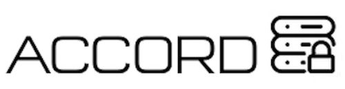
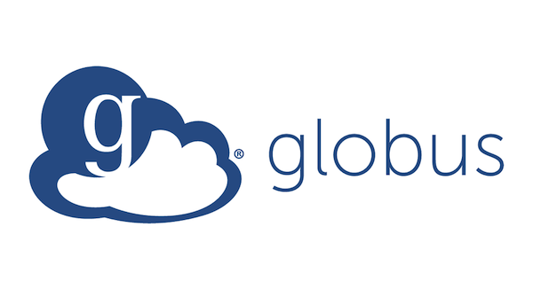
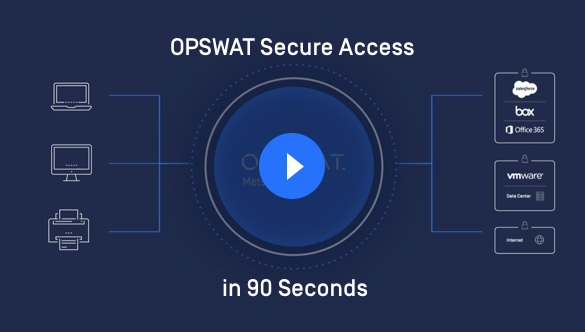
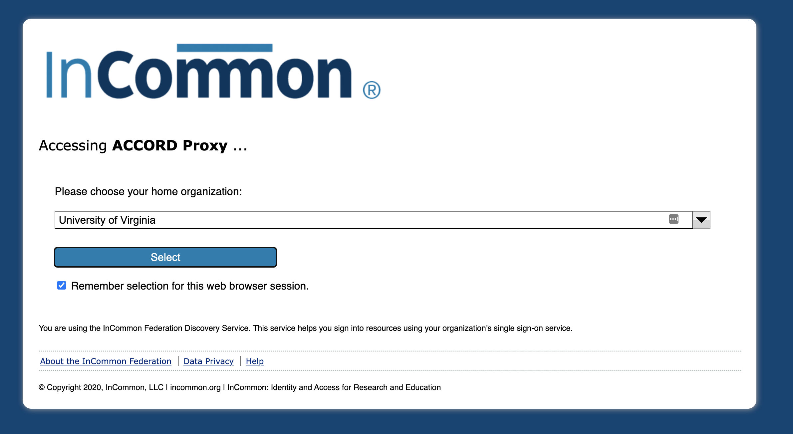
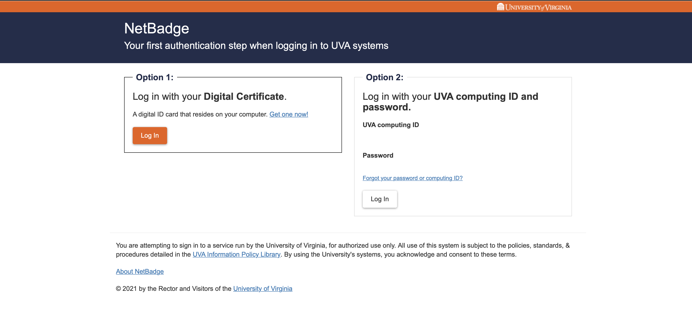
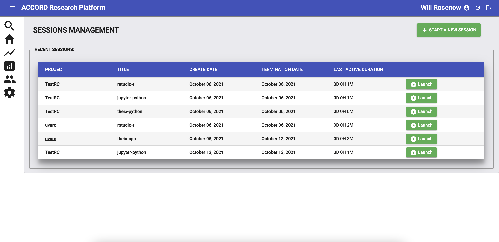
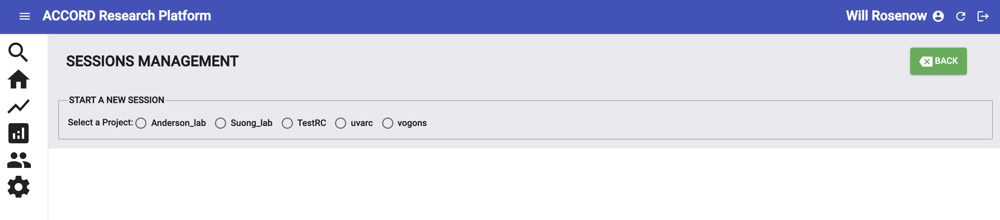
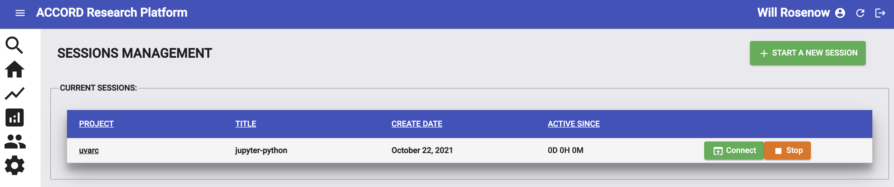
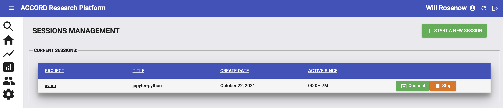
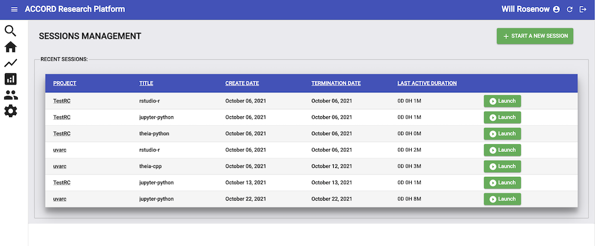

 
 

# Intro to ACCORD

---

### Overview

ACCORD is a web-accessible secure platform which allows researchers from Virginia public universities to analyze their sensitive data in a central location

---

### ACCORD projects

 

 <ul>
    <li>ACCORD is project-based:</li>
      <ul>
      <li>Investigators can have multiple projects</li>
        <ul>
          <li>Example: kidney research and an RNA-seq study</li>
        </ul>
      <li>Projects are isolated, you cannot transfer or access data between them</li>
      </ul>
    <li>Invite co-investigators</li>
      <ul>
      <li>To add researchers to your project, submit a request here: <a href="https://www.rc.virginia.edu/form/accord/">Add a researcher</a></li>
      </ul>
 </ul>
 

 

    
 

---

### Storage on ACCORD

 

 <ul>
  
   <li>ACCORD projects come with:</li>
     <ul>
      
       <li>Home directory of 50GB</li>
       <li>Project directory of 1TB</li>
       <li>Additional storage can be purchased. Please submit a request <a href="https://www.rc.virginia.edu/form/accord/">here</a></li>
     </ul>
 </ul>
 

 

    
 

---

### Data on ACCORD

 

 <ul>
   <li>ACCORD supports:</li>
     <ul>
       <li>De-identified PII</li>
       <li>FERPA</li>
       <li>Business Confidential</li>
       <li>Other types of sensitive data</li>
     </ul>
      
   <li>ACCORD <b>does not</b> support:</li>
     <ul>
       <li>Identifiable HIPAA</li>
       <li>CUI</li>
       <li>FISMA</li>
       <li>PCI</li>
     </ul>
 

 

    
     
    Questions about whether your data is suitable for ACCORD? Submit a support ticket <a href="https://www.rc.virginia.edu/form/accord/">here</a>
 

---

### Data retention

- Data is stored on the system for 6 months.
- To extend your project, please fill out a <a href="https://www.rc.virginia.edu/form/accord/">request</a>

---

### Globus data transfer

- Data transfer is processed through Research Computing staff for the time being.
- Please fill out a request <a href="https://www.rc.virginia.edu/form/accord/">here</a> for data transfer

---

### Requirements to access ACCORD

- To access ACCORD, you need:
	- A modern web browser such as Chrome, Firefox, Safari, or Edge
	- You must be logged into your institution’s VPN
		- If you have a sponsored account or are a UVA researcher, you will need the HSVPN
	- Install and register OPSWAT, a posture-checking client

---

### ACCORD Portal

 

  * ACCORD can be accessed via:[https://accord.uvarc.io/](https://accord.uvarc.io/)
 
  * The ACCORD website has a User Guide, FAQ, and additional documentation:[https://www.rc.virginia.edu/userinfo/accord/overview/](https://www.rc.virginia.edu/userinfo/accord/overview)

---

### Logging into ACCORD

 

    
 

 

    <ul>
      <li>To access ACCORD, you need to login through InCommon</li>
 
      <li>Select your home institution from the dropdown menu (or UVA if you have a sponsored account)</li>
    </ul>
 

---

### Logging into ACCORD

 

    
 

 

    <ul>
      <li>Login using your home institution’s credentials</li>
 
      <li>In this example, UVA will ask you to login using NetBadge. If you're from another institution, this will be different</li>
    </ul>
 

---

### ACCORD dashboard

  * Once you login, you will see the ACCORD dashboard
  * Your name will appear in the top right corner, along with any recent or currently running sessions

---

### Start a new session

  * A session is an individual instance running one of the available containers (RStudio, JupyterLab, etc.)
  * To create a new session, click on the "*Start A New Session*” button in the top right

---

### Select a project

  * To create a new session, you need to select a project
  * Projects are isolated. You can only access data you’ve uploaded to the project you’ve selected

---

### Select an environment

  * After selecting a project, select the environment you want to use
  * To start your new environment, click on the “*Start*” button

---

### Connecting to a session

  * Your new session will be in the “*Current Sessions*” section
  * __Note:__ Your session may show pending as the system waits for resources to become available
  * Once you session is ready, click the “*Connect*” button to launch your session

---

### Stopping a session

  * When you’re finished working in a session, __always__ click on the “**Stop**” button to delete it. This will free up resources for the system
  * Failing to delete sessions will slow down the system and create long wait times for researchers

---

### Recent sessions

  * After stopping a session, it will be moved to the “*Recent Sessions*” section
  * You can re-launch any session by clicking the “*Launch*” button

---

### Want to learn more?
 

* The ACCORD website has additional documentation, FAQs, and a user guide:
  * [https://www.rc.virginia.edu/userinfo/accord/overview/](https://www.rc.virginia.edu/userinfo/accord/overview/)
* Have issues or questions? Fill out a support ticket <a href="https://www.rc.virginia.edu/form/accord/">here</a>

