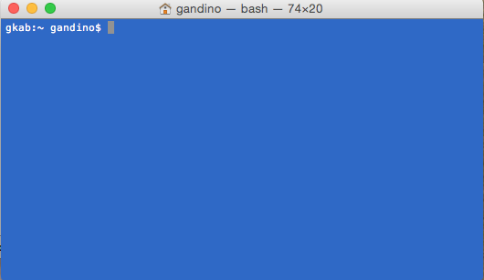
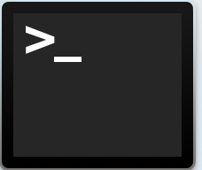
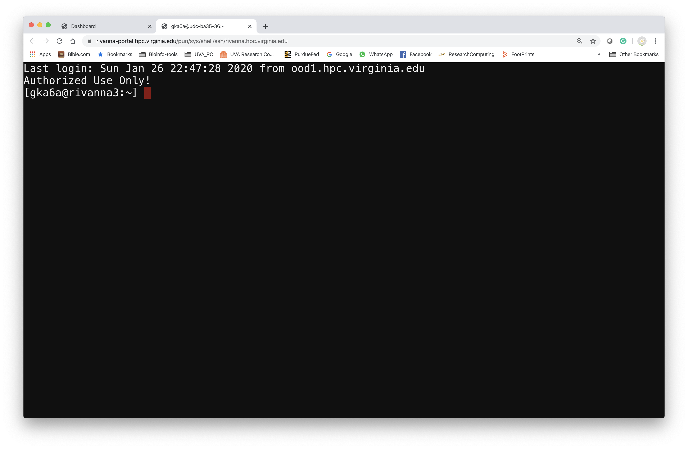
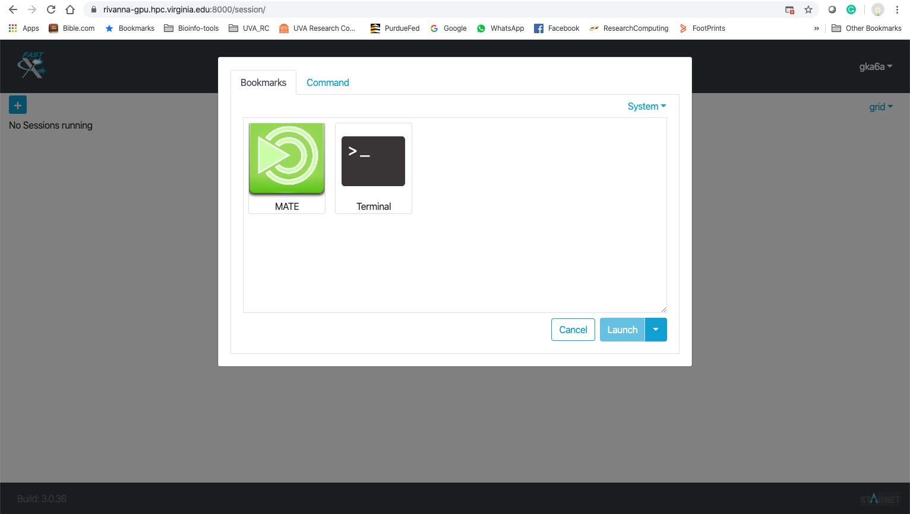
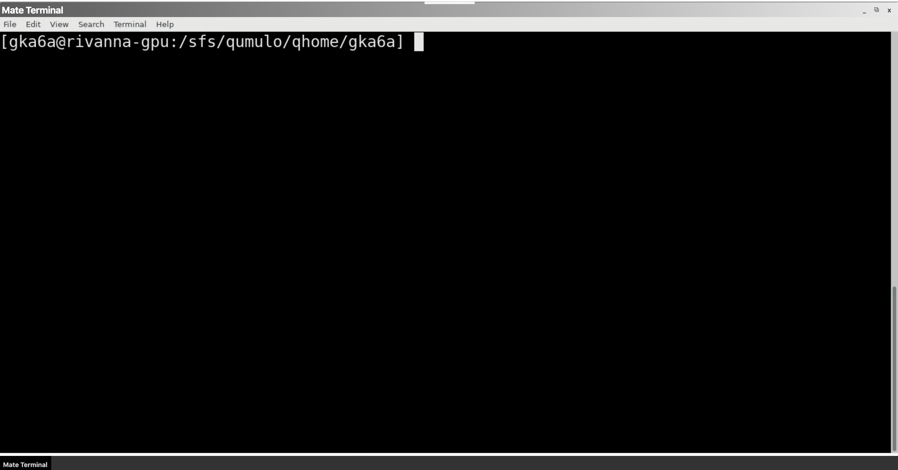
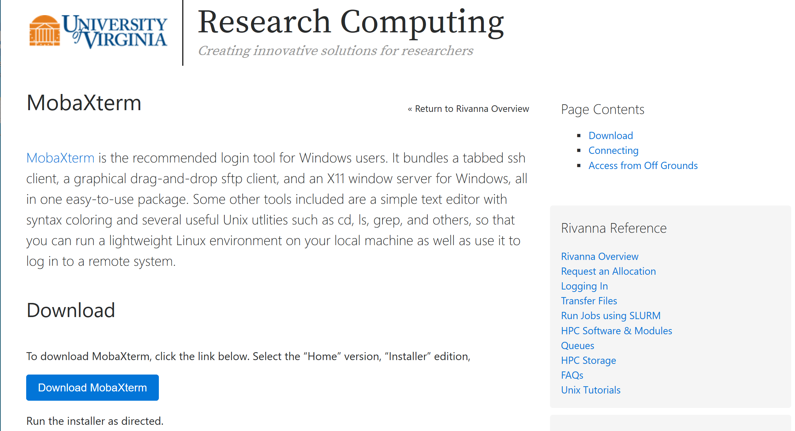
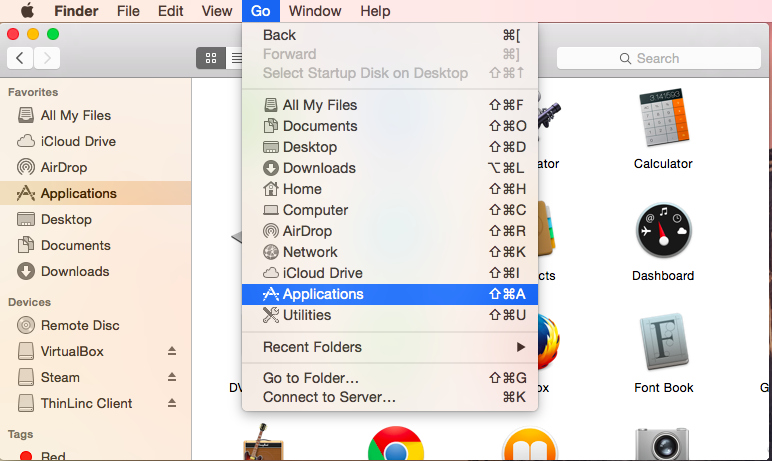
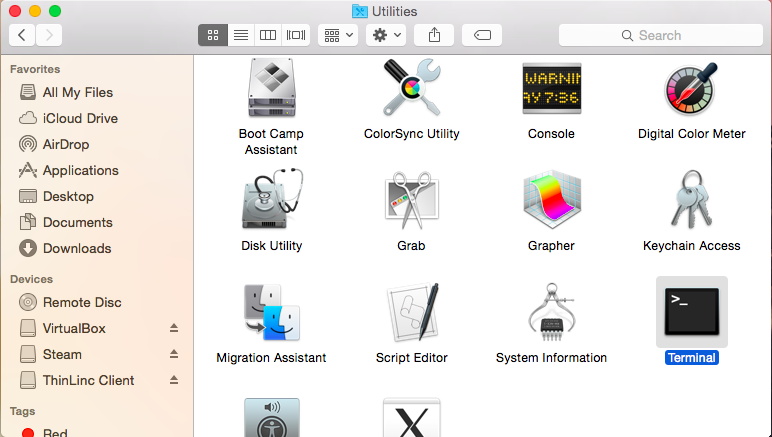
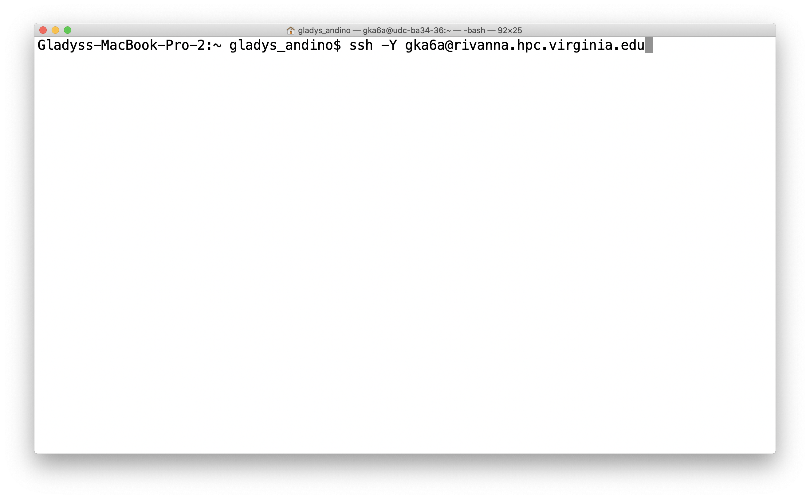
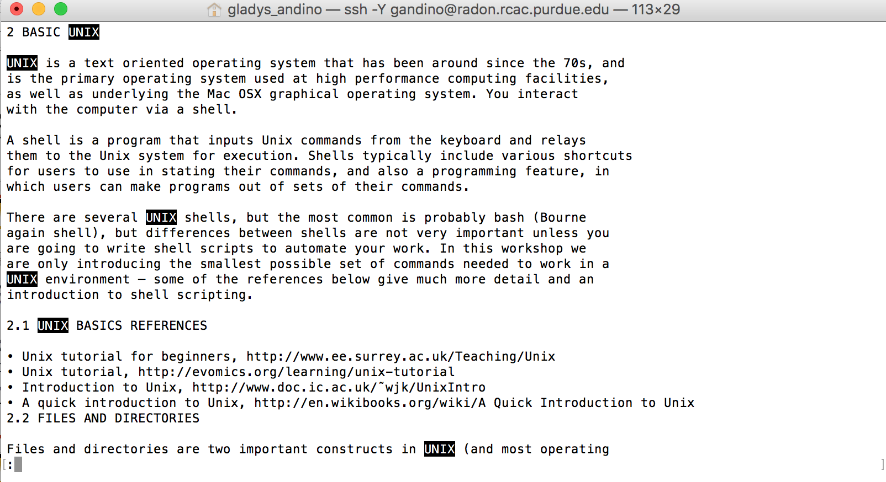

title: High Performance Computing from the Command Line
authors: [uvarc]
tags: []
categories: []
date: "2020-04-13:00:00Z"
slides:
  theme: white
  highlight_style: github
---
# Outline

  * UNIX
  * Terminal emulation/logging in
    * OOD
    * MobaXterm– PC \(ssh\, shell\, SFTP\)
    * Terminal/SSH \- Mac
  * Basic Unix commands
  * Directories and files
  * File editing
  * File transfer
    * File transfer tool
  * Modules \-How to load modules
  * Slurm
  * Practical

---

# Unix

__UNIX__ is an operating system originally developed at Bell Laboratories in the 1960s. Linux is a version of Unix; MacOS is derived from another version. 

- Linux is the dominate operating system for high-performance computing.

- Graphical User Interfaces have been developed for Unix
   - Linux and others use the _X11 Window System_.
   - MacOS calls its native window system _Quartz_. [XQuartz](https://xquartz.org) is a version of X11 for Macs.

---

# File Management from the Command Line
 
* Navigation
* Manipulation of files and directories
  * Editing files
  * Examining files
* File transfer

# The Shell

- Direct interaction with Unix is through a _shell_.  

- The shell is a __program that interprets commands__ issued to the operating system\.
   - The default shell on Linux is `bash` (the Bourne Again Shell).
   - MacOS formerly used bash but has switched to `zsh` as its default.

- You will have a __prompt__ which indicates that the shell is ready to accept commands\. It may appear as a$or a directory name\, or other symbols\.

* To find out your shell\, at the prompt typeecho $shell
* Unix in general and the shell in particular is __case\-sensitive__ \.
* The syntax of commands is not completely standardized but in general is
  * cmd \-o \-\-opts \<filename>
* The pattern is a two or three\-letter abbreviation\, single\-letter options preceded by one hyphen\, multiple\-letter options with two hyphens\, and arguments at the end\.

Overview –Supercomputer

Rivannais the university's primary resource for high\-performance computation\. It provides a platform for computationally\-intensive research across disciplines\.

# LOGGING IN

* Logging into a remote UNIX based system requires a client
* Based on the “SSH” or Secure Shell protocol
  * Encrypted
  * Used on most UNIX systems
  * Variety of clients for all platforms

# Logging in - using (OOD)

[https://www\.rc\.virginia\.edu/userinfo/rivanna/ood/overview/](https://www.rc.virginia.edu/userinfo/rivanna/ood/overview/)

OpenOnDemandis a graphical user interface that allows you to examine and manipulate files and submit jobs\.

It is very easy and intuitive but\, is limited\.  It's a good way to get started\.

OOD also provides portals to applications such asJupyterlaband R Studio Server\.

When you first log in \(throughNetbadge\) you will see the Dashboard\.

From the Dashboard go to Clusters >RivannaFile Access

Logging in \-using \(FastX\)

From the Dashboard go to Interactive Apps >FastXweb

FastXweb > \+ > Terminal > Launch

_LOGGING IN_  _– using_  _MobaXterm_

[https://www\.rc\.virginia\.edu/userinfo/rivanna/login/](https://www.rc.virginia.edu/userinfo/rivanna/login/)

_Remote h_  _ost_  _:_  rivanna  \.  hpc\.virginia\.edu

UVA computing ID

# LOGGING IN – using a MAC

Mac OS X has built in Terminal app that can use SSH

Open Finder and Go to Applications

Utilities > Terminal app

Connect using ssh  –Y  username@rivanna\.hpc\.virginia\.edu

# Command-Line basics

_Dilbert_ \, November 9\, 1993

# NAVIGATION SHELL

Let’s run our first command

__$__  __pwd__  _\(_  _p_  _rint_  _w_  _orking_  _d_  _irectory\)_

command: prints working directory

/home/username \# username should be your UVA computing ID

Know where you are\!

$ __pwd__

/home/gka6a

# FIRST LOOK – Let’s grab some files

* __$ cp \-r /share/resources/tutorials/__  __rivanna__  __\-cl \./__
* Spaces separate these parts\!

_Absolute path_

_Source_

_Relative path_

_Destination_

# Bash History Mechanism

* When using bash you may use its built\-in history mechanism to save yourself some keystrokes\.
  * Up arrow: scroll through the previous commands you have typed
  * Down arrow: if scrolled back\, scroll to more recent commands
  * Left/right arrows: edit text on a line

# More Bash Goodies

* Tab completion
  * string\<tab>causes bash to expand string further as far as it has a unique name\.
* Search for earlier command
  * control\-r  \<text>
* Move to the beginning of the line
  * control\-a
* Move to the beginning of the line
  * control\-e
* Clear the screen
  * clear or control\-l

# FILES AND DIRECTORIES

* Files and directories are two important constructs in UNIX \(and most operating systems\)
* Contain your documents\, images\, code\, programs\, OS\, etc\.
* Everything in UNIX is built on files and directories\!
* A “filesystem” is a collection of files and directories stored on a single physical device
  * Often called “drives” in Windows

* Directories are collections of files and directories
  * Analogous and interchangeable with “folders”
  * Have “metadata” associated with them
  * Name\, timestamps\, permissions
* Files store some sort of information
  * Two basic types of files:
  * Text \(documents\, code\)
  * Binary \(images\, executables\)
  * Have “metadata” associated with them
  * Name\, timestamps\, permissions

* In UNIX all files and directories have a “path”
* The “path” of directories you must follow
* At the top is the __root directory__ that holds everything else\.We refer to it using a slash character __/__ on its own;this is the leading slash in/home/gka6a
  * Examples:
* __/__  __/home/gka6a__  __/home/gka6a/rivanna\-cl\_013020__  __/home/gka6a/rivanna\-cl\_013020/__  __basic\_commands__
* File extensions don’t matter in UNIX

rivanna\-cl\_013020

# Paths

* Example:
* /home/gka6a/rivanna\-cl __\# This is an absolute path__ \.
* The current directory can be represented by a period \(\.\) Thus if we are in
* /home/gka6a/rivanna\-cl/basic\_commandswe can type
  * gedit\./hello\_world\.sh\# to edit or
  * \./hello\_world\.sh\# to execute the file

* __Absolute paths__
* The path to a file starting at the root of the system
* Begins with“/”to denote the path starts at the root
* Guaranteed to get you there
* __Relative paths__
* The path to a file starting at the current location
* Indicate current directory with“ __\.__ ”\, parent directory as“ __\.\.__ ”
* Can break if you start in the wrong place\!

/home/gka6a/file\.txt/home/gka6a/files/file\.txt/home/gka6a/files//project/gka6a

file\.txt\./file\.txtfiles/file\.txt\.\./gka6a/files/\.\./\.\./project/

__ls__ command: list files in current directory

\-llong listing\, includes file date and size

\-adisplays all files\.

\-hshow file sizes in human readable terms

\-tshow the newest files first

$ ls

basic\_commands  data  protein  redirects  regex  scripts  Shakespeare

$   __ls__ 

basic\_commands  data  protein  scripts

$   __ls \-l__ 

drwxr  \-  xr  \-x 2 gka6a users 2560 Jan 29 13:20  basic\_commands

drwxr  \-  xr  \-x 2 gka6a users 2048 Jan 29 13:20 data

drwxr  \-  xr  \-x 2 gka6a users 3584 Jan 29 13:20 protein

drwxr  \-  xr  \-x 2 gka6a users  512 Jan 29 13:20 redirects

drwxr  \-  xr  \-x 2 gka6a users  512 Jan 29 13:20 regex

drwxr  \-  xr  \-x 3 gka6a users 5632 Jan 29 14:48 scripts

drwxr  \-  xr  \-x 2 gka6a users 5120 Jan 29 13:20  shakespeare

$   __ls \-__    __lah__ 

drwxr  \-  xr  \-x  9 gka6a users 4\.0K Jan 29 15:20 \.

drwx  \-\-s\-\-x 42 gka6a users  29K Jan 29 14:32 \.\.

drwxr  \-  xr  \-x  2 gka6a users 2\.5K Jan 29 13:20  basic\_commands

drwxr  \-  xr  \-x  2 gka6a users 2\.0K Jan 29 13:20 data

\-  rw  \-r\-\-r\-\-  1 gka6a users  11K Jan 29 13:20 \.  DS\_Store

drwxr  \-  xr  \-x  2 gka6a users 3\.5K Jan 29 13:20 protein

drwxr  \-  xr  \-x  2 gka6a users  512 Jan 29 13:20 redirects

drwxr  \-  xr  \-x  2 gka6a users  512 Jan 29 13:20 regex

drwxr  \-  xr  \-x  3 gka6a users 5\.5K Jan 29 14:48 scripts

drwxr  \-  xr  \-x  2 gka6a users 5\.0K Jan 29 13:20  shakespeare

$   __ls \-__    __laht__ 

drwxr  \-  xr  \-x  9 gka6a users 4\.0K Jan 29 15:20 \.

drwxr  \-  xr  \-x  3 gka6a users 5\.5K Jan 29 14:48 scripts

drwx  \-\-s\-\-x 42 gka6a users  29K Jan 29 14:32 \.\.

drwxr  \-  xr  \-x  2 gka6a users 2\.0K Jan 29 13:20 data

drwxr  \-  xr  \-x  2 gka6a users  512 Jan 29 13:20 redirects

drwxr  \-  xr  \-x  2 gka6a users 5\.0K Jan 29 13:20  shakespeare

drwxr  \-  xr  \-x  2 gka6a users  512 Jan 29 13:20 regex

drwxr  \-  xr  \-x  2 gka6a users 3\.5K Jan 29 13:20 protein

drwxr  \-  xr  \-x  2 gka6a users 2\.5K Jan 29 13:20  basic\_commands

\-  rw  \-r\-\-r\-\-  1 gka6a users  11K Jan 29 13:20 \.  DS\_Store

_CHANGING DIRECTORIES_

* __cd__  _\(_  _c_  _hange_  _d_  _irectory\)_ command: is used to jump from one directory to another\.
* Changes your present location to the parent directory\.
  * cd \.\.
* The directory which is up one level in the directory tree can be referred to as “\.\.” dot dot\.
* cdwith no directory name puts you into your home directory\.

__$ cd__ rivanna\-cl/basic\_commands

__$__  __ls \-__  __lh__

total 245M

\-rw\-r\-\-r\-\- 1 gka6a users 2\.1K Jan 29 13:20intro\_basic\-unix\.txt

\-rwxr\-xr\-x 1 gka6a users 197M Jan 29 13:20list\_of\_reads\.txt

\-rw\-r\-\-r\-\- 1 gka6a users  46M Jan 29 13:20sequences\.fasta

\-rw\-r\-\-r\-\- 1 gka6a users 1\.6M Jan 29 13:20 SP\_R1\.fastq

\-rw\-r\-\-r\-\- 1 gka6a users 1\.6M Jan 29 13:20 SP\_R2\.fastq

…

# Finding Current Directory?

# Summary - FILES AND DIRECTORIES

* Directories = Folders
  * cdchange directory
  * cd __~__ move to home directory
  * cd \.\.move up one directory
* Special directories
  * \./current directory
  * \.\./parent directory
  * ~/your home directory
  * ~<anyuser>another user's directory

 __Organize your work\!__ 

_CREATING DIRECTORIES_

__mkdir__ command: \( _m_ ake _d_ irectory\)

$ cd rivanna\-cl\_013020/basic\_commands

$ __mkdir__  __NEW\_DIRECTORY__

$ ls \-lht

drwxr\-xr\-x 2 gka6a users    0 Jan 30 00:12 NEW\_DIRECTORY

\-rw\-r\-\-r\-\- 1 gka6a users 1\.6M Jan 29 13:20 SP\_R2\.fastq

\-rw\-r\-\-r\-\- 1 gka6a users  46M Jan 29 13:20sequences\.fasta

\-rw\-r\-\-r\-\- 1 gka6a users 1\.6M Jan 29 13:20 SP\_R1\.fastq

\-rwxr\-xr\-x 1 gka6a users 197M Jan 29 13:20list\_of\_reads\.txt

\-rw\-r\-\-r\-\- 1 gka6a users 2\.1K Jan 29 13:20intro\_basic\-unix\.txt

Look NEW\_DIRECTORY should be empty\!\!

_CREATING DIRECTORIES_

You can use absolute paths or relative paths for the directory name\.

Let’s work these examples\!

mkdirnewcode

mkdir/home/gka6a/newcode/build

cdnewcode

mkdir\.\./oldcode

mkdirsrc

mkdir\.\./oldcode/src

# Exercise

* Start a terminal
* The example prompt is–bash$
* Type after your prompt
  * echo $SHELL
  * pwd
  * mkdirtest\_dir
  * cdtest\_dir
  * ls \.\.
* What is the full path of your home directory?

_VIEWING CONTENTS OF A FILE_

Most common ones areless\, more\, cat\, head and tail\.

__less__ FILENAME

Displays file contents on the screen with line scrolling \(to scroll you can use ‘arrow’ keys\, ‘PgUp/PgDn’ keys\, ‘space bar’ or ‘Enter’ key\)\. __When you are done press ‘q’ to exit\.__

In most implementations you can search in the forward direction with/\<pattern>

$  pwd

/home/gka6a/rivanna\-cl\_013020/basic\_commands

 __$ less__  intro\_basic\-unix\.txt

_VIEWING CONTENTS OF A FILE_

/\<WORD\_PATTERN>

/UNIX

SEARCHING FILE WHILE USING LESS

_VIEWING CONTENTS OF A FILE_

* __head__  FILENAME t _ry this_ :headintro\_basic\-unix\.txt
  * Displays only the starting lines of a file\. The default is first ten lines\. But\, any number of lines can be displayed using–noption \(followed by required number of lines\)\.
* __tail__  FILENAME  _try this_ :tailintro\_basic\-unix\.txt
  * Similar tohead\, but displays the last 10 lines\. Again–noption can be used to change this\.
  * More information about any of these commands can be found in ‘man’ pages \(man command\)\.

_VIEWING CONTENTS OF A FILE_

* __grep__ is one of the most commonly used commands in UNIX and it is commonly used to filter a file/input\, line by line\, against a pattern \(e\.g\.\, to print each line of a file which contains a match for pattern\)\.
  * General syntax:
* grep\[OPTIONS\] PATTERN FILENAME
* A handy trick forbioinformaticians: how many sequences are in a FASTA\-formatted file? By definition\, each sequence record in a FASTA file has one line of description that always starts with>\, followed by multiple lines of sequence itself\. Each sequence record ends when the next line starting with>appears:

_VIEWING CONTENTS OF A FILE_

Let’s  look at the  fasta  file first

$pwd

/home/gka6a/rivanna\-cl/basic\_commands

$ grep \-c '>'sequences\.fasta

?

# Copying Files

__cp__ \( _c_ o _p_ y\) command: is used to copy a file\. When using this command you have to provide both source file and destination file\.

 _Source			Destination_ 

cpoldfilenewfile

You can copy using relative paths

cpthisfile\.\./\.\./place/else/thefile

Copy all files in a directory and its subdirectories:

cp –Rthisdirthatdir

Do not overwrite an existing file \(noclobber\):

cp–noldfilenewfile

Ask before overwriting \(\-iand –n override each other\):

cp–ioldfilenewfile

_MOVING A FILE OR DIRECTORY_

__mv__ can also be used to __rename files and directories__

mv OLDNAME NEWNAME

$pwd

/home/gka6a/rivanna\-cl/basic\_commands

OLDNAME 	  NEWNAME

__$ mv SP\_R1\.list__  __list\_of\_reads\.txt__

_DELETING FILES AND DIRECTORIES_

* __rmdir__ \( _r_ e _m_ ove _dir_ ectory\) command: is used to delete directories from the system\.
  * rmdirdirectory
    * The directory should be empty before you use thermdircommand
* __rm__ \( _r_ e _m_ ove\) command: use to delete a file or a directory\. Some useful options include:
    * \-rrecursively delete files
    * rm \-r directory

# Exercise

If not already in yourbasic\_commandsnavigate there\. Type after your promptbash$

cat >mynewfile\# This is a file\.

Usenanoor editor of your preference and type a line or two of text

moremynewfile

ls

mvmynewfilethe\_file

cpthe\_fileold\_file

ls \-l

# Your Best Friend

The basic documentation for a command can be read from the shell with theman\(manual\) command

man ls

# Wildcards

* Strings of characters may be replaced with wildcards\.
* The asterisk \(\*\) can replace zero to unlimited characters \(it does not replace a leading period\)\.
* The question mark \(?\) replaces exactly one character\.  Wildcards enable you to work with files without needing to type multiple files with similar names\.
  * ls\*py
  * rm list?\.sh
* BE CAREFUL when using wildcards withrm\!Gone is gone\!   On some systems there may be backups\, or maybe not\, and on your personal system you would need to set up backups and learn to retrieve files\.

# Handy Commands

* whoami
* show my user ID
* which \<executable>
  * indicates the path to the executable specified
* wc\<file>
  * word count
    * wc–l \<file>is lines only
* date
  * Shows instantaneous date and time
* exit
  * exit current shell \(if login shell\, this logs you off\!\)

# Standard Streams

Each executable has associated with it\, three I/O streams: __standard input__ \, __standard error__ \, and __standard output__ \.

Normally these streams come from or go to your console \(i\.e\. your shell\)\.

Most Unix commands read from standard input and/or write to standard output\.

They are often represented as __stdin__ \, __stderr__ \, and __stdout__ \.

# Stream Redirection

You can redirect standard input with <

mycode<params\.txt

Redirect standard output with >

ls–l >filelist

Append with >>

cat file1 >>bigfile

Redirection of standard error depends on the shell

Bash:

make >&make\.out

Redirects bothstdoutandstderrtomake\.out

# Pipes

* One of the most powerful properties of Unix is that you can __pipe__ the standard output of one command into the standard input of another\.
* The pipe symbol|is above the backslash on most US keyboards\.
* Example
* grep "@H\-148:116" SP\_R1\.fastq | head
  * grepsearches for the pattern in the file andheadlooks at the first 10 lines of thegrepoutput

# Running Executables

Executables are often called binaries\, especially by Unix types and computer programmers\.  The terms are synonymous in most cases\.

If the executable is in your _search path_ you can simply type its name at the prompt\.

gedithello\_world\.slurm

heregeditis the name of the binary\.  Its actual location is/usr/bin/gedit\,but/usr/binis in the default search path\.

If it is not in your search path you must type the path to the executable \(can be absolute or relative\)

\./hello\_world\.slurm

Usually current directory is not in your default search path for security reasons\.

# Example

In most cases\, current working directory \(\.\) is not in your default search path\.  To add it\, type \(for bash\)

export PATH=$PATH:\.

In this case it is essential to add the first$PATHor you will lose the default path set by the system\.

# Process Control

Running from a __command line__ :

Processes can be running in the _foreground_ \(no prompt returned to the shell\) or _background_ \(prompt available\)\.  To start in the background add an ampersand \(&\) at the end of the command:

\./myexec\-omyoptmyfile&

control\-z\(ctrl\-zor^z\):suspend the job

bgplace into background

fgforward abackgroundedjob

# Killing Processes

control\-c\(ctrl\-cor^c\):kill the current running job \(must be foregrounded\)\.

Find the process ID withpsthen:

kill \-9 <pid>

terminates with extreme prejudice\.

killall\-9 \<executable name>

same as above\.

# RIVANNA

# Rivanna in More Detail

