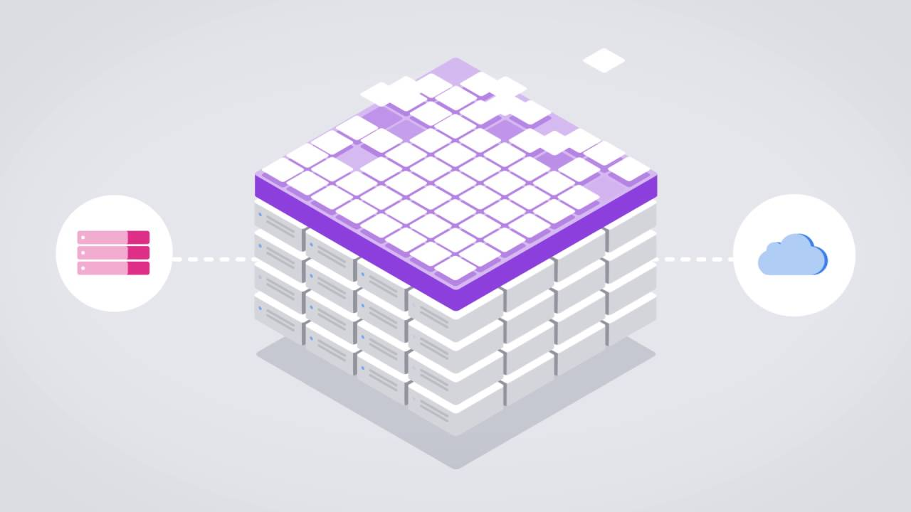

Container-based architecture, also known as "microservices," is an approach to designing and running applications as a distributed set of components or layers. Such applications are typically run within containers, made popular in the last few years by Docker.

Containers are portable, efficient, reusable, and contain code and any dependencies in a single package. Containerized services typically run a single process, rather than an entire stack within the same environment. This allows developers to replace, scale, or troubleshoot portions of their entire application at a time.

Research Computing runs microservices in a clustered orchestration environment that automates the deployment and management of many containers easy and scalable. This cluster has >1000 cores and ~1TB of memory allocated to running containerized services. It also has over 300TB of cluster storage and can attach to project and value storage.
