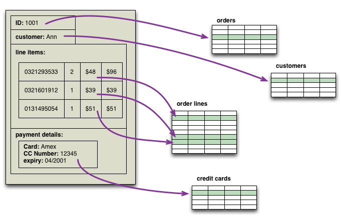

There are two main families of databases: Relational and NoSQL.
* *Relational databases* store information in an orderly, column, row, and table schema. They “relate” the tables together to present different views of the data.
* *NoSQL databases* are much less structured. This means they can store different data alongside each other – which makes things both easier to store but harder to query across.

There are additional types of databases, such as *ledger*, *time-series* and others. Those are beyond the scope of this introduction.

# Relational Databases (RDBMS)

Most users have at least heard of relational databases such as:

* MySQL / MariaDB
* PostgreSQL
* Microsoft SQL Server
* Oracle

Relational databases operate on the concepts of tables, relations, schemas, data types, indices, SQL, joins and basic "CRUD" operations.

	C = Create   (Insert)
	R = Read     (Select)
	U = Update   (Update)
	D = Delete   (Delete)

Take the example of an online store, where data revolves around the ideas of items, orders and customers. When a customer makes a purchase in our store, the data from the transaction is actually broken apart into tables of related data. Here’s one way of seeing that process:



The database for such an online store might have a handful of related tables:

1. **Orders**
2. **Customers**
3. **Credit Cards**
4. **Items**

Relational database tables use unique keys as a way to relate one table with another, and so the "orders" table
might simply aggregate keys drawn from other tables for each order. This allows each table to have a clear definition
of what data fields, and their data types, are expected with every transaction. Data coming in must be broken apart
to conform to this data structure, and data going out must be drawn back together from across the tables.

But this “breaking apart” process is actually an intensive, time-consuming process. Data being sent off to
any particular table has to be validated by data type (strings, integers, dates, decimals, binary, etc.), length,
and NULL before it can be inserted into a particular data table. This happens across multiple tables at
the same time, and ensures that the entire transaction completes successfully or is rolled back.

<b>Impedance Mismatch</b> - a set of conceptual and technical difficulties that are often encountered when interacting with a relational database management system.

SQL, "structured query language" is the language spoken by most relational databases. While there are slight variations
in SQL syntax between RDBMS platforms (a semicolon here, a percent sign there), they all generally read the same to
anyone familiar with general SQL queries.

Create a table:
```sql
  create table researchers
  (researcherID int NOT NULL AUTO_INCREMENT,
    first varchar(15),
    last varchar(20),
    email varchar(30),
    age int,
    PRIMARY KEY (ID)
  );
```

Insert an item into a table:
```sql
  insert into researchers
    (first, last, email, age)
    values ('Jane', 'Doe', 'jdoe@georgia.edu', 34);
```

Select (read) all items from a table:
```sql
  select * from researchers;
```

Select (read) a single item from a table:
```sql
  select * from researchers where researcherID = 147;
  select * from researchers where first = 'Jane';
  select first, last from researchers where age = 34;
```

---

# NoSQL Databases

NoSQL databases come in at least two main groupings: **Aggregate oriented** or **Node-Arc/Graph**.

## 1. Aggregate-Oriented Databases

* Key-Value - Redis, Memcached
* Document - DynamoDB, MongoDB
* Column-Family - Cassandra, BigTable

NoSQL databases share very few common characteristics. Perhaps the only one is that they are **schema-less**. Typical aggregate-oriented NoSQL databases will store an aggregation in the form of strings or entire documents. That is usually in plain text, often in a specific format or notation, such as JSON or XML.

Here are some sample entries from a simple Key-Value datastore:

| Key              | Value                           |
|------------------|---------------------------------|
| access_key       | ABCDEfghijklmnop123456789xyzabc |
| secret_key       | 23481283852384128328a           |
| current_count    | 472                             |
| jobs_remaining   | 13                              |
| last-winner      | Darla Johnson                   |
| last-winner-date | 08/17/2014 08:42:13.015 UTC     |

In the case of document NoSQL databases, the “value” portion of the entry can get much larger.

Here is an example of an entry in JSON. Note that the entire entry (or “document”) breaks down into a hierarchy of data: fields and their values, and dictionaries of multiple values,

```
{
  "success": {
    "total": 1
  },
  "contents": {
    "quotes": [
      {
        "quote": "Remove the temptation to settle for anything short of what you deserve.",
        "length": "71",
        "author": "Lorii Myers",
        "tags": [
          "expectation",
          "inspire",
          "perfection"
        ],
        "category": "inspire",
        "date": "2017-09-08",
        "permalink": "https://theysaidso.com/quote/ZWrV624xU_q6_KYYlrQpYgeF/lorii-myers-remove-the-temptation-to-settle-for-anything-short-of-what-you-deser",
        "title": "Inspiring Quote of the day",
        "background": "https://theysaidso.com/img/bgs/man_on_the_mountain.jpg",
        "id": "ZWrV624xU_q6_KYYlrQpYgeF"
      }
    ],
    "copyright": "2017-19 theysaidso.com"
  }
}
```

Also consider that subsequent entries into this table may or may not contain a background image, or the same number of tags, or the precise data structure of this
entry. NoSQL evolved out of the need to quickly collect varied data at very high rates and so it does not suffer from impedance mismatch. Rather, it suffers from
its difficulty to aggregate or join.

## 2. Node-Arc / Graph Databases

Graph, or Node-arc databases are entirely different, in that they try to store and represent connectivity between nodes in a constellation, and their relationships. So a “query” of a graph database might inform you about the networks of other nodes related to the node you are interested in, and the types and strengths of those relationships, among other uses. Some examples of Graph DBs are:

* Neo4j
* TinkerPop
* Infinite


---

# Using Databases in Your Research

We are frequently asked by researchers how to incorporate databases into their work. Here are four suggestions:

<div class="card-deck"><div class="card" style="padding: 1rem">

Track Results
: Track the status of your completed work by adding a record to a table upon completion. This lets you know what work remains open and information about its processing.

</div>
<div class="card" style="padding: 1rem">

Queue Up Your Work
: Collect and store data about future work you need to complete, the steps required, and the expected lifecycle of each step. While this might be easy to do in Excel, you could grow this into a database that orchestrates some of these steps for you.

</div></div>
<div class="card-deck" style="margin-top:2rem;"><div class="card" style="padding: 1rem">

Index Everything
: Maintain a searchable history of source data, result sets, and code used to process them. This could include links to related data, articles published, GitHub code repositories, and more.

</div>
<div class="card" style="padding: 1rem">

Automate
: If you are awash in source data or have a backlog of files to process, consider automating it by using a database. Your code, instead of handling a single file at a time, could read each row in the database and process files indexed in a table. A single HPC job could process thousands of files!

</div></div>

**Note:** Research Computing may be able to provide support for your database needs. Please schedule a consultation request on our website by filling out [this form](https://www.rc.virginia.edu/form/support-request/?category=Consultation).


# Other Resources

Here is a great overview of databases and their histories:



Martin Fowler - NoSQL - YouTube
